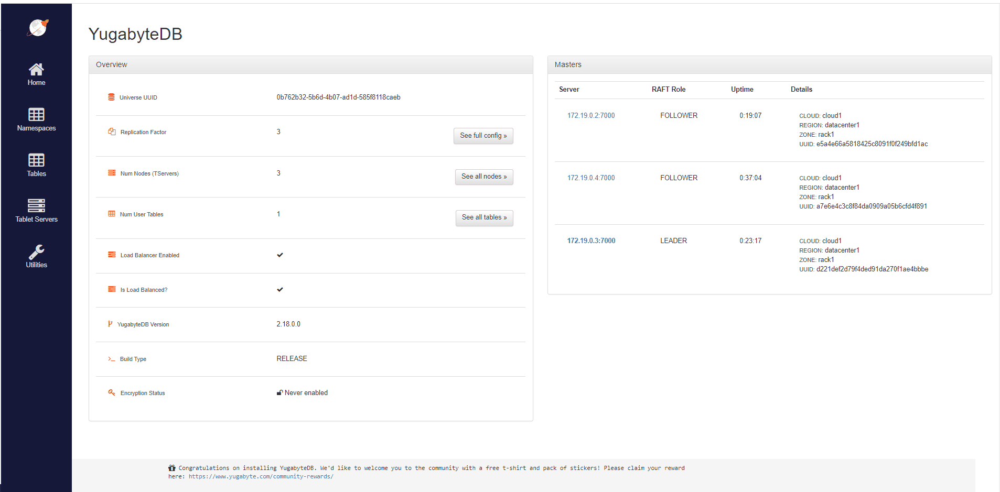
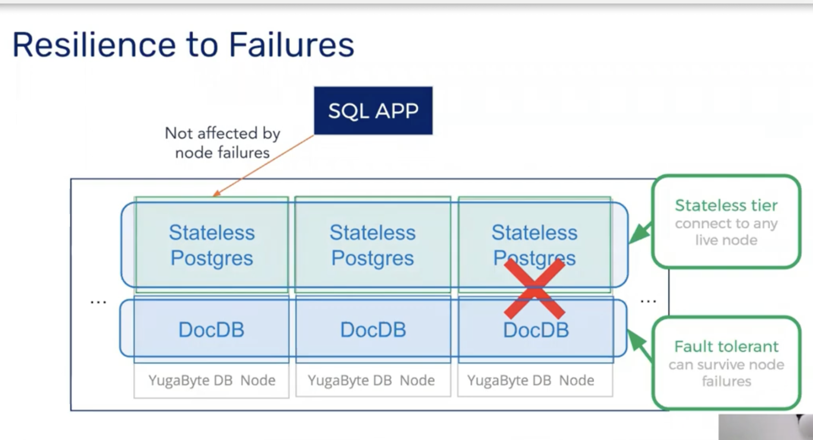
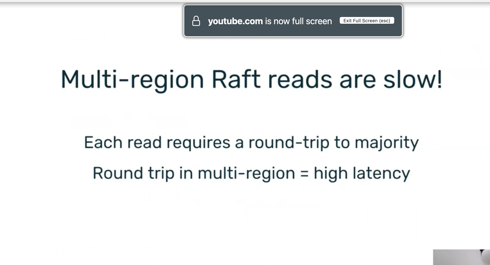
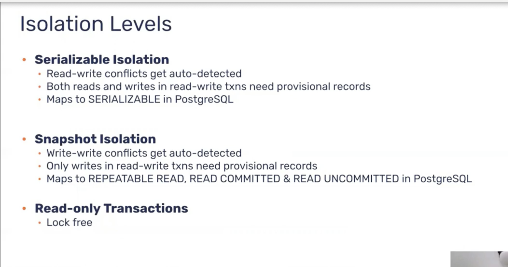

# Yogabyte

## Create a local cluster

Use the yugabyted utility to create and manage universes.

To create a 1-node cluster with a replication factor (RF) of 1, run the following command:

```sh
docker run -d --name yugabyte -p7000:7000 -p9000:9000 -p15433:15433 -p5433:5433 -p9042:9042 \
 yugabytedb/yugabyte:2.25.2.0-b359 bin/yugabyted start \
 --background=false

```
`docker exec -it yugabyte yugabyted status`


The cluster you have created consists of two processes:

- `YB-Master` keeps track of various metadata (list of tables, users, roles, permissions, and so on).
- `YB-TServer` is responsible for the actual end user requests for data updates and queries.


## Monitor your cluster

When you start a cluster using yugabyted, you can monitor the cluster using the YugabyteDB UI, available at `localhost:15433`.

The YugabyteDB UI provides cluster status, node information, performance metrics, and more.


A daemon is a special kind of process designed to run silently in the background as a service.

Process is to Program as Container is to Image

You can run multiple processes from the same program (e.g., run vim in two terminals).

You can run multiple containers from the same image (e.g., two nginx containers from the same Docker image).


While YugabyteDB Anywhere can have multiple customers in a multi-tenant setup, a typical installation is a single-tenant and will have just one customer account. Each customer account has multiple user accounts.

each customer can have:
- Multiple providers
- Multiple universes
- Multiple users

### Cluster

A cluster is a group of nodes on which YugabyteDB is deployed. The table data is distributed across the various nodes in the cluster. Typically used as Primary cluster and Read replica cluster.


### DocDB

DocDB is the underlying document storage engine of YugabyteDB and is built on top of a highly customized and optimized verison of RocksDB

### Fault domain

A fault domain is a potential point of failure. Examples of fault domains would be nodes, racks, zones, or entire regions.

### Fault tolerance

YugabyteDB achieves resiliency by replicating data across fault domains using the Raft consensus protocol. The fault domain can be at the level of individual nodes, availability zones, or entire regions.


### Master server

The YB-Master service is responsible for keeping system metadata, coordinating system-wide operations, such as creating, altering, and dropping tables, as well as initiating maintenance operations such as load balancing.

### MVCC

MVCC stands for Multi-version Concurrency Control. It is a concurrency control method used by YugabyteDB to provide access to data in a way that allows concurrent queries and updates without causing conflicts


### Raft

Raft stands for Replication for availability and fault tolerance. This is the algorithm that YugabyteDB uses for replication guaranteeing consistency.


`EXPOSE 7000 7100 7200 9000 9100 12000 11000 6379 9042 5433 10100`

## Client APIs

Application clients connect to the following addresses:

```sh
API 	Port 	Server 	Flag (default)
YSQL 	5433 	YB-TServer 	--pgsql_proxy_bind_address 0.0.0.0:5433
YCQL 	9042 	YB-TServer 	--cql_proxy_bind_address 0.0.0.0:9042
YEDIS 	6379 	YB-TServer 	--redis_proxy_bind_address 0.0.0.0:6379
```


## Internode RPC communication

Internode (server-to-server or node-to-node) communication, including xCluster, is managed using RPC calls on the following addresses:
```sh
Server 	Port 	Flag (default)
YB-Master 	7100 	--rpc_bind_addresses 0.0.0.0:7100
YB-TServer 	9100 	--rpc_bind_addresses 0.0.0.0:9100
--tserver_master_addrs 0.0.0.0:7100
--server_broadcast_addresses 0.0.0.0:9100
```

To enable login to the machines running these servers, the SSH port 22 should be opened.


Port 7000 (to access the admin UI) should also be open to all nodes, as requests made to the Master UI of a non-leader Master are internally redirected to the leader Master's 7000 port.


## Admin web server

Admin web server UI can be viewed at the following addresses:
Server 	Port 	Flag (default)
```sh
YB-Master 	7000 	--webserver_interface 0.0.0.0
--webserver_port 7000
YB-TServer 	9000 	--webserver_interface 0.0.0.0
--webserver_port 9000
```
http://localhost:7000/
http://localhost:9000/
`YB-TServer`is a play application with react ui


For clusters started using `yugabyted`, the YugabyteDB UI can be viewed at the following address:
```sh
Server 	Port 	Flag
YugabyteDB UI 	15433 	--ui (default is true)
```
http://localhost:15433/


## YugabyteDB Anywhere
Self-managed Database-as-a-Service

YugabyteDB Anywhere is a self-managed database-as-a-service offering from YugabyteDB that allows you to deploy and operate YugabyteDB universes at scale.

Use YugabyteDB Anywhere to automate the deployment and management of YugabyteDB in your preferred environments (spanning on-prem, in the public cloud, and in Kubernetes) and topologies (single- and multi-region).


YugabyteDB Anywhere (YBA) needs to be able to access nodes that will be used to create universes, and the nodes that make up universes need to be accessible to each other and to applications.

```sh
From 	To 	Requirements
DB nodes 	DB nodes 	Open the following ports for communication between nodes in clusters. They do not need to be exposed to your application. For universes with Node-to-Node encryption in transit, communication over these ports is encrypted.

    7000 - YB-Master HTTP(S)
    7100 - YB-Master RPC
    9000 - YB-TServer HTTP(S)
    9100 - YB-TServer RPC
    18018 - YB Controller RPC
```   


The YugabyteDB Anywhere REST API allows you to deploy and manage universes programmatically. 

Some examples of what you can accomplish using this API include:

- Create and manage YugabyteDB Anywhere provider configurations
- Deploy and manage universes
- Pause and resume universes
- Perform software upgrades
- Run on-demand backups and restores
- Resize nodes


`Yugabyte Anywhere` is a self-managed, on-premises or cloud-deployed database management platform. It allows you to deploy, monitor, and manage YugabyteDB clusters on infrastructure that you control (your own VMs, cloud accounts, or data centers). You are responsible for the operations, upgrades, security, networking, and maintenance.

`Yugabyte Managed` (sometimes called YugabyteDB Managed or YBM) is a fully managed Database-as-a-Service (DBaaS) offering provided by Yugabyte. The Yugabyte team handles all the operational aspects: provisioning, scaling, patching, backups, and security. You simply use the database and pay for the service, without worrying about infrastructure or management overhead.

## YugabyteDB Anywhere
What is YugabyteDB Anywhere?

YugabyteDB Anywhere (previously known as Yugabyte Platform and YugaWare) is a private database-as-a-service, used to create and manage YugabyteDB universes and clusters. YugabyteDB Anywhere can be used to deploy YugabyteDB in any public or private cloud.

You deploy and manage your YugabyteDB universes using the YugabyteDB Anywhere UI.


## YugabyteDB Aeon
What is YugabyteDB Aeon?
YugabyteDB Aeon (previously known as YugabyteDB Managed) is a fully managed YugabyteDB-as-a-Service that allows you to run YugabyteDB clusters on Amazon Web Services (AWS), Microsoft Azure, and Google Cloud Platform (GCP).

You access your YugabyteDB Aeon clusters via YSQL and YCQL client APIs, and administer your clusters using the YugabyteDB Aeon UI.

`YugabyteDB Aeon runs on top of YugabyteDB Anywhere.`

We are thrilled to announce a new name for our database-as-a-service: YugabyteDB Aeon!

YugabyteDB Aeon is a PostgreSQL-compatible managed cloud database service designed for modern applications. It is fully distributed, multi-region, and multi-cloud. YugabyteDB Aeon automates the deployment, scaling, management, and recovery of YugabyteDB databases across AWS, Azure, and Google Cloud. YugabyteDB Aeon was previously called YugabyteDB Managed.


## Why The Name Change?

To simplify how YugabyteDB clusters are deployed and managed, we introduced YugabyteDB Anywhere, a commercial database-as-a-service product, in 2018 to complement our open source YugabyteDB database. This was released as a bring-your-own-cloud (BYOC) solution running in a customer’s cloud environment, and was managed either by the customer or by Yugabyte.

We later introduced YugabyteDB Managed, a fully-managed DBaaS where the data is stored in Yugabyte’s public cloud environments and fully managed by Yugabyte.

YugabyteDB Anywhere and YugabyteDB Managed provide organizations with complete deployment flexibility when it comes to automating database and infrastructure management.

However, having different names for the deployment options led to confusion about whether they are different products. To dispel this confusion and make it clear that these are deployment options of one unified product, we are unifying the product name – YugabyteDB Aeon.


[cloud-vpc-intro](https://docs.yugabyte.com/preview/yugabyte-cloud/cloud-basics/cloud-vpcs/cloud-vpc-intro/)

[cloud-add-peering](https://docs.yugabyte.com/preview/yugabyte-cloud/cloud-basics/cloud-vpcs/cloud-add-peering/)

[cloud-add-endpoint](https://docs.yugabyte.com/preview/yugabyte-cloud/cloud-basics/cloud-vpcs/cloud-add-endpoint/)

[cloud-add-vpc-aws](https://docs.yugabyte.com/preview/yugabyte-cloud/cloud-basics/cloud-vpcs/cloud-add-vpc-aws/)

[add-connections](https://docs.yugabyte.com/preview/yugabyte-cloud/cloud-secure-clusters/add-connections/)

[cloud-add-vpc](https://docs.yugabyte.com/preview/yugabyte-cloud/cloud-basics/cloud-vpcs/cloud-add-vpc/)


[yba-overview](https://docs.yugabyte.com/preview/yugabyte-platform/yba-overview/)

## Introduction to YugabyteDB Anywhere
YugabyteDB Anywhere from 50,000 ft

YugabyteDB Anywhere (YBA) is a self-managed database-as-a-service that allows you to deploy and operate YugabyteDB database clusters (also known as universes) at scale.

In YBA, a database cluster is called a universe, and the terms are used interchangeably. More precisely, a universe in YBA always consists of one (and only one) primary cluster, and can optionally also include a single read replica cluster attached to the primary cluster


## Features

You can use YBA to deploy YugabyteDB database clusters that will tolerate single node failures, multiple node failures, single availability zone failures, multiple availability zone failures, single region failures, cloud provider failures, and more.

YugabyteDB Anywhere also supports xCluster deployments (including for disaster recovery), where two YugabyteDB universes are deployed, and data is replicated asynchronously between them.

YBA supports these deployments in the following environments:

- On-premises - YBA can deploy YugabyteDB on VMs or bare metal hosts running various flavors of Linux, with the flexibility required to accommodate organizational security and compliance needs.
- Public clouds - YBA can deploy cloud-native YugabyteDB clusters in AWS, Azure, and GCP. YBA understands the native instance types, volume types, availability zones, regions, and OS image availability on each cloud, and maps them seamlessly to YugabyteDB's fault tolerance and performance configurations.
- Kubernetes - YBA can deploy YugabyteDB in Kubernetes clusters and both map the zones available in a single Kubernetes cluster, and map multiple regions across different Kubernetes clusters to YugabyteDB's fault tolerance capabilities.


## YugabyteDB Anywhere architecture


Many Azure regions provide availability zones, which are separated groups of datacenters within a region. Each availability zone has independent power, cooling, and networking infrastructure, so that if one zone experiences an outage, then regional services, capacity, and high availability are supported by the remaining zones.

Availability zones are typically separated by several kilometers, and usually are within 100 kilometers. This distance means they're close enough to have low-latency connections to other availability zones through a high-performance network. However, they're far enough apart to reduce the likelihood that more than one will be affected by local outages or weather.


diagram shows several example Azure regions. Regions 1 and 2 support availability zones, and regions 3 and 4 don't have availability zones.


connect to the database
```sh
docker exec -it yugabyte-yuga-1 bash -c 'ysqlsh --echo-queries 
-h $(hostname) -p 5433'

```

[global-yugabyte-database-deployment-into-google-cloud-](https://medium.com/google-cloud/global-yugabyte-database-deployment-into-google-cloud-a03544e68b72)
[global-yugabyte-database-deployment-into-google-cloud-part](https://medium.com/google-cloud/global-yugabyte-database-deployment-into-google-cloud-part-2-1f34e08f6d6f)


`$ docker run -d --name yugabyte -p7000:7000 -p9000:9000 -p5433:5433 yugabytedb/yugabyte:latest bin/yugabyted start --daemon=false`

We can access http://localhost:7000/ to see the Admin web server UI:


`t-server` means `tablet-servers`


## run more than one instance of the database

1. start by creating a Docker network for our clusters:
`docker network create yugabyte-network`

2. Afterward, we’ll create our main YugabyteDB node:

`docker run -d --name yugabyte1 --net=yugabyte-network -p7000:7000 -p9000:9000 -p5433:5433 yugabytedb/yugabyte:latest bin/yugabyted start --daemon=false`

3. Besides that, we can add two more nodes so that we’ll have a three-node cluster:

```sh
 docker run -d --name yugabyte2 --net=yugabyte-network yugabytedb/yugabyte:latest bin/yugabyted start --join=yugabyte1 --daemon=false
docker run -d --name yugabyte3 --net=yugabyte-network yugabytedb/yugabyte:latest bin/yugabyted start --join=yugabyte1 --daemon=false
```




[yugabytedb](https://www.baeldung.com/yugabytedb)


[yugabyte-cloud-customers-get-the-best-of-both-worlds](https://cloud.google.com/blog/topics/startups/yugabyte-cloud-customers-get-the-best-of-both-worlds)

[setting-up-a-yugabytedb-cluster-with-a-replication-factor-of3](https://itnext.io/setting-up-a-yugabytedb-cluster-with-a-replication-factor-of-3-3bef581cead7)


[yugabyte-cross-continent-deployment](https://dev.to/yugabyte/yugabyte-cross-continent-deployment-b7i)

[](https://www.infracloud.io/blogs/multi-region-yugabytedb-deployments-kubernetes-istio/)

[unpacking-competitive-benchmarks](https://www.cockroachlabs.com/blog/unpacking-competitive-benchmarks/)


#### OAuth

OAuth related settings are described in the following table. With the exception of `useOauth`, they are all optional. Only set these fields if you intend to use OIDC SSO for your YugabyteDB Anywhere installation (otherwise leave them empty).

| Option | Description |
| :--- | :--- |
| `useOauth` | Boolean that determines if OIDC SSO needs to be enabled for YBA. Default is false. Set to true if you intend on using OIDC SSO for your YBA installation (must be a boolean). |
| `ybSecurityType` | The Security Type corresponding to the OIDC SSO for your YBA installation. |
| `ybOidcClientId` | The Client ID corresponding to the OIDC SSO for your YBA installation. |
| `ybOidcSecret` | The OIDC Secret Key corresponding to the OIDC SSO for your YBA installation. |
| `ybOidcDiscoveryUri` | The OIDC Discovery URI corresponding to the OIDC SSO for your YBA installation. Must be a valid URL. |
| `ywWrl` | The Platform IP corresponding to the OIDC SSO for your YBA installation. Must be a valid URL. |
| `ybOidcScope` | The OIDC Scope corresponding to the OIDC SSO for your YBA installation. |
| `ybOidcEmailAtr` | The OIDC Email Attribute corresponding to the OIDC SSO for your YBA installation. Must be a valid email address. |


YugabyteDB Anywhere provides the following built-in roles for user accounts: Super Admin, Admin, Backup Admin, Read only, and Connect only. Unless otherwise specified, the YugabyteDB Anywhere documentation describes the functionality available to a Super Admin user.

The first step after installing YugabyteDB Anywhere is to create your Super Admin account. You can subsequently use this account to create additional users and roles, configure your YugabyteDB Anywhere instance, and manage your user profile.

A YugabyteDB Anywhere installation can have only one Super Admin user.


## Create admin account

You can create an admin account via `https://<yugabytedbanywhere-host-ip>/register`, replacing *yugabytedbanywhere-host-ip* with the IP address hosting your YugabyteDB Anywhere instance, as per the following example:

```output
https://10.170.1.192/register
```
Note that by default YugabyteDB Anywhere runs as a single-tenant application.

You proceed with the account creation as follows:

- Select the environment.
- Enter your new user credentials.
- Confirm the user agreement.
- Click **Register**.

You are now redirected to the sign in page located at `https://<yugabytedb-anywhere-host-ip>/login`.

YugabyteDB supports LDAP and OIDC for database authentication.

| Protocol | Description |
| :--- | :--- |
| LDAP | LDAP authentication is similar to password authentication, except that it uses the LDAP protocol to verify the database user's password. Before LDAP can be used for database authentication, users must already exist in the database and have appropriate permissions. |
| OIDC | OpenID Connect (OIDC) is an authentication protocol that allows client applications to confirm the user's identity via authentication by an authorization server. YugabyteDB supports authentication based on the OIDC protocol for access to YugabyteDB databases. This includes support for fine-grained access control using OIDC token claims and improved isolation with tenant-specific token signing keys. |


```java
 public static class SessionInfo {

    @ApiModelProperty(value = "Auth token")
    public final String authToken;

    @ApiModelProperty(value = "API token")
    public final String apiToken;

    @ApiModelProperty(value = "API token version")
    public final Long apiTokenVersion;

    @ApiModelProperty(value = "Customer UUID")
    public final UUID customerUUID;

    @ApiModelProperty(value = "User UUID")
    public final UUID userUUID;
  }
  ```


  ```java
  COOKIE_AUTH_TOKEN = "authToken";
  public static final String AUTH_TOKEN_HEADER = "X-AUTH-TOKEN";
  public static final String COOKIE_API_TOKEN = "apiToken";
  public static final String API_TOKEN_HEADER = "X-AUTH-YW-API-TOKEN";
  public static final String API_JWT_HEADER = "X-AUTH-YW-API-JWT";
  public static final String COOKIE_PLAY_SESSION = "PLAY_SESSION";
  ```

- `COOKIE_AUTH_TOKEN = "authToken"`
    This is the name of a cookie used to store a user's authentication token for web session authentication.

- `AUTH_TOKEN_HEADER = "X-AUTH-TOKEN"`
    This is the HTTP header name used to send the same authentication token (as above) from API clients (for example, via AJAX or CLI).

- `COOKIE_API_TOKEN = "apiToken"`
    This is the name of a cookie used to store an API token for machine-to-machine authentication, usually for API clients/scripts.

- `API_TOKEN_HEADER = "X-AUTH-YW-API-TOKEN"`
    This is the HTTP header name used to send the API token from clients.

- `API_JWT_HEADER = "X-AUTH-YW-API-JWT"`
    This is the HTTP header name used to send a JWT (JSON Web Token) for authentication, supporting token-based auth scenarios.

- `COOKIE_PLAY_SESSION = "PLAY_SESSION"`
    This is the name of the session cookie used by the Play Framework (the web framework YugabyteDB uses), typically to track user sessions when using OAuth or other session-based logins.


    ```java

  private static String fetchToken(Http.Request request, boolean isApiToken) {
    String header, cookie;
    if (isApiToken) {
      header = API_TOKEN_HEADER;
      cookie = COOKIE_API_TOKEN;
    } else {
      header = AUTH_TOKEN_HEADER;
      cookie = COOKIE_AUTH_TOKEN;
    }
    Optional<String> headerValueOp = request.header(header);
    Optional<Http.Cookie> cookieValue = request.getCookie(cookie);

    if (headerValueOp.isPresent()) {
      return headerValueOp.get();
    }
    // If we are accessing authenticated pages, the auth token would be in the cookie
    return cookieValue.map(Cookie::value).orElse(null);
  }

  ```


```curl 
curl -H "X-AUTH-TOKEN: <your-token>" https://<host>/api/v1/customers
curl -H "X-AUTH-YW-API-TOKEN: <your-api-token>" https://<host>/api/v1/customers
curl -H "X-AUTH-YW-API-JWT: <jwt-token>" https://<host>/api/v1/customers
```  
```java
    protected CompletionStage<Result> internalCall(final PlayFrameworkParameters parameters, final String clients, final String authorizers, final String matchers) throws Throwable {

        FrameworkAdapter.INSTANCE.applyDefaultSettingsIfUndefined(config);

        final HttpActionAdapter actionAdapterWrapper = (action, webCtx) -> CompletableFuture.completedFuture(config.getHttpActionAdapter().adapt(action, webCtx));

        val configSecurity = new Config()
            .withClients(config.getClients())
            .withAuthorizers(config.getAuthorizers())
            .withMatchers(config.getMatchers())
            .withSecurityLogic(config.getSecurityLogic())
            .withCallbackLogic(config.getCallbackLogic())
            .withLogoutLogic(config.getLogoutLogic())
            .withWebContextFactory(config.getWebContextFactory())
            .withSessionStoreFactory(config.getSessionStoreFactory())
            .withProfileManagerFactory(config.getProfileManagerFactory())
            .withHttpActionAdapter(actionAdapterWrapper);

        return (CompletionStage<Result>) configSecurity.getSecurityLogic().perform(configSecurity, (webCtx, session, profiles) -> {
            val playWebContext = (PlayWebContext) webCtx;
            // when called from Scala
            if (delegate == null) {
                return CompletableFuture.completedFuture(new PlayWebContextResultHolder(playWebContext));
            } else {
                return delegate.call(playWebContext.supplementRequest((Http.Request)
                    playWebContext.getNativeJavaRequest())).thenApply(result -> playWebContext.supplementResponse(result));
            }
        }, clients, authorizers, matchers, parameters);
    }

    public CompletionStage<Result> callback(final Http.Request request) {

        FrameworkAdapter.INSTANCE.applyDefaultSettingsIfUndefined(config);

        return CompletableFuture.supplyAsync(() ->
                   (Result) config.getCallbackLogic().perform(config, defaultUrl, renewSession, defaultClient, new PlayFrameworkParameters(request))
               , ec.current());
    }

    public CompletionStage<Result> logout(final Http.Request request) {

        FrameworkAdapter.INSTANCE.applyDefaultSettingsIfUndefined(config);

        return CompletableFuture.supplyAsync(() ->
                   (Result) config.getLogoutLogic().perform(config, defaultUrl, logoutUrlPattern, localLogout,
                       destroySession, centralLogout, new PlayFrameworkParameters(request))
               , ec.current());
    }        
```

```java
package org.pac4j.play.java;

import java.lang.annotation.Documented;
import java.lang.annotation.ElementType;
import java.lang.annotation.Inherited;
import java.lang.annotation.Retention;
import java.lang.annotation.RetentionPolicy;
import java.lang.annotation.Target;

import play.mvc.With;

@With(SecureAction.class)
@Retention(RetentionPolicy.RUNTIME)
@Target({ ElementType.METHOD, ElementType.TYPE })
@Inherited
@Documented
/**
 * This annotation is used for the {@link SecureAction}.
 *
 */
public @interface Secure {

    String clients() default "";

    String authorizers() default "";

    String matchers() default "";
}

  @ApiOperation(value = "UI_ONLY", hidden = true)
  @Secure(clients = "OidcClient")
  public Result thirdPartyLogin(Http.Request request) {
  }


public class Application extends Controller {

    @Inject
    private Config config;

    private List<UserProfile> getProfiles(Http.Request request) {
        val parameters = new PlayFrameworkParameters(request);
        val context = config.getWebContextFactory().newContext(parameters);
        val sessionStore = config.getSessionStoreFactory().newSessionStore(parameters);
        val profileManager = config.getProfileManagerFactory().apply(context, sessionStore);
        return profileManager.getProfiles();
    }

    @Secure(clients = "AnonymousClient", matchers = "+csrfToken")
    public Result index(Http.Request request) throws Exception {
        val parameters = new PlayFrameworkParameters(request);
        val context = (PlayWebContext) config.getWebContextFactory().newContext(parameters);
        val sessionStore = config.getSessionStoreFactory().newSessionStore(parameters);
        val sessionId = sessionStore.getSessionId(context, false).orElse("nosession");
        val token = (String) context.getRequestAttribute(Pac4jConstants.CSRF_TOKEN).orElse(null);
        // profiles (maybe be empty if not authenticated)
        return ok(views.html.index.render(getProfiles(request), token, sessionId));
    }

    private Result protectedIndexView(Http.Request request) {
        // profiles
        return ok(views.html.protectedIndex.render(getProfiles(request)));
    }

    @Secure(clients = "FacebookClient", matchers = "excludedPath")
    public Result facebookIndex(Http.Request request) {
        return protectedIndexView(request);
    }

    private Result notProtectedIndexView(Http.Request request) {
        // profiles
        return ok(views.html.notprotectedIndex.render(getProfiles(request)));
    }

    public Result facebookNotProtectedIndex(Http.Request request) {
        return notProtectedIndexView(request);
    }

    @Secure(clients = "FacebookClient", authorizers = "admin")
    public Result facebookAdminIndex(Http.Request request) {
        return protectedIndexView(request);
    }

    @Secure(clients = "FacebookClient", authorizers = "custom")
    public Result facebookCustomIndex(Http.Request request) {
        return protectedIndexView(request);
    }

    @Secure(clients = "TwitterClient,FacebookClient")
    public Result twitterIndex(Http.Request request) {
        return protectedIndexView(request);
    }

    @Secure
    public Result protectedIndex(Http.Request request) {
        return protectedIndexView(request);
    }

    @Secure(clients = "FormClient")
    public Result formIndex(Http.Request request) {
        return protectedIndexView(request);
    }

    // Setting the isAjax parameter is no longer necessary as AJAX requests are automatically detected:
    // a 401 error response will be returned instead of a redirection to the login url.
    @Secure(clients = "FormClient")
    public Result formIndexJson(Http.Request request) {
        Content content = views.html.protectedIndex.render(getProfiles(request));
        JsonContent jsonContent = new JsonContent(content.body());
        return ok(jsonContent);
    }

    @Secure(clients = "IndirectBasicAuthClient")
    public Result basicauthIndex(Http.Request request) {
        return protectedIndexView(request);
    }

    @Secure(clients = "DirectBasicAuthClient,ParameterClient,DirectFormClient")
    public Result dbaIndex(Http.Request request) {

        Utils.block();

        return protectedIndexView(request);
    }

    @Secure(clients = "CasClient")
    public Result casIndex(Http.Request request) {
        final UserProfile profile = getProfiles(request).get(0);
        final String service = "http://localhost:8080/proxiedService";
        String proxyTicket = null;
        if (profile instanceof CasProxyProfile) {
            final CasProxyProfile proxyProfile = (CasProxyProfile) profile;
            proxyTicket = proxyProfile.getProxyTicketFor(service);
        }
        return ok(views.html.casProtectedIndex.render(profile, service, proxyTicket));
    }

    @Secure(clients = "SAML2Client")
    public Result samlIndex(Http.Request request) {
        return protectedIndexView(request);
    }

    @Secure(clients = "OidcClient")
    public Result oidcIndex(Http.Request request) {
        return protectedIndexView(request);
    }

    @Secure(clients = "ParameterClient")
    public Result restJwtIndex(Http.Request request) {
        return protectedIndexView(request);
    }

    //@Secure(clients = "AnonymousClient", authorizers = "csrfCheck")
    public Result csrfIndex(Http.Request request) {
        return ok(views.html.csrf.render(getProfiles(request)));
    }

    public Result loginForm() throws TechnicalException {
        final FormClient formClient = (FormClient) config.getClients().findClient("FormClient").get();
        return ok(views.html.loginForm.render(formClient.getCallbackUrl()));
    }

    public Result jwt(Http.Request request) {
        final List<UserProfile> profiles = getProfiles(request);
        final JwtGenerator generator = new JwtGenerator(new SecretSignatureConfiguration(SecurityModule.JWT_SALT));
        String token = "";
        if (CommonHelper.isNotEmpty(profiles)) {
            token = generator.generate(profiles.get(0));
        }
        return ok(views.html.jwt.render(token));
    }

    public Result forceLogin(Http.Request request) {
        val parameters = new PlayFrameworkParameters(request);
        val context = config.getWebContextFactory().newContext(parameters);
        val sessionStore = config.getSessionStoreFactory().newSessionStore(parameters);
        val client = config.getClients().findClient(context.getRequestParameter(Pac4jConstants.DEFAULT_CLIENT_NAME_PARAMETER).get()).get();
        try {
            val action = client.getRedirectionAction(new CallContext(context, sessionStore, config.getProfileManagerFactory())).get();
            return (Result) config.getHttpActionAdapter().adapt(action, context);
        } catch (final HttpAction e) {
            throw new TechnicalException(e);
        }
    }
}
```
`A Client represents an authentication mechanism. It performs the login process and returns (if successful) a user profile.`

When a request hits a `@Secure` protected route, pac4j checks if the user is authenticated using any of the specified clients. If not, the security logic (e.g., redirect to login, challenge, or error) is applied automatically.

```java
//Authorizers are registered and group by path
  Config pac4j = new Config();

  pac4j.addAuthorizer("test", new Authorizer<CommonProfile>() {
	@Override public boolean isAuthorized(WebContext context, List<CommonProfile> profiles) {
		return false;
	}
  });
```  

```java

/**
 * <p>This filter protects an URL.</p>
 *
 */
@Slf4j
public class SecureAction extends Action<Result> {

    protected final static Method CLIENTS_METHOD;

    protected final static Method AUTHORIZERS_METHOD;

    protected final static Method MATCHERS_METHOD;

    static {
        try {
            CLIENTS_METHOD = Secure.class.getDeclaredMethod(Pac4jConstants.CLIENTS);
            AUTHORIZERS_METHOD = Secure.class.getDeclaredMethod(Pac4jConstants.AUTHORIZERS);
            MATCHERS_METHOD = Secure.class.getDeclaredMethod(Pac4jConstants.MATCHERS);
        } catch (final SecurityException | NoSuchMethodException e) {
            throw new TechnicalException(e);
        }
    }

    final private Config config;

    @Inject
    public SecureAction(final Config config) {
        this.config = config;
    }

    @Override
    public CompletionStage<Result> call(final Http.Request req) {
        try {
          final InvocationHandler invocationHandler = Proxy.getInvocationHandler(configuration);
          final String clients = getStringParam(invocationHandler, CLIENTS_METHOD, null);
          final String authorizers = getStringParam(invocationHandler, AUTHORIZERS_METHOD, null);
          final String matchers = getStringParam(invocationHandler, MATCHERS_METHOD, null);

          return internalCall(new PlayFrameworkParameters(req), clients, authorizers, matchers);
        } catch(Throwable t) {
          throw new RuntimeException(t);
        }        
    }

    public CompletionStage<Result> call(final PlayFrameworkParameters parameters, final String clients, final String authorizers, final String matchers) throws Throwable {
        return internalCall(parameters, clients, authorizers, matchers);
    }

    protected CompletionStage<Result> internalCall(final PlayFrameworkParameters parameters, final String clients, final String authorizers, final String matchers) throws Throwable {

        FrameworkAdapter.INSTANCE.applyDefaultSettingsIfUndefined(config);

        final HttpActionAdapter actionAdapterWrapper = (action, webCtx) -> CompletableFuture.completedFuture(config.getHttpActionAdapter().adapt(action, webCtx));

        val configSecurity = new Config()
                .withClients(config.getClients())
                .withAuthorizers(config.getAuthorizers())
                .withMatchers(config.getMatchers())
                .withSecurityLogic(config.getSecurityLogic())
                .withCallbackLogic(config.getCallbackLogic())
                .withLogoutLogic(config.getLogoutLogic())
                .withWebContextFactory(config.getWebContextFactory())
                .withSessionStoreFactory(config.getSessionStoreFactory())
                .withProfileManagerFactory(config.getProfileManagerFactory())
                .withHttpActionAdapter(actionAdapterWrapper);

        return (CompletionStage<Result>) configSecurity.getSecurityLogic().perform(configSecurity, (webCtx, session, profiles) -> {
                val playWebContext = (PlayWebContext) webCtx;
	            // when called from Scala
	            if (delegate == null) {
	                return CompletableFuture.completedFuture(new PlayWebContextResultHolder(playWebContext));
	            } else {
	                return delegate.call(playWebContext.supplementRequest((Http.Request)
                        playWebContext.getNativeJavaRequest())).thenApply(result -> playWebContext.supplementResponse(result));

	            }
            }, clients, authorizers, matchers, parameters);
    }

    protected String getStringParam(final InvocationHandler invocationHandler, final Method method, final String defaultValue) throws Throwable {
        String value = (String) invocationHandler.invoke(configuration, method, null);
        if (value == null) {
            value = defaultValue;
        }
        LOGGER.debug("String param: {}: {}", method.getName(), value);
        return value;
    }

    protected boolean getBooleanParam(final InvocationHandler invocationHandler, final Method method, final boolean defaultValue) throws Throwable {
        Boolean value = (Boolean) invocationHandler.invoke(configuration, method, null);
        if (value == null) {
            value = defaultValue;
        }
        LOGGER.debug("Boolean param: {}: {}", method.getName(), value);
        return value;
    }
}
```


```java
package org.pac4j.play.store;

import com.google.inject.Provider;
import lombok.Getter;
import lombok.Setter;
import lombok.ToString;
import org.pac4j.core.exception.TechnicalException;
import org.pac4j.core.store.AbstractStore;
import org.pac4j.core.util.CommonHelper;
import org.pac4j.core.util.serializer.JsonSerializer;
import org.pac4j.core.util.serializer.Serializer;
import play.cache.SyncCacheApi;

import javax.inject.Inject;
import java.util.Optional;

/**
 * Store using the Play Cache.
 *
 */
@ToString
public class PlayCacheStore<K, O> extends AbstractStore<K, O> {

    private final SyncCacheApi cache;
    private final Provider<SyncCacheApi> cacheProvider;

    @Getter
    @Setter
    private int timeout;

    @Getter
    @Setter
    private Serializer serializer = new JsonSerializer();

    @Inject
    public PlayCacheStore(final SyncCacheApi cacheApi) {
        this.cacheProvider = null;
        this.cache = cacheApi;
    }

    public PlayCacheStore(final Provider<SyncCacheApi> cacheProvider) {
        this.cache = null;
        this.cacheProvider = cacheProvider;
    }

    @Override
    protected void internalInit(final boolean forceReinit) {
        CommonHelper.assertTrue(this.timeout >= 0, "timeout must be greater than zero");
        if (this.cache == null && this.cacheProvider == null) {
            throw new TechnicalException("The cache and the cacheProvider must not both be null");
        }
    }

    @Override
    protected Optional<O> internalGet(final K key) {
        return getCache().get(computeKey(key));
    }

    @Override
    protected void internalSet(final K key, final O value) {
        getCache().set(computeKey(key), value, this.timeout);
    }

    @Override
    protected void internalRemove(final K key) {
        getCache().remove(computeKey(key));
    }

    protected String computeKey(final Object objKey) {
        if (objKey instanceof String) {
            return (String) objKey;
        } else {
            return serializer.serializeToString(objKey);
        }
    }

    public SyncCacheApi getCache() {
        return cache != null ? cache : cacheProvider.get();
    }
}
```

```java
package org.pac4j.play.store;

/**
 * A wrapper with encryption/decryption functions, used in session cookie generation in `PlayCookieSessionStore`.
 *
 */
public interface DataEncrypter {

    /**
     * Decrypt the data.
     *
     * @param encryptedBytes the encrypted bytes
     * @return decrypted bytes
     */
    byte[] decrypt(byte[] encryptedBytes);

    /**
     * Encrypt the data.
     *
     * @param rawBytes the raw bytes
     * @return encrypted bytes
     */
    byte[] encrypt(byte[] rawBytes);
}
```
```java
package org.pac4j.play.store;

import com.google.inject.Provider;
import lombok.Getter;
import lombok.Setter;
import lombok.ToString;
import org.pac4j.core.context.WebContext;
import org.pac4j.core.context.session.SessionStore;
import org.pac4j.core.util.Pac4jConstants;
import org.pac4j.play.PlayWebContext;
import org.slf4j.Logger;
import org.slf4j.LoggerFactory;
import play.cache.SyncCacheApi;
import play.mvc.Http;

import javax.inject.Inject;
import javax.inject.Singleton;
import java.util.HashMap;
import java.util.Map;
import java.util.Optional;

/**
 * This session store internally uses the {@link PlayCacheStore} which uses the Play Cache, only an identifier is saved into the Play session.
 *
 */
@Singleton
@ToString
public class PlayCacheSessionStore implements SessionStore {

    protected static final Logger LOGGER = LoggerFactory.getLogger(PlayCacheSessionStore.class);

    @Getter
    @Setter
    // prefix for the cache
    private String prefix = null;

    // store
    protected PlayCacheStore<String, Map<String, Object>> store;

    protected PlayCacheSessionStore() {}

    @Inject
    public PlayCacheSessionStore(final SyncCacheApi cache) {
        this.store = new PlayCacheStore<>(cache);
        setDefaultTimeout();
    }

    public PlayCacheSessionStore(final Provider<SyncCacheApi> cacheProvider) {
        this.store = new PlayCacheStore<>(cacheProvider);
        setDefaultTimeout();
    }

    String getPrefixedSessionKey(final String sessionId) {
        if (this.prefix != null) {
            return this.prefix + sessionId;
        } else {
            return sessionId;
        }
    }

    @Override
    public Optional<String> getSessionId(final WebContext context, final boolean createSession) {
        // get current sessionId from session or from request
        String sessionId = getSessionIdFromSessionOrRequest(context);
        if (sessionId == null && createSession) {
            // generate id for session
            sessionId = java.util.UUID.randomUUID().toString();
            LOGGER.debug("generated sessionId: {}", sessionId);
            // and save it to session/request
            setSessionIdInSession(context, sessionId);
            context.setRequestAttribute(Pac4jConstants.SESSION_ID, sessionId);
        }
        return Optional.ofNullable(sessionId);
    }

    protected String getSessionIdFromSessionOrRequest(final WebContext context) {
        String sessionId = ((PlayWebContext) context).getNativeSession().get(Pac4jConstants.SESSION_ID).orElse(null);
        LOGGER.debug("retrieved sessionId from session: {}", sessionId);
        if (sessionId == null) {
            sessionId = (String) context.getRequestAttribute(Pac4jConstants.SESSION_ID).orElse(null);
            LOGGER.debug("retrieved sessionId from request: {}", sessionId);
            // re-save it in session if defined
            if (sessionId != null) {
                LOGGER.debug("re-saving sessionId in session: {}", sessionId);
                setSessionIdInSession(context, sessionId);
            }
        }
        return sessionId;
    }

    protected void setSessionIdInSession(final WebContext context, final String sessionId) {
        final PlayWebContext playWebContext = (PlayWebContext) context;
        playWebContext.setNativeSession(playWebContext.getNativeSession().adding(Pac4jConstants.SESSION_ID, sessionId));
    }

    @Override
    public Optional<Object> get(final WebContext context, final String key) {
        final Optional<String> sessionId = getSessionId(context, false);
        if (sessionId.isPresent()) {
            final Optional<Map<String, Object>> values = store.get(getPrefixedSessionKey(sessionId.get()));
            Object value = null;
            if (values != null && values.isPresent()) {
                value = values.get().get(key);
            }
            if (value instanceof Exception) {
                LOGGER.debug("Get value: {} for key: {}", value.toString(), key);
            } else {
                LOGGER.debug("Get value: {} for key: {}", value, key);
            }
            return Optional.ofNullable(value);
        } else {
            LOGGER.debug("Can't get value for key: {}, no session available", key);
            return Optional.empty();
        }
    }

    @Override
    public void set(final WebContext context, final String key, final Object value) {
        final String sessionId = getSessionId(context, true).get();
        String prefixedSessionKey = getPrefixedSessionKey(sessionId);
        Optional<Map<String, Object>> oldValues = store.get(prefixedSessionKey);
        Map<String, Object> values = new HashMap<>();
        if (oldValues != null && oldValues.isPresent()) {
            values = oldValues.get();
        }
        if (value instanceof Exception) {
            LOGGER.debug("Set key: {} with value: {}", key, value.toString());
        } else {
            LOGGER.debug("Set key: {} with value: {}", key, value);
        }
        if (value == null) {
            values.remove(key);
        } else {
            values.put(key, value);
        }
        store.set(prefixedSessionKey, values);
    }

    @Override
    public boolean destroySession(final WebContext context) {
        final String sessionId = getSessionIdFromSessionOrRequest(context);
        if (sessionId != null) {
            LOGGER.debug("Invalidate session: {}", sessionId);
            ((PlayWebContext) context).setNativeSession(new Http.Session(new HashMap<>()));
            context.setRequestAttribute(Pac4jConstants.SESSION_ID, null);
            final String prefixedSessionKey = getPrefixedSessionKey(sessionId);
            store.remove(prefixedSessionKey);
        }
        return true;
    }

    @Override
    public Optional<Object> getTrackableSession(final WebContext context) {
        final String sessionId = getSessionIdFromSessionOrRequest(context);
        LOGGER.debug("Return trackable session: {}", sessionId);
        return Optional.ofNullable(sessionId);
    }

    @Override
    public Optional<SessionStore> buildFromTrackableSession(final WebContext context, final Object trackableSession) {
        if (trackableSession != null) {
            LOGGER.debug("Rebuild session from trackable session: {}", trackableSession);
            setSessionIdInSession(context, (String) trackableSession);
            context.setRequestAttribute(Pac4jConstants.SESSION_ID, trackableSession);
            return Optional.of(this);
        } else {
            LOGGER.debug("Unable to build session from trackable session");
            return Optional.empty();
        }
    }

    @Override
    public boolean renewSession(final WebContext context) {
        final Optional<String> oldSessionId = getSessionId(context, false);
        final Map<String, Object> oldData = new HashMap<>();
        oldSessionId.ifPresent(sessionId -> {
            final String prefixedSessionId = getPrefixedSessionKey(sessionId);
            final Optional<Map<String, Object>> optOldData = store.get(prefixedSessionId);
            optOldData.ifPresent(oldDataMap -> {
                oldData.putAll(optOldData.get());
                store.remove(prefixedSessionId);
            });
        });

        final PlayWebContext playWebContext = (PlayWebContext) context;
        playWebContext.setNativeSession(playWebContext.getNativeSession().removing(Pac4jConstants.SESSION_ID));
        context.setRequestAttribute(Pac4jConstants.SESSION_ID, null);

        final String newSessionId = getSessionId(context, true).get();
        if (oldData.size() > 0) {
            store.set(getPrefixedSessionKey(newSessionId), oldData);
        }

        LOGGER.debug("Renewing session: {} -> {}", oldSessionId, newSessionId);
        return true;
    }

    public int getTimeout() {
        return this.store.getTimeout();
    }

    public void setTimeout(final int timeout) {
        this.store.setTimeout(timeout);
    }

    protected void setDefaultTimeout() {
        // 1 hour = 3600 seconds
        this.store.setTimeout(3600);
    }
}
```

```java
package org.pac4j.play.store;

import com.google.inject.Provider;
import play.cache.SyncCacheApi;

import javax.inject.Inject;
import javax.inject.Singleton;

/**
 * This session store uses the specific {@link PlayEhCacheStore}.
 *

 */
@Singleton
public class PlayEhCacheSessionStore extends PlayCacheSessionStore {

    @Inject
    public PlayEhCacheSessionStore(final SyncCacheApi cache) {
        this.store = new PlayEhCacheStore<>(cache);
        setDefaultTimeout();
    }

    public PlayEhCacheSessionStore(final Provider<SyncCacheApi> cacheProvider) {
        this.store = new PlayEhCacheStore<>(cacheProvider);
        setDefaultTimeout();
    }
}
```


## stateless backend
```java
package org.pac4j.play.store;

import lombok.Getter;
import lombok.Setter;
import org.pac4j.core.context.WebContext;
import org.pac4j.core.context.session.SessionStore;
import org.pac4j.core.profile.CommonProfile;
import org.pac4j.core.util.Pac4jConstants;
import org.pac4j.core.util.serializer.JsonSerializer;
import org.pac4j.core.util.serializer.Serializer;
import org.pac4j.play.PlayWebContext;
import org.slf4j.Logger;
import org.slf4j.LoggerFactory;
import play.mvc.Http;

import javax.inject.Singleton;
import java.io.ByteArrayInputStream;
import java.io.ByteArrayOutputStream;
import java.io.IOException;
import java.util.*;
import java.util.zip.GZIPInputStream;
import java.util.zip.GZIPOutputStream;

/**
 * A session store which only uses the Play Session cookie for storage, allowing for a stateless backend.
 *
 */
@Singleton
@Getter
@Setter
public class PlayCookieSessionStore implements SessionStore {

    private static final Logger LOGGER = LoggerFactory.getLogger(PlayCookieSessionStore.class);

    private String sessionName = "pac4j";

    private DataEncrypter dataEncrypter = new ShiroAesDataEncrypter();

    private Serializer serializer = new JsonSerializer();

    public PlayCookieSessionStore() {}

    public PlayCookieSessionStore(final DataEncrypter dataEncrypter) {
        this.dataEncrypter = dataEncrypter;
    }

    @Override
    public Optional<String> getSessionId(final WebContext context, final boolean createSession) {
        final Http.Session session = ((PlayWebContext) context).getNativeSession();
        if (session.get(sessionName).isPresent()) {
            return Optional.of(sessionName);
        } else if (createSession) {
            putSessionValues(context, new HashMap<>());
            return Optional.of(sessionName);
        } else {
            return Optional.empty();
        }
    }

    @Override
    public Optional<Object> get(final WebContext context, final String key) {
        final Map<String, Object> values = getSessionValues(context);
        final Object value = values.get(key);
        if (value instanceof Exception) {
            LOGGER.debug("Get value: {} for key: {}", value.toString(), key);
        } else {
            LOGGER.debug("Get value: {} for key: {}", value, key);
        }
        return Optional.ofNullable(value);
    }

    protected Map<String, Object> getSessionValues(final WebContext context) {
        final Http.Session session = ((PlayWebContext) context).getNativeSession();
        final String sessionValue = session.get(sessionName).orElse(null);
        Map<String, Object> values = null;
        if (sessionValue != null) {
            final byte[] inputBytes = Base64.getDecoder().decode(sessionValue);
            values = (Map<String, Object>) serializer.deserializeFromBytes(uncompressBytes(dataEncrypter.decrypt(inputBytes)));
        }
        if (values != null) {
            return values;
        } else {
            return new HashMap<>();
        }
    }

    @Override
    public void set(final WebContext context, final String key, final Object value) {
        if (value instanceof Exception) {
            LOGGER.debug("set key: {} with value: {}", key, value.toString());
        } else {
            LOGGER.debug("set key: {}, with value: {}", key, value);
        }

        final Map<String, Object> values = getSessionValues(context);
        if (value == null) {
            // let's try to save some space by removing the key for a null value
            values.remove(key);
        } else {
            Object clearedValue = value;
            if (Pac4jConstants.USER_PROFILES.equals(key)) {
                clearedValue = clearUserProfiles(value);
            }
            values.put(key, clearedValue);
        }

        putSessionValues(context, values);
    }

    protected void putSessionValues(final WebContext context, final Map<String, Object> values) {
        String serialized = null;
        if (values != null) {
            final byte[] javaSerBytes = serializer.serializeToBytes(values);
            serialized = Base64.getEncoder().encodeToString(dataEncrypter.encrypt(compressBytes(javaSerBytes)));
        }
        if (serialized != null) {
            LOGGER.trace("serialized token size = {}", serialized.length());
        } else {
            LOGGER.trace("-> null serialized token");
        }
        final PlayWebContext playWebContext = (PlayWebContext) context ;
        if (serialized == null) {
            playWebContext.setNativeSession(playWebContext.getNativeSession().removing(sessionName));
        } else {
            playWebContext.setNativeSession(playWebContext.getNativeSession().adding(sessionName, serialized));
        }
    }

    @Override
    public boolean destroySession(final WebContext context) {
        putSessionValues(context, null);
        return true;
    }

    @Override
    public Optional<Object> getTrackableSession(final WebContext context) {
        return Optional.empty();
    }

    @Override
    public Optional<SessionStore> buildFromTrackableSession(final WebContext context, final Object trackableSession) {
        return Optional.empty();
    }

    @Override
    public boolean renewSession(final WebContext context) {
        return false;
    }

    protected Object clearUserProfiles(Object value) {
        final LinkedHashMap<String, CommonProfile> profiles = (LinkedHashMap<String, CommonProfile>) value;
        profiles.forEach((name, profile) -> profile.removeLoginData());
        return profiles;
    }

    public static byte[] uncompressBytes(byte [] zippedBytes) {
        final ByteArrayOutputStream resultBao = new ByteArrayOutputStream();
        try (GZIPInputStream zipInputStream = new GZIPInputStream(new ByteArrayInputStream(zippedBytes))) {
            byte[] buffer = new byte[8192];
            int len;
            while ((len = zipInputStream.read(buffer)) > 0) {
                resultBao.write(buffer, 0, len);
            }
            return resultBao.toByteArray();
        } catch (IOException e) {
            LOGGER.error("Unable to uncompress session cookie", e);
            return null;
        }
    }

    public static byte[] compressBytes(byte[] srcBytes) {
        final ByteArrayOutputStream resultBao = new ByteArrayOutputStream();
        try (GZIPOutputStream zipOutputStream = new GZIPOutputStream(resultBao)) {
            zipOutputStream.write(srcBytes);
        } catch (IOException e) {
            LOGGER.error("Unable to compress session cookie", e);
            return null;
        }

        return resultBao.toByteArray();
    }
}
```

Yugabyte uses `bind(SessionStore.class).to(PlayCacheSessionStore.class);`

```java
package org.pac4j.core.util;

/**
 * Common constants.
 *
 */
public interface Pac4jConstants {

    /* Original requested url to save before redirect to Identity Provider */
    /** Constant <code>REQUESTED_URL="pac4jRequestedUrl"</code> */
    String REQUESTED_URL = "pac4jRequestedUrl";

    /* User profiles object saved in session */
    /** Constant <code>USER_PROFILES="pac4jUserProfiles"</code> */
    String USER_PROFILES = "pac4jUserProfiles";

    /* CSRF token name saved in session */
    /** Constant <code>PREVIOUS_CSRF_TOKEN="pac4jPreviousCsrfToken"</code> */
    String PREVIOUS_CSRF_TOKEN = "pac4jPreviousCsrfToken";
    /** Constant <code>CSRF_TOKEN="pac4jCsrfToken"</code> */
    String CSRF_TOKEN = "pac4jCsrfToken";

    /* CSRF token expiration date name saved in session */
    /** Constant <code>CSRF_TOKEN_EXPIRATION_DATE="pac4jCsrfTokenExpirationDate"</code> */
    String CSRF_TOKEN_EXPIRATION_DATE = "pac4jCsrfTokenExpirationDate";

    /* Session ID */
    /** Constant <code>SESSION_ID="pac4jSessionId"</code> */
    String SESSION_ID = "pac4jSessionId";

    /* Client names configuration parameter */
    /** Constant <code>CLIENTS="clients"</code> */
    String CLIENTS = "clients";

    /* Authorizers names configuration parameter */
    /** Constant <code>AUTHORIZERS="authorizers"</code> */
    String AUTHORIZERS = "authorizers";

    /* The default url parameter */
    /** Constant <code>DEFAULT_URL="defaultUrl"</code> */
    String DEFAULT_URL = "defaultUrl";

    /* The client name servlet parameter */
    /** Constant <code>CLIENT_NAME="clientName"</code> */
    String CLIENT_NAME = "clientName";

    /* The default client */
    /** Constant <code>DEFAULT_CLIENT="defaultClient"</code> */
    String DEFAULT_CLIENT = "defaultClient";

    /* The default url, the root path */
    /** Constant <code>DEFAULT_URL_VALUE="/"</code> */
    String DEFAULT_URL_VALUE = "/";

    /* The url parameter */
    /** Constant <code>URL="url"</code> */
    String URL = "url";

    /* The element (client or authorizer) separator */
    /** Constant <code>ELEMENT_SEPARATOR=","</code> */
    String ELEMENT_SEPARATOR = ",";

    /** Constant <code>ADD_ELEMENT=""</code> */
    String ADD_ELEMENT = "+";

    /** Constant <code>TYPED_ID_SEPARATOR="#"</code> */
    String TYPED_ID_SEPARATOR = "#";

    /* The logout pattern for url */
    /** Constant <code>LOGOUT_URL_PATTERN="logoutUrlPattern"</code> */
    String LOGOUT_URL_PATTERN = "logoutUrlPattern";

    /* The default value for the logout url pattern, meaning only relative urls are allowed */
    /** Constant <code>DEFAULT_LOGOUT_URL_PATTERN_VALUE="^(\\/|\\/[^\\/].*)$"</code> */
    String DEFAULT_LOGOUT_URL_PATTERN_VALUE = "^(\\/|\\/[^\\/].*)$";

    /* The config factory parameter */
    /** Constant <code>CONFIG_FACTORY="configFactory"</code> */
    String CONFIG_FACTORY = "configFactory";

    /* Matcher names configuration parameter */
    /** Constant <code>MATCHERS="matchers"</code> */
    String MATCHERS = "matchers";

    /** Constant <code>USERNAME="username"</code> */
    String USERNAME = "username";

    /** Constant <code>PASSWORD="password"</code> */
    String PASSWORD = "password";

    /** Whether the session must be renewed after login. */
    String RENEW_SESSION = "renewSession";

    /** Whether a local logout must be performed */
    String LOCAL_LOGOUT = "localLogout";

    /** Whether we must destroy the web session during the local logout */
    String DESTROY_SESSION = "destroySession";

    /** Whether a central logout must be performed */
    String CENTRAL_LOGOUT = "centralLogout";

    /** Constant <code>DEFAULT_REALM_NAME="authentication required"</code> */
    String DEFAULT_REALM_NAME = "authentication required";

    /** Constant <code>OIDC_CLAIM_SESSIONID="sid"</code> */
    String OIDC_CLAIM_SESSIONID = "sid";

    /* An AJAX parameter name to dynamically set a HTTP request as an AJAX one. */
    /** Constant <code>IS_AJAX_REQUEST="is_ajax_request"</code> */
    String IS_AJAX_REQUEST = "is_ajax_request";

    /** The default client name parameter used on callback */
    String DEFAULT_CLIENT_NAME_PARAMETER = "client_name";

    /** The default client name parameter used for security */
    String DEFAULT_FORCE_CLIENT_PARAMETER = "force_client";

    /** Constant <code>EMPTY_STRING=""</code> */
    String EMPTY_STRING = "";
}
```

```java
package org.pac4j.play.store;

import org.apache.shiro.crypto.AesCipherService;
import org.pac4j.core.util.CommonHelper;

import java.security.SecureRandom;

/**
 * A DataEncrypter based on the Shiro library and AES encryption.
 *
 */
public class ShiroAesDataEncrypter implements DataEncrypter {

    private static final SecureRandom random = new SecureRandom();

    private AesCipherService aesCipherService = new AesCipherService();

    private byte[] key;

    public ShiroAesDataEncrypter(final byte[] key) {
        CommonHelper.assertNotNull("key", key);
        this.key = key.clone();
    }

    public ShiroAesDataEncrypter() {
        byte bytes[] = new byte[16];
        random.nextBytes(bytes);
        this.key = bytes;
    }

    @Override
    public byte[] decrypt(byte[] encryptedBytes) {
        if (encryptedBytes == null) {
            return null;
        } else {
            return aesCipherService.decrypt(encryptedBytes, key).getBytes();
        }
    }

    @Override
    public byte[] encrypt(byte[] rawBytes) {
        if (rawBytes == null) {
            return null;
        } else {
            return aesCipherService.encrypt(rawBytes, key).getBytes();
        }
    }
}
```

```scala
package org.pac4j.play.scala

import javax.inject.{Inject, Singleton}
import scala.concurrent.ExecutionContext
import play.api.mvc._
import org.pac4j.core.config.Config
import org.pac4j.core.profile.UserProfile
import org.pac4j.play.context.PlayFrameworkParameters
import org.pac4j.play.result.PlayWebContextResultHolder
import play.api.http.FileMimeTypes
import play.api.i18n.{Langs, MessagesApi}

/**
 * <p>To protect a resource, the {@link #Secure} methods must be used.</p>
 * <p>For manual computation of login urls (redirections to identity providers), the session must be first initialized
 * using the {@link #getSessionId} method with <code>createSession</code> set to <code>true</code>.</p>
 *
 * @since 1.5.0
 */
trait Security[P<:UserProfile] extends BaseController {

  protected type AuthenticatedRequest[A] = org.pac4j.play.scala.AuthenticatedRequest[P, A]

  protected def controllerComponents: SecurityComponents

  protected def config: Config = controllerComponents.config

  protected def profiles[A](implicit request: AuthenticatedRequest[A]): List[P] = request.profiles

  protected def Secure: SecureAction[P,AnyContent,AuthenticatedRequest] =
    SecureAction[P,AnyContent,AuthenticatedRequest](clients = null, authorizers = null, matchers = null, controllerComponents.parser, config)(controllerComponents.executionContext)
}


case class SecureAction[P <: UserProfile, ContentType, R[X]>:AuthenticatedRequest[P, X]<:Request[X]](
  clients: String, authorizers: String, matchers: String, parser: BodyParser[ContentType], config: Config
)(implicit implicitExecutionContext: ExecutionContext) extends ActionBuilder[R, ContentType] {
  import scala.jdk.CollectionConverters._
  import scala.jdk.FutureConverters._
  import scala.concurrent.Future
  import org.pac4j.play.scala.SecureAction._

  protected def executionContext: ExecutionContext = implicitExecutionContext


  /**
    * This function is used to protect an action.
    *
    * @param clients the list of clients (separated by commas) to use for authentication
    * @param authorizers the list of authorizers (separated by commas) to use to check authorizations
    * @param matchers the list of matchers (separated by commas)
    * @return
    */
  def apply(clients: String = clients, authorizers: String = authorizers, matchers: String = matchers): SecureAction[P,ContentType,R] =
    copy[P,ContentType,R](clients, authorizers, matchers)

  /**
    * This function is used to protect an action.
    *
    * @param action nested action assuming authenticated and authorized users
    * @tparam A content type
    * @return
    */
  def apply[A](action: Action[A]): Action[A] =
    copy[P,A,R](parser = action.parser).async(action.parser)(r => action.apply(r))

  def invokeBlock[A](request: Request[A], block: R[A] => Future[Result]): Future[Result] = {
    val secureAction = new org.pac4j.play.java.SecureAction(config)
    val parameters = new PlayFrameworkParameters(request)
    secureAction.call(parameters, clients, authorizers, matchers).asScala.flatMap[play.api.mvc.Result] {
      case holder: PlayWebContextResultHolder =>
        val webContext = holder.getPlayWebContext
        val sessionStore = config.getSessionStoreFactory.newSessionStore(parameters)
        val profileManager = config.getProfileManagerFactory.apply(webContext, sessionStore)
        val profiles = profileManager.getProfiles
        logger.debug("profiles: {}", profiles)
        val sProfiles = profiles.asScala.toList.asInstanceOf[List[P]]
        val sRequest = webContext.supplementRequest(request)
        block(AuthenticatedRequest(sProfiles, sRequest))
      case r =>
        Future successful {
          r.asScala
        }
    }
  }
}

object SecureAction {
  private val logger = org.slf4j.LoggerFactory.getLogger(getClass)
}

case class AuthenticatedRequest[P<:UserProfile, +A](profiles: List[P], request: Request[A]) extends WrappedRequest[A](request)

trait SecurityComponents extends ControllerComponents {

  def components: ControllerComponents
  def config: Config
  def parser: BodyParsers.Default

  @inline def actionBuilder: ActionBuilder[Request, AnyContent] = components.actionBuilder
  @inline def parsers: PlayBodyParsers = components.parsers
  @inline def messagesApi: MessagesApi = components.messagesApi
  @inline def langs: Langs = components.langs
  @inline def fileMimeTypes: FileMimeTypes = components.fileMimeTypes
  @inline def executionContext: ExecutionContext = components.executionContext
}

@Singleton
case class DefaultSecurityComponents @Inject()
(
  config: Config,
  parser: BodyParsers.Default,
  components: ControllerComponents
) extends SecurityComponents


```

```java
package org.pac4j.core.profile;

import lombok.Getter;
import lombok.Setter;
import lombok.extern.slf4j.Slf4j;
import lombok.val;
import org.pac4j.core.authorization.authorizer.Authorizer;
import org.pac4j.core.authorization.authorizer.IsAuthenticatedAuthorizer;
import org.pac4j.core.config.Config;
import org.pac4j.core.context.CallContext;
import org.pac4j.core.context.WebContext;
import org.pac4j.core.context.session.SessionStore;
import org.pac4j.core.exception.TechnicalException;
import org.pac4j.core.exception.http.HttpAction;
import org.pac4j.core.util.CommonHelper;
import org.pac4j.core.util.Pac4jConstants;
import org.slf4j.Logger;
import org.slf4j.LoggerFactory;

import java.util.*;

/**
 * This class is a generic way to manage the current user profile(s), i.e. the one(s) of the current authenticated user.
 *

 */
@Slf4j
public class ProfileManager {

    private final Authorizer IS_AUTHENTICATED_AUTHORIZER = new IsAuthenticatedAuthorizer();

    protected final Logger logger = LoggerFactory.getLogger(getClass());

    protected final WebContext context;

    protected SessionStore sessionStore;

    @Getter
    @Setter
    protected Config config;

    /**
     * <p>Constructor for ProfileManager.</p>
     *
     * @param context a {@link WebContext} object
     * @param sessionStore a {@link SessionStore} object
     */
    public ProfileManager(final WebContext context, final SessionStore sessionStore) {
        CommonHelper.assertNotNull("context", context);
        CommonHelper.assertNotNull("sessionStore", sessionStore);
        this.context = context;
        this.sessionStore = sessionStore;
    }

    /**
     * Retrieve the first user profile if it exists, ignoring any {@link AnonymousProfile} if possible.
     *
     * @return the user profile
     */
    public Optional<UserProfile> getProfile() {
        val allProfiles = retrieveAll(true);
        return ProfileHelper.flatIntoOneProfile(allProfiles.values());
    }

    /**
     * <p>getProfile.</p>
     *
     * @param clazz a {@link Class} object
     * @param <U> a U class
     * @return a {@link Optional} object
     */
    public <U extends UserProfile> Optional<U> getProfile(final Class<U> clazz) {
        return (Optional<U>) getProfile();
    }

    /**
     * Retrieve all user profiles.
     *
     * @return the user profiles
     */
    public List<UserProfile> getProfiles() {
        val profiles = retrieveAll(true);
        return ProfileHelper.flatIntoAProfileList(profiles);
    }

    /**
     * Retrieve the map of profiles from the session or the request.
     *
     * @param readFromSession if the user profiles must be read from session
     * @return the map of profiles
     */
    protected LinkedHashMap<String, UserProfile> retrieveAll(final boolean readFromSession) {
        val profiles = new LinkedHashMap<String, UserProfile>();
        this.context.getRequestAttribute(Pac4jConstants.USER_PROFILES)
            .ifPresent(requestAttribute -> {
                LOGGER.debug("Retrieved profiles (request): {}", requestAttribute);
                profiles.putAll((Map<String, UserProfile>) requestAttribute);
            });
        if (readFromSession) {
            this.sessionStore.get(this.context, Pac4jConstants.USER_PROFILES)
                .ifPresent(sessionAttribute -> {
                    LOGGER.debug("Retrieved profiles (session): {}", sessionAttribute);
                    profiles.putAll((Map<String, UserProfile>) sessionAttribute);
                });
        }

        removeOrRenewExpiredProfiles(profiles, readFromSession);

        return profiles;
    }

    /**
     * <p>removeOrRenewExpiredProfiles.</p>
     *
     * @param profiles a {@link LinkedHashMap} object
     * @param readFromSession a boolean
     */
    protected void removeOrRenewExpiredProfiles(final LinkedHashMap<String, UserProfile> profiles, final boolean readFromSession) {
        var profilesUpdated = false;
        for (Iterator<Map.Entry<String, UserProfile>> profileIterator = profiles.entrySet().iterator(); profileIterator.hasNext(); ) {
            val entry= profileIterator.next();
            val key = entry.getKey();
            val profile = entry.getValue();
            if (profile.isExpired()) {
                LOGGER.debug("Expired profile: {}", profile);
                profilesUpdated = true;
                boolean removeEntry = true;
                if (config != null && profile.getClientName() != null) {
                    val client = config.getClients().findClient(profile.getClientName());
                    if (client.isPresent()) {
                        try {
                            val newProfile = client.get().renewUserProfile(new CallContext(context, sessionStore), profile);
                            if (newProfile.isPresent()) {
                                LOGGER.debug("Renewed by profile: {}", newProfile);
                                removeEntry = false;
                                entry.setValue(newProfile.get());
                            }
                        } catch (final RuntimeException e) {
                            logger.error("Unable to renew the user profile for key: {}", key, e);
                        }
                    }
                }
                if(removeEntry)
                    profileIterator.remove();
            }
        }
        if (profilesUpdated) {
            saveAll(profiles, readFromSession);
        }
    }

    /**
     * Remove the current user profile(s).
     */
    public void removeProfiles() {
        val sessionExists = sessionStore.getSessionId(context, false).isPresent();
        if (sessionExists) {
            LOGGER.debug("Removing profiles from session");
            this.sessionStore.set(this.context, Pac4jConstants.USER_PROFILES, new LinkedHashMap<String, UserProfile>());
        }
        LOGGER.debug("Removing profiles from request");
        this.context.setRequestAttribute(Pac4jConstants.USER_PROFILES, new LinkedHashMap<String, UserProfile>());
    }

    /**
     * Save the given user profile (replace the current one if multi profiles are not supported, add it otherwise).
     *
     * @param saveInSession if the user profile must be saved in session
     * @param profile a given user profile
     * @param multiProfile whether multiple profiles are supported
     */
    public void save(final boolean saveInSession, final UserProfile profile, final boolean multiProfile) {
        final LinkedHashMap<String, UserProfile> profiles;

        val clientName = retrieveClientName(profile);
        if (multiProfile) {
            profiles = retrieveAll(saveInSession);
            profiles.remove(clientName);
        } else {
            profiles = new LinkedHashMap<>();
        }
        profiles.put(clientName, profile);

        saveAll(profiles, saveInSession);
    }

    /**
     * <p>retrieveClientName.</p>
     *
     * @param profile a {@link UserProfile} object
     * @return a {@link String} object
     */
    protected String retrieveClientName(final UserProfile profile) {
        var clientName = profile.getClientName();
        if (clientName == null) {
            clientName = "DEFAULT";
        }
        return clientName;
    }

    /**
     * <p>saveAll.</p>
     *
     * @param profiles a {@link LinkedHashMap} object
     * @param saveInSession a boolean
     */
    protected void saveAll(LinkedHashMap<String, UserProfile> profiles, final boolean saveInSession) {
        if (saveInSession) {
            LOGGER.debug("Saving profiles (session): {}", profiles);
            this.sessionStore.set(this.context, Pac4jConstants.USER_PROFILES, profiles);
        }
        LOGGER.debug("Saving profiles (request): {}", profiles);
        this.context.setRequestAttribute(Pac4jConstants.USER_PROFILES, profiles);
    }

    /**
     * Tests if the current user is authenticated (meaning a user profile exists
     * which is not an {@link AnonymousProfile}).
     *
     * @return whether the current user is authenticated
     */
    public boolean isAuthenticated() {
        try {
            return IS_AUTHENTICATED_AUTHORIZER.isAuthorized(context, sessionStore, getProfiles());
        } catch (final HttpAction e) {
            throw new TechnicalException(e);
        }
    }
}

```


```java
  @ApiOperation(value = "UI_ONLY", hidden = true)
  @Secure(clients = "OidcClient")
  public Result thirdPartyLogin(Http.Request request) {
  }
  ```


While the [`WebContext`](web-context.html) is related to the HTTP request and response, the [`SessionStore`](https://github.com/pac4j/pac4j/blob/master/pac4j-core/src/main/java/org/pac4j/core/context/session/SessionStore.java) is an abstraction to deal with the web session.

It has the following methods:

- `getSessionId`: gets or creates the session identifier and initializes the session with it if necessary
- `get`: gets the attribute from the session
- `set`: sets the attribute in the session
- `destroySession`: destroys the underlying web session
- `getTrackableSession`: get the native session as a trackable object (for back-channel logout)
- `buildFromTrackableSession`: builds a new session store from a trackable session (for back-channel logout)
- `renewSession`: renews the native session by copying all data to a new one.

Its implementations are different depending on the *pac4*j implementations.  


To handle the logout, a logout endpoint is necessary to perform:

- the local logout by removing the pac4j profiles from the session
- the central logout by calling the identity provider logout endpoint. This is the Single-Log-Out (= SLO) process.


## 1) Behavior

By default, it relies on the `DefaultLogoutLogic` which has the following behaviour:

1. If the `localLogout` property is `true`, the *pac4j* profiles are removed from the web session (and the web session is destroyed if the `destroySession` property is `true`)

2. A post logout action is computed as the redirection to the `url` request parameter if it matches the `logoutUrlPattern` or to the `defaultUrl` if it is defined or as a blank page otherwise

3. If the `centralLogout` property is `true`, the user is redirected to the identity provider for a central logout and then optionally to the post logout redirection URL (if it's supported by the identity provider and if it's an absolute URL).
If no central logout is defined, the post logout action is performed directly.


## 2) Options

The following options are available for the logout endpoint. They can be defined via setters, constructors, servlet parameters, etc... depending on the *pac4j* implementation:

### a) config

It's the [security configuration](config.html).

### b) defaultUrl

It's the default logout URL if no `url` request parameter is provided or if the `url` does not match the `logoutUrlPattern`. It is an optional parameter, not defined by default.

### c) logoutUrlPattern

It's the logout URL pattern that the `url` parameter must match. It is an optional parameter and only relative URLs are allowed by default.

### d) localLogout

It indicates whether a local logout must be performed. It is an optional parameter, `true` by default.

### e) destroySession

It defines whether we must destroy the web session during the local logout. It is an optional parameter, `false` by default.

### f) centralLogout

It defines whether a central logout must be performed. It is an optional parameter, `false` by default.


## 3) Logout requests from the identity provider

In case of a central logout, the SLO process happening at the identity provider will send logout requests to the applications.
Yet, these logout requests will be received by the [callback endpoint](callback-endpoint.html) and not this logout endpoint.


The security configuration must be defined via a [`Config`](https://github.com/pac4j/pac4j/blob/master/pac4j-core/src/main/java/org/pac4j/core/config/Config.java) object.

### 1) The basics

It gathers the required:

- [Clients](clients.html) (authentication mechanisms)
- [Authenticators](authenticators.html) (credentials validation)
- [Authorizers](authorizers.html) (authorization checks)
- [Matchers](matchers.html)

**Example:**

```java
FacebookClient facebookClient = new FacebookClient("145278422258960", "be21409ba8f39b5dae2a7de525484da8");
TwitterClient twitterClient = new TwitterClient("CoxUiYwQOSFDReZYdjigBA", "2kAzunH5Btc4gRSaMr7D7MkyoJ5u1VzbOOzE8rBofs");

Config config = new Config("http://localhost:8080/callback", facebookClient, twitterClient);

config.addAuthorizer("admin", new RequireAnyRoleAuthorizer("ROLE_ADMIN"));
config.addAuthorizer("custom", new CustomAuthorizer());

config.addMatcher("excludedPath", new ExcludedPathMatcher("^/facebook/notprotected\\.jsp$"));
```

`http://localhost:8080/callback` is the URL of the callback endpoint, which is only necessary for indirect clients and can be removed for web services:

```java
ParameterClient parameterClient = new ParameterClient("token", new JwtAuthenticator(salt));

Config config = new Config(parameterClient);
```
Play stores the session using a session cookie in the browser. When you are programming, you will typically access the session through the Scala API or Java API, but there are useful configuration settings.

Session and flash cookies are stored in JSON Web Token (JWT) format. The encoding is transparent to Play, but there some useful properties of JWT which can be leveraged for session cookies, and can be configured through application.conf. Note that JWT is typically used in an HTTP header value, which is not what is active here – `in addition, the JWT is signed using the secret, but is not encrypted by Play.`

`Redirect("/home").withSession("userId" -> "12345")`

This will result in a `PLAY_SESSION` cookie on the client with a signed payload like:
`PLAY_SESSION=someSignedDataRepresenting_userId=12345`


## PLAY_SESSION + PlayCacheSessionStore
`PLAY_SESSION=sessionId=<someRandomSessionKey>`

 the cookie only holds a reference (a session ID) — the actual session contents (user profile, tokens, etc.) are stored server-side in a cache like:
- In-memory (default)
- Redis
- EhCache, etc.


```java
package org.pac4j.play;

import org.pac4j.core.context.Cookie;
import org.pac4j.core.context.WebContext;
import org.pac4j.core.context.session.SessionStore;
import org.pac4j.core.util.CommonHelper;
import org.slf4j.Logger;
import org.slf4j.LoggerFactory;
import play.api.mvc.AnyContentAsFormUrlEncoded;
import play.api.mvc.AnyContentAsText;
import play.api.mvc.Request;
import play.api.mvc.RequestHeader;
import play.api.mvc.request.AssignedCell;
import play.api.mvc.request.RequestAttrKey;
import play.libs.typedmap.TypedKey;
import play.mvc.Http;
import play.mvc.Result;

import java.time.Duration;
import java.time.temporal.ChronoUnit;
import java.util.*;

/**
 * <p>This class is the web context for Play (used both for Java and Scala).</p>
 * <p>"Session objects" are managed by the defined {@link SessionStore}.</p>
 */
public class PlayWebContext implements WebContext {

    protected final Logger logger = LoggerFactory.getLogger(getClass());

    protected static final TypedKey<Map<String, Object>> PAC4J_REQUEST_ATTRIBUTES = TypedKey.create("pac4jRequestAttributes");

    protected Http.RequestHeader javaRequest;

    protected RequestHeader scalaRequest;

    protected String requestContent;

    protected Map<String, String> responseHeaders = new HashMap<>();

    protected List<Http.Cookie> responseCookies = new ArrayList<>();

    protected String responseContentType;

    protected Http.Session session;

    public PlayWebContext(final Http.RequestHeader javaRequest) {
        CommonHelper.assertNotNull("request", javaRequest);
        this.javaRequest = javaRequest;
        this.session = javaRequest.session();
    }

    public PlayWebContext(final RequestHeader scalaRequest) {
        this(scalaRequest.asJava());
        this.scalaRequest = scalaRequest;
    }

    public Http.RequestHeader getNativeJavaRequest() {
        return javaRequest;
    }

    public RequestHeader getNativeScalaRequest() {
        return scalaRequest;
    }

    @Override
    public Optional<String> getRequestHeader(final String name) {
        return javaRequest.header(name);
    }

    @Override
    public String getRequestMethod() {
        return javaRequest.method();
    }

    @Override
    public Optional<String> getRequestParameter(final String name) {
        final Map<String, String[]> parameters = getRequestParameters();
        final String[] values = parameters.get(name);
        if (values != null && values.length > 0) {
            return Optional.of(values[0]);
        }
        return Optional.empty();
    }

    @Override
    public Map<String, String[]> getRequestParameters() {
        final Map<String, String[]> parameters = new HashMap<>();
        final Object body = getBody();
        Map<String, String[]> p = null;
        if (body instanceof Http.RequestBody) {
            p = ((Http.RequestBody) body).asFormUrlEncoded();
        } else if (body instanceof AnyContentAsFormUrlEncoded) {
            p = ScalaCompatibility.parseBody((AnyContentAsFormUrlEncoded) body);
        }
        if (p != null) {
            parameters.putAll(p);
        }
        final Map<String, String[]> urlParameters = javaRequest.queryString();
        if (urlParameters != null) {
            parameters.putAll(urlParameters);
        }
        return parameters;
    }

    protected Object getBody() {
        if (scalaRequest != null && scalaRequest.hasBody() && scalaRequest instanceof Request) {
            return ((Request<?>) scalaRequest).body();
        } else if (javaRequest.hasBody() && javaRequest instanceof Http.Request) {
            return ((Http.Request) javaRequest).body();
        }
        return null;
    }

    @Override
    public void setResponseHeader(final String name, final String value) {
        responseHeaders.put(name, value);
    }

    @Override
    public Optional<String> getResponseHeader(final String name) {
        return Optional.ofNullable(responseHeaders.get(name));
    }

    @Override
    public String getServerName() {
        String[] split = javaRequest.host().split(":");
        return split[0];
    }

    @Override
    public int getServerPort() {
        String defaultPort = javaRequest.secure() ? "443" : "80";

        String[] split = javaRequest.host().split(":");
        String portStr = split.length > 1 ? split[1] : defaultPort;
        return Integer.parseInt(portStr);
    }

    @Override
    public String getScheme() {
        if (javaRequest.secure()) {
            return "https";
        } else {
            return "http";
        }
    }

    @Override
    public boolean isSecure() { return javaRequest.secure(); }

    @Override
    public String getFullRequestURL() {
        return getScheme() + "://" + javaRequest.host() + javaRequest.uri();
    }

    @Override
    public String getRemoteAddr() {
        return javaRequest.remoteAddress();
    }

    @Override
    public Optional<Object> getRequestAttribute(final String name) {
        Map<String, Object> attributes = javaRequest.attrs().getOptional(PAC4J_REQUEST_ATTRIBUTES).orElse(new HashMap<>());
        return Optional.ofNullable(attributes.get(name));
    }

    @Override
    public void setRequestAttribute(final String name, final Object value) {
        Map<String, Object> attributes = javaRequest.attrs().getOptional(PAC4J_REQUEST_ATTRIBUTES).orElse(new HashMap<>());
        attributes.put(name, value);
        javaRequest = javaRequest.addAttr(PAC4J_REQUEST_ATTRIBUTES, attributes);
    }

    @Override
    public Collection<Cookie> getRequestCookies() {
        final List<Cookie> cookies = new ArrayList<>();
        final Http.Cookies httpCookies = javaRequest.cookies();
        httpCookies.forEach(httpCookie -> {
            final Cookie cookie = new Cookie(httpCookie.name(), httpCookie.value());
            if(httpCookie.domain() != null) {
                cookie.setDomain(httpCookie.domain());
            }
            cookie.setHttpOnly(httpCookie.httpOnly());
            if(httpCookie.maxAge() != null) {
                cookie.setMaxAge(httpCookie.maxAge());
            }
            cookie.setPath(httpCookie.path());
            cookie.setSecure(httpCookie.secure());
            cookies.add(cookie);
        });
        return cookies;
    }

    @Override
    public String getPath() {
        return javaRequest.path();
    }

    @Override
    public void addResponseCookie(final Cookie cookie) {
        final Http.CookieBuilder cookieBuilder =
                Http.Cookie.builder(cookie.getName(), cookie.getValue())
                        .withPath(cookie.getPath())
                        .withDomain(cookie.getDomain())
                        .withSecure(cookie.isSecure())
                        .withHttpOnly(cookie.isHttpOnly());
        // in Play, maxAge: Cookie duration in seconds (null for a transient cookie [value by default], 0 or less for one that expires now)
        // in pac4j, maxAge == -1 -> session cookie, 0 -> expires now, > 0, expires in x seconds
        final int maxAge = cookie.getMaxAge();
        if (maxAge != -1) {
            cookieBuilder.withMaxAge(Duration.of(maxAge, ChronoUnit.SECONDS));
        }
        final Http.Cookie responseCookie = cookieBuilder.build();
        responseCookies.add(responseCookie);
    }

    @Override
    public void setResponseContentType(final String contentType) {
        responseContentType = contentType;
    }

    @Override
    public String getRequestContent() {
        if (requestContent == null) {
            final Object body = getBody();
            if (body instanceof Http.RequestBody) {
                requestContent = ((Http.RequestBody) body).asText();
            } else if (body instanceof AnyContentAsText) {
                requestContent = ((AnyContentAsText) body).asText().getOrElse(null);
            }
        }
        return requestContent;
    }

    public Http.Session getNativeSession() {
        return session;
    }

    public void setNativeSession(final Http.Session session) {
        this.session = session;
    }

    public Http.Request supplementRequest(final Http.Request request) {
        logger.trace("supplement request with: {} and session: {}", this.javaRequest.attrs(), session);
        return request.withAttrs(this.javaRequest.attrs()).addAttr(RequestAttrKey.Session().asJava(), new AssignedCell<>(session.asScala()));
    }

    public Http.RequestHeader supplementRequest(final Http.RequestHeader request) {
        logger.trace("supplement request with: {} and session: {}", this.javaRequest.attrs(), session);
        return request.withAttrs(this.javaRequest.attrs()).addAttr(RequestAttrKey.Session().asJava(), new AssignedCell<>(session.asScala()));
    }

    public <A> Request<A> supplementRequest(Request<A> request) {
        logger.trace("supplement request with: {} and session: {}", this.javaRequest.attrs(), session);
        return request.withAttrs(this.javaRequest.attrs().asScala()).addAttr(RequestAttrKey.Session(), new AssignedCell<>(session.asScala()));
    }

    public Result supplementResponse(final Result result) {
        Result r = result;
        if (responseCookies.size() > 0) {
            logger.trace("supplement response with cookies: {}", responseCookies);
            r = r.withCookies(responseCookies.toArray(new Http.Cookie[responseCookies.size()]));
            responseCookies.clear();
        }
        if (responseHeaders.size() > 0) {
            for (final Map.Entry<String, String> header : responseHeaders.entrySet()) {
                logger.trace("supplement response with header: {}", header);
                r = r.withHeader(header.getKey(), header.getValue());
            }
            responseHeaders.clear();
        }
        if (responseContentType != null) {
            logger.trace("supplement response with type: {}", responseContentType);
            r = r.as(responseContentType);
            responseContentType = null;
        }
        logger.trace("supplement response with session: {}", session);
        r = r.withSession(session);
        return r;
    }

    public play.api.mvc.Result supplementResponse(final play.api.mvc.Result result) {
        return supplementResponse(result.asJava()).asScala();
    }
}

```

```java
package org.pac4j.core.engine;

import lombok.Getter;
import lombok.Setter;
import lombok.ToString;
import lombok.experimental.Accessors;
import lombok.extern.slf4j.Slf4j;
import lombok.val;
import org.pac4j.core.client.BaseClient;
import org.pac4j.core.client.finder.ClientFinder;
import org.pac4j.core.client.finder.DefaultCallbackClientFinder;
import org.pac4j.core.config.Config;
import org.pac4j.core.context.CallContext;
import org.pac4j.core.context.FrameworkParameters;
import org.pac4j.core.engine.savedrequest.DefaultSavedRequestHandler;
import org.pac4j.core.engine.savedrequest.SavedRequestHandler;
import org.pac4j.core.exception.http.HttpAction;
import org.pac4j.core.profile.UserProfile;
import org.pac4j.core.util.Pac4jConstants;

import java.util.Objects;

import static org.pac4j.core.util.CommonHelper.*;

/**
 * <p>Default callback logic:</p>
 * <p>The credentials are extracted from the current request to fetch the user profile (from the identity provider) which is then saved in
 * the web session. Finally, the user is redirected back to the originally requested url (or to the <code>defaultUrl</code>).</p>
 *
 */
@Getter
@Setter
@ToString(callSuper = true)
@Slf4j
@Accessors(chain = true)
public class DefaultCallbackLogic extends AbstractExceptionAwareLogic implements CallbackLogic {

    /** Constant <code>INSTANCE</code> */
    public static final DefaultCallbackLogic INSTANCE = new DefaultCallbackLogic();

    private ClientFinder clientFinder = new DefaultCallbackClientFinder();

    private SavedRequestHandler savedRequestHandler = new DefaultSavedRequestHandler();

    /** {@inheritDoc} */
    @Override
    public Object perform(final Config config, final String inputDefaultUrl, final Boolean inputRenewSession,
                          final String defaultClient, final FrameworkParameters parameters) {

        LOGGER.debug("=== CALLBACK ===");

        // checks
        val ctx = buildContext(config, parameters);
        val webContext = ctx.webContext();
        val httpActionAdapter = config.getHttpActionAdapter();
        assertNotNull("httpActionAdapter", httpActionAdapter);

        HttpAction action;
        try {
            assertNotNull("clientFinder", clientFinder);

            // default values
            final String defaultUrl;
            defaultUrl = Objects.requireNonNullElse(inputDefaultUrl, Pac4jConstants.DEFAULT_URL_VALUE);
            val renewSession = inputRenewSession == null || inputRenewSession;

            assertNotBlank(Pac4jConstants.DEFAULT_URL, defaultUrl);
            val clients = config.getClients();
            assertNotNull("clients", clients);

            val foundClients = clientFinder.find(clients, webContext, defaultClient);
            assertTrue(foundClients != null && foundClients.size() == 1,
                "unable to find one indirect client for the callback: check the callback URL for a client name parameter or suffix path"
                    + " or ensure that your configuration defaults to one indirect client");
            val foundClient = foundClients.get(0);
            LOGGER.debug("foundClient: {}", foundClient);
            assertNotNull("foundClient", foundClient);

            var credentials = foundClient.getCredentials(ctx).orElse(null);
            LOGGER.debug("extracted credentials: {}", credentials);
            credentials = foundClient.validateCredentials(ctx, credentials).orElse(null);
            LOGGER.debug("validated credentials: {}", credentials);

            if (credentials != null && !credentials.isForAuthentication()) {

                action = foundClient.processLogout(ctx, credentials);

            } else {

                if (credentials != null) {
                    val optProfile = foundClient.getUserProfile(ctx, credentials);
                    LOGGER.debug("optProfile: {}", optProfile);
                    if (optProfile.isPresent()) {
                        val profile = optProfile.get();
                        val saveProfileInSession = ((BaseClient) foundClient).getSaveProfileInSession(webContext, profile);
                        val multiProfile = ((BaseClient) foundClient).isMultiProfile(webContext, profile);
                        LOGGER.debug("saveProfileInSession: {} / multiProfile: {}", saveProfileInSession, multiProfile);
                        saveUserProfile(ctx, config, profile, saveProfileInSession, multiProfile, renewSession);
                    }
                }

                action = redirectToOriginallyRequestedUrl(ctx, defaultUrl);
            }

        } catch (final RuntimeException e) {
            return handleException(e, httpActionAdapter, webContext);
        }

        return httpActionAdapter.adapt(action, webContext);
    }

    /**
     * <p>saveUserProfile.</p>
     *
     * @param ctx a {@link CallContext} object
     * @param config a {@link Config} object
     * @param profile a {@link UserProfile} object
     * @param saveProfileInSession a boolean
     * @param multiProfile a boolean
     * @param renewSession a boolean
     */
    protected void saveUserProfile(final CallContext ctx, final Config config, final UserProfile profile,
                                   final boolean saveProfileInSession, final boolean multiProfile, final boolean renewSession) {
        val manager = ctx.profileManagerFactory().apply(ctx.webContext(), ctx.sessionStore());
        if (profile != null) {
            manager.save(saveProfileInSession, profile, multiProfile);
            if (renewSession) {
                renewSession(ctx, config);
            }
        }
    }

    /**
     * <p>renewSession.</p>
     *
     * @param ctx a {@link CallContext} object
     * @param config a {@link Config} object
     */
    protected void renewSession(final CallContext ctx, final Config config) {
        val context = ctx.webContext();
        val sessionStore = ctx.sessionStore();

        val optOldSessionId = sessionStore.getSessionId(context, true);
        if (optOldSessionId.isEmpty()) {
            LOGGER.error("No old session identifier retrieved although the session creation has been requested");
        } else {
            val oldSessionId = optOldSessionId.get();
            val renewed = sessionStore.renewSession(context);
            if (renewed) {
                val optNewSessionId = sessionStore.getSessionId(context, true);
                if (optNewSessionId.isEmpty()) {
                    LOGGER.error("No new session identifier retrieved although the session creation has been requested");
                } else {
                    val newSessionId = optNewSessionId.get();
                    LOGGER.debug("Renewing session: {} -> {}", oldSessionId, newSessionId);
                    val clients = config.getClients();
                    if (clients != null) {
                        val clientList = clients.getClients();
                        for (val client : clientList) {
                            val baseClient = (BaseClient) client;
                            baseClient.notifySessionRenewal(ctx, oldSessionId);
                        }
                    }
                }
            } else {
                LOGGER.error("Unable to renew the session. The session store may not support this feature");
            }
        }
    }

    /**
     * <p>redirectToOriginallyRequestedUrl.</p>
     *
     * @param ctx a {@link CallContext} object
     * @param defaultUrl a {@link String} object
     * @return a {@link HttpAction} object
     */
    protected HttpAction redirectToOriginallyRequestedUrl(final CallContext ctx, final String defaultUrl) {
        return savedRequestHandler.restore(ctx, defaultUrl);
    }
}
```

```java
package org.pac4j.play;

import lombok.Getter;
import lombok.Setter;
import org.pac4j.core.adapter.FrameworkAdapter;
import org.pac4j.core.config.Config;
import org.pac4j.play.context.PlayFrameworkParameters;
import play.libs.concurrent.HttpExecutionContext;
import play.mvc.Controller;
import play.mvc.Http;
import play.mvc.Result;

import javax.inject.Inject;
import java.util.concurrent.CompletableFuture;
import java.util.concurrent.CompletionStage;

/**
 * <p>This filter finishes the login process for an indirect client.</p>
 *
 */
public class CallbackController extends Controller {

    @Getter
    @Setter
    private String defaultUrl;

    @Getter
    @Setter
    private Boolean renewSession;

    @Getter
    @Setter
    private String defaultClient;

    @Inject
    protected Config config;
    @Inject
    protected HttpExecutionContext ec;

    public CompletionStage<Result> callback(final Http.Request request) {

        FrameworkAdapter.INSTANCE.applyDefaultSettingsIfUndefined(config);

        return CompletableFuture.supplyAsync(() ->
                    (Result) config.getCallbackLogic().perform(config, defaultUrl, renewSession, defaultClient, new PlayFrameworkParameters(request))
               , ec.current());
    }
}
```
```java
   public Object perform(final Config config, final String inputDefaultUrl, final Boolean inputRenewSession,
                          final String defaultClient, final FrameworkParameters parameters) {
                          }
getCallbackLogic().perform(config, defaultUrl, renewSession, defaultClient, new PlayFrameworkParameters(request))
```


In Play Framework, session data can be stored either in the session cookie (`PLAY_SESSION`) or in a cache, depending on which session store is used.
- pac4j provides two session stores for Play:
        `PlayCacheSessionStore`: stores session data in the Play cache (server-side), using a session ID that is referenced in the `PLAY_SESSION` cookie.
- `PlayCookieSessionStore`: stores session data directly in the `PLAY_SESSION` cookie (client-side).
- When pac4j needs to access or persist session data (such as user profiles, authentication state, etc.), it interacts with the session via the configured SessionStore implementation. For Play, this means reading from or writing to the `PLAY_SESSION` cookie, either directly or via a cache lookup.


```java
/**
 * Store using the Play Cache.
 *
 */
@ToString
public class PlayCacheStore<K, O> extends AbstractStore<K, O> {

    private final SyncCacheApi cache;
    private final Provider<SyncCacheApi> cacheProvider;

}
public class PlayEhCacheStore<K, O> extends PlayCacheStore<K, O> {}


/**
 * This session store uses the specific {@link PlayEhCacheStore}.
 *
 */
@Singleton
public class PlayEhCacheSessionStore extends PlayCacheSessionStore {
}

/**
 * This session store internally uses the {@link PlayCacheStore} which uses the Play Cache, only an identifier is saved into the Play session.
 *
 */
@Singleton
@ToString
public class PlayCacheSessionStore implements SessionStore {

    protected static final Logger LOGGER = LoggerFactory.getLogger(PlayCacheSessionStore.class);

    @Getter
    @Setter
    // prefix for the cache
    private String prefix = null;

    // store
    protected PlayCacheStore<String, Map<String, Object>> store;

    protected PlayCacheSessionStore() {}

    @Inject
    public PlayCacheSessionStore(final SyncCacheApi cache) {
        this.store = new PlayCacheStore<>(cache);
        setDefaultTimeout();
    }

    public PlayCacheSessionStore(final Provider<SyncCacheApi> cacheProvider) {
        this.store = new PlayCacheStore<>(cacheProvider);
        setDefaultTimeout();
    }

    String getPrefixedSessionKey(final String sessionId) {
        if (this.prefix != null) {
            return this.prefix + sessionId;
        } else {
            return sessionId;
        }
    }

    @Override
    public Optional<String> getSessionId(final WebContext context, final boolean createSession) {
        // get current sessionId from session or from request
        String sessionId = getSessionIdFromSessionOrRequest(context);
        if (sessionId == null && createSession) {
            // generate id for session
            sessionId = java.util.UUID.randomUUID().toString();
            LOGGER.debug("generated sessionId: {}", sessionId);
            // and save it to session/request
            setSessionIdInSession(context, sessionId);
            context.setRequestAttribute(Pac4jConstants.SESSION_ID, sessionId);
        }
        return Optional.ofNullable(sessionId);
    }

    protected String getSessionIdFromSessionOrRequest(final WebContext context) {
        String sessionId = ((PlayWebContext) context).getNativeSession().get(Pac4jConstants.SESSION_ID).orElse(null);
        LOGGER.debug("retrieved sessionId from session: {}", sessionId);
        if (sessionId == null) {
            sessionId = (String) context.getRequestAttribute(Pac4jConstants.SESSION_ID).orElse(null);
            LOGGER.debug("retrieved sessionId from request: {}", sessionId);
            // re-save it in session if defined
            if (sessionId != null) {
                LOGGER.debug("re-saving sessionId in session: {}", sessionId);
                setSessionIdInSession(context, sessionId);
            }
        }
        return sessionId;
    }

    protected void setSessionIdInSession(final WebContext context, final String sessionId) {
        final PlayWebContext playWebContext = (PlayWebContext) context;
        playWebContext.setNativeSession(playWebContext.getNativeSession().adding(Pac4jConstants.SESSION_ID, sessionId));
    }

    @Override
    public Optional<Object> get(final WebContext context, final String key) {
        final Optional<String> sessionId = getSessionId(context, false);
        if (sessionId.isPresent()) {
            final Optional<Map<String, Object>> values = store.get(getPrefixedSessionKey(sessionId.get()));
            Object value = null;
            if (values != null && values.isPresent()) {
                value = values.get().get(key);
            }
            if (value instanceof Exception) {
                LOGGER.debug("Get value: {} for key: {}", value.toString(), key);
            } else {
                LOGGER.debug("Get value: {} for key: {}", value, key);
            }
            return Optional.ofNullable(value);
        } else {
            LOGGER.debug("Can't get value for key: {}, no session available", key);
            return Optional.empty();
        }
    }

    @Override
    public void set(final WebContext context, final String key, final Object value) {
        final String sessionId = getSessionId(context, true).get();
        String prefixedSessionKey = getPrefixedSessionKey(sessionId);
        Optional<Map<String, Object>> oldValues = store.get(prefixedSessionKey);
        Map<String, Object> values = new HashMap<>();
        if (oldValues != null && oldValues.isPresent()) {
            values = oldValues.get();
        }
        if (value instanceof Exception) {
            LOGGER.debug("Set key: {} with value: {}", key, value.toString());
        } else {
            LOGGER.debug("Set key: {} with value: {}", key, value);
        }
        if (value == null) {
            values.remove(key);
        } else {
            values.put(key, value);
        }
        store.set(prefixedSessionKey, values);
    }

    @Override
    public boolean destroySession(final WebContext context) {
        final String sessionId = getSessionIdFromSessionOrRequest(context);
        if (sessionId != null) {
            LOGGER.debug("Invalidate session: {}", sessionId);
            ((PlayWebContext) context).setNativeSession(new Http.Session(new HashMap<>()));
            context.setRequestAttribute(Pac4jConstants.SESSION_ID, null);
            final String prefixedSessionKey = getPrefixedSessionKey(sessionId);
            store.remove(prefixedSessionKey);
        }
        return true;
    }

    @Override
    public Optional<Object> getTrackableSession(final WebContext context) {
        final String sessionId = getSessionIdFromSessionOrRequest(context);
        LOGGER.debug("Return trackable session: {}", sessionId);
        return Optional.ofNullable(sessionId);
    }

    @Override
    public Optional<SessionStore> buildFromTrackableSession(final WebContext context, final Object trackableSession) {
        if (trackableSession != null) {
            LOGGER.debug("Rebuild session from trackable session: {}", trackableSession);
            setSessionIdInSession(context, (String) trackableSession);
            context.setRequestAttribute(Pac4jConstants.SESSION_ID, trackableSession);
            return Optional.of(this);
        } else {
            LOGGER.debug("Unable to build session from trackable session");
            return Optional.empty();
        }
    }

    @Override
    public boolean renewSession(final WebContext context) {
        final Optional<String> oldSessionId = getSessionId(context, false);
        final Map<String, Object> oldData = new HashMap<>();
        oldSessionId.ifPresent(sessionId -> {
            final String prefixedSessionId = getPrefixedSessionKey(sessionId);
            final Optional<Map<String, Object>> optOldData = store.get(prefixedSessionId);
            optOldData.ifPresent(oldDataMap -> {
                oldData.putAll(optOldData.get());
                store.remove(prefixedSessionId);
            });
        });

        final PlayWebContext playWebContext = (PlayWebContext) context;
        playWebContext.setNativeSession(playWebContext.getNativeSession().removing(Pac4jConstants.SESSION_ID));
        context.setRequestAttribute(Pac4jConstants.SESSION_ID, null);

        final String newSessionId = getSessionId(context, true).get();
        if (oldData.size() > 0) {
            store.set(getPrefixedSessionKey(newSessionId), oldData);
        }

        LOGGER.debug("Renewing session: {} -> {}", oldSessionId, newSessionId);
        return true;
    }

    public int getTimeout() {
        return this.store.getTimeout();
    }

    public void setTimeout(final int timeout) {
        this.store.setTimeout(timeout);
    }

    protected void setDefaultTimeout() {
        // 1 hour = 3600 seconds
        this.store.setTimeout(3600);
    }
}

/**
 * A session store which only uses the Play Session cookie for storage, allowing for a stateless backend.
 *
 */
@Singleton
@Getter
@Setter
public class PlayCookieSessionStore implements SessionStore {

    private static final Logger LOGGER = LoggerFactory.getLogger(PlayCookieSessionStore.class);

    private String sessionName = "pac4j";

    private DataEncrypter dataEncrypter = new ShiroAesDataEncrypter();

    private Serializer serializer = new JsonSerializer();

    public PlayCookieSessionStore() {}

    public PlayCookieSessionStore(final DataEncrypter dataEncrypter) {
        this.dataEncrypter = dataEncrypter;
    }

    @Override
    public Optional<String> getSessionId(final WebContext context, final boolean createSession) {
        final Http.Session session = ((PlayWebContext) context).getNativeSession();
        if (session.get(sessionName).isPresent()) {
            return Optional.of(sessionName);
        } else if (createSession) {
            putSessionValues(context, new HashMap<>());
            return Optional.of(sessionName);
        } else {
            return Optional.empty();
        }
    }

    @Override
    public Optional<Object> get(final WebContext context, final String key) {
        final Map<String, Object> values = getSessionValues(context);
        final Object value = values.get(key);
        if (value instanceof Exception) {
            LOGGER.debug("Get value: {} for key: {}", value.toString(), key);
        } else {
            LOGGER.debug("Get value: {} for key: {}", value, key);
        }
        return Optional.ofNullable(value);
    }

    protected Map<String, Object> getSessionValues(final WebContext context) {
        final Http.Session session = ((PlayWebContext) context).getNativeSession();
        final String sessionValue = session.get(sessionName).orElse(null);
        Map<String, Object> values = null;
        if (sessionValue != null) {
            final byte[] inputBytes = Base64.getDecoder().decode(sessionValue);
            values = (Map<String, Object>) serializer.deserializeFromBytes(uncompressBytes(dataEncrypter.decrypt(inputBytes)));
        }
        if (values != null) {
            return values;
        } else {
            return new HashMap<>();
        }
    }

    @Override
    public void set(final WebContext context, final String key, final Object value) {
        if (value instanceof Exception) {
            LOGGER.debug("set key: {} with value: {}", key, value.toString());
        } else {
            LOGGER.debug("set key: {}, with value: {}", key, value);
        }

        final Map<String, Object> values = getSessionValues(context);
        if (value == null) {
            // let's try to save some space by removing the key for a null value
            values.remove(key);
        } else {
            Object clearedValue = value;
            if (Pac4jConstants.USER_PROFILES.equals(key)) {
                clearedValue = clearUserProfiles(value);
            }
            values.put(key, clearedValue);
        }

        putSessionValues(context, values);
    }

    protected void putSessionValues(final WebContext context, final Map<String, Object> values) {
        String serialized = null;
        if (values != null) {
            final byte[] javaSerBytes = serializer.serializeToBytes(values);
            serialized = Base64.getEncoder().encodeToString(dataEncrypter.encrypt(compressBytes(javaSerBytes)));
        }
        if (serialized != null) {
            LOGGER.trace("serialized token size = {}", serialized.length());
        } else {
            LOGGER.trace("-> null serialized token");
        }
        final PlayWebContext playWebContext = (PlayWebContext) context ;
        if (serialized == null) {
            playWebContext.setNativeSession(playWebContext.getNativeSession().removing(sessionName));
        } else {
            playWebContext.setNativeSession(playWebContext.getNativeSession().adding(sessionName, serialized));
        }
    }

    @Override
    public boolean destroySession(final WebContext context) {
        putSessionValues(context, null);
        return true;
    }

    @Override
    public Optional<Object> getTrackableSession(final WebContext context) {
        return Optional.empty();
    }

    @Override
    public Optional<SessionStore> buildFromTrackableSession(final WebContext context, final Object trackableSession) {
        return Optional.empty();
    }

    @Override
    public boolean renewSession(final WebContext context) {
        return false;
    }

    protected Object clearUserProfiles(Object value) {
        final LinkedHashMap<String, CommonProfile> profiles = (LinkedHashMap<String, CommonProfile>) value;
        profiles.forEach((name, profile) -> profile.removeLoginData());
        return profiles;
    }

    public static byte[] uncompressBytes(byte [] zippedBytes) {
        final ByteArrayOutputStream resultBao = new ByteArrayOutputStream();
        try (GZIPInputStream zipInputStream = new GZIPInputStream(new ByteArrayInputStream(zippedBytes))) {
            byte[] buffer = new byte[8192];
            int len;
            while ((len = zipInputStream.read(buffer)) > 0) {
                resultBao.write(buffer, 0, len);
            }
            return resultBao.toByteArray();
        } catch (IOException e) {
            LOGGER.error("Unable to uncompress session cookie", e);
            return null;
        }
    }

    public static byte[] compressBytes(byte[] srcBytes) {
        final ByteArrayOutputStream resultBao = new ByteArrayOutputStream();
        try (GZIPOutputStream zipOutputStream = new GZIPOutputStream(resultBao)) {
            zipOutputStream.write(srcBytes);
        } catch (IOException e) {
            LOGGER.error("Unable to compress session cookie", e);
            return null;
        }

        return resultBao.toByteArray();
    }
}

```


```java
package org.pac4j.core.store;

import java.util.Optional;

/**
 * Store data.
 *
 */
public interface Store<K, O> {

    /**
     * Get a value by key.
     *
     * @param key the key
     * @return the object (optional)
     */
    Optional<O> get(K key);

    /**
     * Set a value by its key.
     *
     * @param key the key
     * @param value the value
     */
    void set(K key, O value);

    /**
     * Remove the value associated to the key.
     *
     * @param key the key
     */
    void remove(K key);
}

package org.pac4j.core.store;

import org.pac4j.core.util.CommonHelper;
import org.pac4j.core.util.InitializableObject;

import java.util.Optional;

/**
 * Abstract store.
 *
 */
public abstract class AbstractStore<K, O> extends InitializableObject implements Store<K, O> {

    /** {@inheritDoc} */
    @Override
    protected void internalInit(final boolean forceReinit) {
    }

    /** {@inheritDoc} */
    @Override
    public Optional<O> get(final K key) {
        CommonHelper.assertNotNull("key", key);
        init();

        return internalGet(key);
    }

    /** {@inheritDoc} */
    @Override
    public void set(final K key, final O value) {
        CommonHelper.assertNotNull("key", key);
        init();

        if (value == null) {
            internalRemove(key);
        } else {
            internalSet(key, value);
        }
    }

    /** {@inheritDoc} */
    @Override
    public void remove(final K key) {
        CommonHelper.assertNotNull("key", key);
        init();

        internalRemove(key);
    }

    /**
     * <p>internalGet.</p>
     *
     * @param key a K object
     * @return a {@link Optional} object
     */
    protected abstract Optional<O> internalGet(final K key);

    /**
     * <p>internalSet.</p>
     *
     * @param key a K object
     * @param value a O object
     */
    protected abstract void internalSet(final K key, final O value);

    /**
     * <p>internalRemove.</p>
     *
     * @param key a K object
     */
    protected abstract void internalRemove(final K key);
}

```


## Troubleshoot application

```ts
export const ROOT_URL =
  process.env.REACT_APP_YUGAWARE_API_URL ??
  (IN_DEVELOPMENT_MODE ? 'http://localhost:8080' : '/api/v1');
```

- **?? (Nullish Coalescing Operator)**:
If `REACT_APP_YUGAWARE_API_URL` is null or undefined, it evaluates the next expression.

- If the app is in development mode (`IN_DEVELOPMENT_MODE` is true), it uses `http://localhost:8080` as the base URL (often the local server).

- Otherwise, it uses a relative path `/api/v1`, assuming the API is served under the same domain (e.g., for production).

`fetch(`${ROOT_URL}/customers`)`
Which would resolve to:
- `http://localhost:8080/customers` in development

- `/api/v1/customers` in production (unless overridden by an environment variable)

## Managed UI
```ts
export const IN_DEVELOPMENT_MODE = process.env.NODE_ENV === 'development';
export const ROOT_URL =
  process.env.REACT_APP_YUGAWARE_API_URL ??
  (IN_DEVELOPMENT_MODE ? 'http://localhost:9000/api/v1' : '/api/v1');
  // Allow requests made to endpoints in ‘routes’ file.
export const BASE_URL = IN_DEVELOPMENT_MODE ? 'http://localhost:9000' : '';


// get SSO flag from global config loaded in index.html before UI app started
export const USE_SSO = _.get(window, 'YB_Platform_Config.use_oauth', false);

export const isSSOLogin = () => Cookies.get('apiToken') ?? localStorage.getItem('apiToken');

export const isSSOEnabled = () => _.get(window, 'YB_Platform_Config.use_oauth', false);

export const setSSO = (value) => _.set(window, 'YB_Platform_Config.use_oauth', value);

export const setShowJWTTokenInfo = (value) =>
  _.set(window, 'YB_Platform_Config.show_jwt_token_info', value);

export const shouldShowJWTTokenInfo = () =>
  _.get(window, 'YB_Platform_Config.show_jwt_token_info', false);
 ```

If `REACT_APP_YUGAWARE_API_URL` is set, it uses that.
Otherwise:
- If in development, use `http://localhost:9000/api/v1`
- If in production, use relative path `/api/v1`

```js
fetch(`${ROOT_URL}/users`);  // GET http://localhost:9000/api/v1/users (in dev)
fetch(`${BASE_URL}/logout`); // GET http://localhost:9000/logout (in dev)
```


```java
 public static final String COOKIE_AUTH_TOKEN = "authToken";
  public static final String AUTH_TOKEN_HEADER = "X-AUTH-TOKEN";
  public static final String COOKIE_API_TOKEN = "apiToken";
  public static final String API_TOKEN_HEADER = "X-AUTH-YW-API-TOKEN";
  public static final String API_JWT_HEADER = "X-AUTH-YW-API-JWT";
  public static final String COOKIE_PLAY_SESSION = "PLAY_SESSION";

  private static String fetchToken(Http.Request request, boolean isApiToken) {
    String header, cookie;
    if (isApiToken) { //SSO enabled
      header = API_TOKEN_HEADER;//X-AUTH-YW-API-TOKEN
      cookie = COOKIE_API_TOKEN;//apiToken
    } else {// SSO not enabled
      header = AUTH_TOKEN_HEADER;//X-AUTH-TOKEN
      cookie = COOKIE_AUTH_TOKEN; //authToken
    }
    Optional<String> headerValueOp = request.header(header);
    Optional<Http.Cookie> cookieValue = request.getCookie(cookie);

    if (headerValueOp.isPresent()) {
      return headerValueOp.get();
    }
    // If we are accessing authenticated pages, the auth token would be in the cookie
    return cookieValue.map(Cookie::value).orElse(null);
  }


  private Users authWithToken(String token, boolean apiToken) {
    if (StringUtils.isEmpty(token)) {
      return null;
    }
    UUID userUuid = (apiToken ? apiTokenCache : authTokenCache).getUnchecked(token).orElse(null);
    if (userUuid == null) {
      return null;
    }
    return Users.get(userUuid);
  }

    private final LoadingCache<String, Optional<UUID>> authTokenCache =
      CacheBuilder.newBuilder()
          .maximumSize(10000)
          .expireAfterWrite(10, TimeUnit.MINUTES)
          .build(
              new CacheLoader<>() {
                public Optional<UUID> load(String token) {
                  Users user = Users.authWithToken(token, getAuthTokenExpiry());
                  return Optional.ofNullable(user != null ? user.getUuid() : null);
                }
              });

  private final LoadingCache<String, Optional<UUID>> apiTokenCache =
      CacheBuilder.newBuilder()
          .maximumSize(10000)
          .expireAfterWrite(10, TimeUnit.MINUTES)
          .build(
              new CacheLoader<>() {
                public Optional<UUID> load(String token) {
                  Users user = Users.authWithApiToken(token);
                  return Optional.ofNullable(user != null ? user.getUuid() : null);
                }
              });
  ```
```java
LoadingCache<String, User> userCache = CacheBuilder.newBuilder()
    .maximumSize(1000)
    .expireAfterWrite(10, TimeUnit.MINUTES)
    .build(new CacheLoader<String, User>() {
        public User load(String username) throws Exception {
            return loadUserFromDatabase(username);
        }
    });

    User user = userCache.get("john_doe"); // If not cached, it loads from DB.

```


```java

LoadingCache<String, User> userCache = CacheBuilder.newBuilder()
    .maximumSize(1000)
    .refreshAfterWrite(5, TimeUnit.MINUTES) // refresh but do not block
    .build(new CacheLoader<String, User>() {
        @Override
        public User load(String key) {
            return loadUserFromDb(key); // first time
        }

        @Override
        public ListenableFuture<User> reload(String key, User oldValue) {
            return Futures.immediateFuture(loadUserFromDb(key)); // background refresh
        }
    });

import com.google.common.cache.CacheBuilder;
import com.google.common.cache.CacheLoader;
import com.google.common.cache.LoadingCache;
import com.google.common.util.concurrent.RateLimiter;
import com.zyc.zdh.queue.Message;

import java.util.concurrent.DelayQueue;
import java.util.concurrent.TimeUnit;

public class IpUtil {


    public static DelayQueue<Message> queue = new DelayQueue<Message>();

    public static LoadingCache<String, RateLimiter> ipRequestCaches = CacheBuilder.newBuilder()
            .maximumSize(100000)// 设置缓存个数
            .expireAfterWrite(300, TimeUnit.SECONDS)
            .build(new CacheLoader<String, RateLimiter>() {
                @Override
                public RateLimiter load(String s) throws Exception {
                    return RateLimiter.create(1000);// 新的IP初始化 (限流每秒100个令牌响应)
                }
            });

    public static LoadingCache<String, RateLimiter> userRequestCaches = CacheBuilder.newBuilder()
            .maximumSize(100000)// 设置缓存个数
            .expireAfterWrite(300, TimeUnit.SECONDS)
            .build(new CacheLoader<String, RateLimiter>() {
                @Override
                public RateLimiter load(String s) throws Exception {
                    return RateLimiter.create(1000);// 新的IP初始化 (限流每秒100个令牌响应)
                }
            });


    public static String getCityByIp(String ip){
        try {
            return "内网";
        } catch (Exception e) {
            e.printStackTrace();
            return "未知";
        }
    }

}
```

```py
    # Retrieves permanent api_token. Returns error, if any.
    def login(self):
        try:
            target = "{}/login".format(self.url)
            headers = {
                "Content-Type": "application/json",
            }
            data = urlencode({"email": "admin", "password": "admin"})
            req = Request(target, data=data.encode('utf8'))
            resp = urlopen(req)
            session_data = json.loads(resp.read())
            auth_token = session_data["authToken"]
            self.cust_uuid = session_data["customerUUID"]
            # Auth token will expire, so get API token instead.
            target = "{}/customers/{}/api_token".format(self.url, self.cust_uuid)
            headers = {
                "X-Auth-Token": auth_token,
            }
            req = Request(target, headers=headers)
            req.get_method = lambda: "PUT"
            resp = urlopen(req)
            api_data = json.loads(resp.read())
            self.api_token_secure = api_data["apiToken"]
            return None
        except (ValueError, HTTPError, URLError, KeyError) as e:
            return "Failed to log into webserver. {}".format(e)
 ```
 use `authToken` to generate `apitToken`

 The` YB-Master` service plays a crucial role in maintaining essential system metadata and records. These records include information about tables, tablet locations, user profiles, roles, and their corresponding permissions, among other vital details.   


 The `YB-TServer` service plays a crucial role in handling the input-output (I/O) of end-user requests within a YugabyteDB cluster.       


**YB-Master**   Manages metadata (e.g., tablets, tables, placements, cluster state). Does **not** handle Raft consensus.                           
**YB-TServer**  Stores actual user data in **tablets**. Each tablet is a Raft group, and TServers participate in Raft consensus for those tablets. 

Each tablet is replicated across multiple YB-TServers using the Raft protocol.
One TServer is elected the Raft Leader for a given tablet.
Raft consensus ensures:
- Strong consistency
- Fault tolerance (majority quorum)
- Leader elections
- Replicated log

So when a write is made:
- It is sent to the leader TServer of the relevant tablet.
- The leader replicates the write to followers.
- Once a majority (quorum) of TServers acknowledge the write, it is committed.

Yugabyte uses Raft consensus among master nodes to maintain high availability and consistency for cluster metadata.

What they replicate:
- Table schemas
- Tablet location metadata
- Placement info
- Universe configuration
- User-defined roles & permissions (not user data, but auth)


```scala
/**
 * The session configuration
 *
 * @param cookieName The name of the cookie used to store the session
 * @param secure     Whether the session cookie should set the secure flag or not
 * @param maxAge     The max age of the session, none, use "session" sessions
 * @param httpOnly   Whether the HTTP only attribute of the cookie should be set
 * @param domain     The domain to set for the session cookie, if defined
 * @param path       The path for which this cookie is valid
 * @param sameSite   The cookie's SameSite attribute
 * @param partitioned Whether the Partitioned attribute of the cookie should be set
 * @param jwt        The JWT specific information
 */
case class SessionConfiguration(
    cookieName: String = "PLAY_SESSION",
    secure: Boolean = false,
    maxAge: Option[FiniteDuration] = None,
    httpOnly: Boolean = true,
    domain: Option[String] = None,
    path: String = "/",
    sameSite: Option[SameSite] = Some(SameSite.Lax),
    partitioned: Boolean = false,
    jwt: JWTConfiguration = JWTConfiguration()
)

/**
 * The JSON Web Token configuration
 *
 * @param signatureAlgorithm The signature algorithm used to sign the JWT
 * @param expiresAfter The period of time after which the JWT expires, if any.
 * @param clockSkew The amount of clock skew to permit for expiration / not before checks
 * @param dataClaim The claim key corresponding to the data map passed in by the user
 */
case class JWTConfiguration(
    signatureAlgorithm: String = "HS256",
    expiresAfter: Option[FiniteDuration] = None,
    clockSkew: FiniteDuration = 30.seconds,
    dataClaim: String = "data"
)
```

```java

/**
 * <p>This class is the web context for Play (used both for Java and Scala).</p>
 * <p>"Session objects" are managed by the defined {@link SessionStore}.</p>
 *
 */
public class PlayWebContext implements WebContext {

    protected final Logger logger = LoggerFactory.getLogger(getClass());

    protected static final TypedKey<Map<String, Object>> PAC4J_REQUEST_ATTRIBUTES = TypedKey.create("pac4jRequestAttributes");

    protected Http.RequestHeader javaRequest;

    protected RequestHeader scalaRequest;

    protected String requestContent;

    protected Map<String, String> responseHeaders = new HashMap<>();

    protected List<Http.Cookie> responseCookies = new ArrayList<>();

    protected String responseContentType;

    protected Http.Session session;

    public PlayWebContext(final Http.RequestHeader javaRequest) {
        CommonHelper.assertNotNull("request", javaRequest);
        this.javaRequest = javaRequest;
        this.session = javaRequest.session();
    }

    public PlayWebContext(final RequestHeader scalaRequest) {
        this(scalaRequest.asJava());
        this.scalaRequest = scalaRequest;
    }

    public Http.RequestHeader getNativeJavaRequest() {
        return javaRequest;
    }

    public RequestHeader getNativeScalaRequest() {
        return scalaRequest;
    }

    @Override
    public Optional<String> getRequestHeader(final String name) {
        return javaRequest.header(name);
    }

    @Override
    public String getRequestMethod() {
        return javaRequest.method();
    }

    @Override
    public Optional<String> getRequestParameter(final String name) {
        final Map<String, String[]> parameters = getRequestParameters();
        final String[] values = parameters.get(name);
        if (values != null && values.length > 0) {
            return Optional.of(values[0]);
        }
        return Optional.empty();
    }

    @Override
    public Map<String, String[]> getRequestParameters() {
        final Map<String, String[]> parameters = new HashMap<>();
        final Object body = getBody();
        Map<String, String[]> p = null;
        if (body instanceof Http.RequestBody) {
            p = ((Http.RequestBody) body).asFormUrlEncoded();
        } else if (body instanceof AnyContentAsFormUrlEncoded) {
            p = ScalaCompatibility.parseBody((AnyContentAsFormUrlEncoded) body);
        }
        if (p != null) {
            parameters.putAll(p);
        }
        final Map<String, String[]> urlParameters = javaRequest.queryString();
        if (urlParameters != null) {
            parameters.putAll(urlParameters);
        }
        return parameters;
    }

    protected Object getBody() {
        if (scalaRequest != null && scalaRequest.hasBody() && scalaRequest instanceof Request) {
            return ((Request<?>) scalaRequest).body();
        } else if (javaRequest.hasBody() && javaRequest instanceof Http.Request) {
            return ((Http.Request) javaRequest).body();
        }
        return null;
    }

    @Override
    public void setResponseHeader(final String name, final String value) {
        responseHeaders.put(name, value);
    }

    @Override
    public Optional<String> getResponseHeader(final String name) {
        return Optional.ofNullable(responseHeaders.get(name));
    }

    @Override
    public String getServerName() {
        String[] split = javaRequest.host().split(":");
        return split[0];
    }

    @Override
    public int getServerPort() {
        String defaultPort = javaRequest.secure() ? "443" : "80";

        String[] split = javaRequest.host().split(":");
        String portStr = split.length > 1 ? split[1] : defaultPort;
        return Integer.parseInt(portStr);
    }

    @Override
    public String getScheme() {
        if (javaRequest.secure()) {
            return "https";
        } else {
            return "http";
        }
    }

    @Override
    public boolean isSecure() { return javaRequest.secure(); }

    @Override
    public String getFullRequestURL() {
        return getScheme() + "://" + javaRequest.host() + javaRequest.uri();
    }

    @Override
    public String getRemoteAddr() {
        return javaRequest.remoteAddress();
    }

    @Override
    public Optional<Object> getRequestAttribute(final String name) {
        Map<String, Object> attributes = javaRequest.attrs().getOptional(PAC4J_REQUEST_ATTRIBUTES).orElse(new HashMap<>());
        return Optional.ofNullable(attributes.get(name));
    }

    @Override
    public void setRequestAttribute(final String name, final Object value) {
        Map<String, Object> attributes = javaRequest.attrs().getOptional(PAC4J_REQUEST_ATTRIBUTES).orElse(new HashMap<>());
        attributes.put(name, value);
        javaRequest = javaRequest.addAttr(PAC4J_REQUEST_ATTRIBUTES, attributes);
    }

    @Override
    public Collection<Cookie> getRequestCookies() {
        final List<Cookie> cookies = new ArrayList<>();
        final Http.Cookies httpCookies = javaRequest.cookies();
        httpCookies.forEach(httpCookie -> {
            final Cookie cookie = new Cookie(httpCookie.name(), httpCookie.value());
            if(httpCookie.domain() != null) {
                cookie.setDomain(httpCookie.domain());
            }
            cookie.setHttpOnly(httpCookie.httpOnly());
            if(httpCookie.maxAge() != null) {
                cookie.setMaxAge(httpCookie.maxAge());
            }
            cookie.setPath(httpCookie.path());
            cookie.setSecure(httpCookie.secure());
            cookies.add(cookie);
        });
        return cookies;
    }

    @Override
    public String getPath() {
        return javaRequest.path();
    }

    @Override
    public void addResponseCookie(final Cookie cookie) {
        final Http.CookieBuilder cookieBuilder =
                Http.Cookie.builder(cookie.getName(), cookie.getValue())
                        .withPath(cookie.getPath())
                        .withDomain(cookie.getDomain())
                        .withSecure(cookie.isSecure())
                        .withHttpOnly(cookie.isHttpOnly());
        // in Play, maxAge: Cookie duration in seconds (null for a transient cookie [value by default], 0 or less for one that expires now)
        // in pac4j, maxAge == -1 -> session cookie, 0 -> expires now, > 0, expires in x seconds
        final int maxAge = cookie.getMaxAge();
        if (maxAge != -1) {
            cookieBuilder.withMaxAge(Duration.of(maxAge, ChronoUnit.SECONDS));
        }
        final Http.Cookie responseCookie = cookieBuilder.build();
        responseCookies.add(responseCookie);
    }

    @Override
    public void setResponseContentType(final String contentType) {
        responseContentType = contentType;
    }

    @Override
    public String getRequestContent() {
        if (requestContent == null) {
            final Object body = getBody();
            if (body instanceof Http.RequestBody) {
                requestContent = ((Http.RequestBody) body).asText();
            } else if (body instanceof AnyContentAsText) {
                requestContent = ((AnyContentAsText) body).asText().getOrElse(null);
            }
        }
        return requestContent;
    }

    public Http.Session getNativeSession() {
        return session;
    }

    public void setNativeSession(final Http.Session session) {
        this.session = session;
    }

    public Http.Request supplementRequest(final Http.Request request) {
        logger.trace("supplement request with: {} and session: {}", this.javaRequest.attrs(), session);
        return request.withAttrs(this.javaRequest.attrs()).addAttr(RequestAttrKey.Session().asJava(), new AssignedCell<>(session.asScala()));
    }

    public Http.RequestHeader supplementRequest(final Http.RequestHeader request) {
        logger.trace("supplement request with: {} and session: {}", this.javaRequest.attrs(), session);
        return request.withAttrs(this.javaRequest.attrs()).addAttr(RequestAttrKey.Session().asJava(), new AssignedCell<>(session.asScala()));
    }

    public <A> Request<A> supplementRequest(Request<A> request) {
        logger.trace("supplement request with: {} and session: {}", this.javaRequest.attrs(), session);
        return request.withAttrs(this.javaRequest.attrs().asScala()).addAttr(RequestAttrKey.Session(), new AssignedCell<>(session.asScala()));
    }

    public Result supplementResponse(final Result result) {
        Result r = result;
        if (responseCookies.size() > 0) {
            logger.trace("supplement response with cookies: {}", responseCookies);
            r = r.withCookies(responseCookies.toArray(new Http.Cookie[responseCookies.size()]));
            responseCookies.clear();
        }
        if (responseHeaders.size() > 0) {
            for (final Map.Entry<String, String> header : responseHeaders.entrySet()) {
                logger.trace("supplement response with header: {}", header);
                r = r.withHeader(header.getKey(), header.getValue());
            }
            responseHeaders.clear();
        }
        if (responseContentType != null) {
            logger.trace("supplement response with type: {}", responseContentType);
            r = r.as(responseContentType);
            responseContentType = null;
        }
        logger.trace("supplement response with session: {}", session);
        r = r.withSession(session);
        return r;
    }

    public play.api.mvc.Result supplementResponse(final play.api.mvc.Result result) {
        return supplementResponse(result.asJava()).asScala();
    }
}
```


```java

/**
 * <p>This filter protects an URL.</p>
 *
 */
@Slf4j
public class SecureAction extends Action<Result> {

    protected final static Method CLIENTS_METHOD;

    protected final static Method AUTHORIZERS_METHOD;

    protected final static Method MATCHERS_METHOD;

    static {
        try {
            CLIENTS_METHOD = Secure.class.getDeclaredMethod(Pac4jConstants.CLIENTS);
            AUTHORIZERS_METHOD = Secure.class.getDeclaredMethod(Pac4jConstants.AUTHORIZERS);
            MATCHERS_METHOD = Secure.class.getDeclaredMethod(Pac4jConstants.MATCHERS);
        } catch (final SecurityException | NoSuchMethodException e) {
            throw new TechnicalException(e);
        }
    }

    final private Config config;

    @Inject
    public SecureAction(final Config config) {
        this.config = config;
    }

    @Override
    public CompletionStage<Result> call(final Http.Request req) {
        try {
          final InvocationHandler invocationHandler = Proxy.getInvocationHandler(configuration);
          final String clients = getStringParam(invocationHandler, CLIENTS_METHOD, null);
          final String authorizers = getStringParam(invocationHandler, AUTHORIZERS_METHOD, null);
          final String matchers = getStringParam(invocationHandler, MATCHERS_METHOD, null);

          return internalCall(new PlayFrameworkParameters(req), clients, authorizers, matchers);
        } catch(Throwable t) {
          throw new RuntimeException(t);
        }        
    }

    public CompletionStage<Result> call(final PlayFrameworkParameters parameters, final String clients, final String authorizers, final String matchers) throws Throwable {
        return internalCall(parameters, clients, authorizers, matchers);
    }

    protected CompletionStage<Result> internalCall(final PlayFrameworkParameters parameters, final String clients, final String authorizers, final String matchers) throws Throwable {

        FrameworkAdapter.INSTANCE.applyDefaultSettingsIfUndefined(config);

        final HttpActionAdapter actionAdapterWrapper = (action, webCtx) -> CompletableFuture.completedFuture(config.getHttpActionAdapter().adapt(action, webCtx));

        val configSecurity = new Config()
                .withClients(config.getClients())
                .withAuthorizers(config.getAuthorizers())
                .withMatchers(config.getMatchers())
                .withSecurityLogic(config.getSecurityLogic())
                .withCallbackLogic(config.getCallbackLogic())
                .withLogoutLogic(config.getLogoutLogic())
                .withWebContextFactory(config.getWebContextFactory())
                .withSessionStoreFactory(config.getSessionStoreFactory())
                .withProfileManagerFactory(config.getProfileManagerFactory())
                .withHttpActionAdapter(actionAdapterWrapper);

        return (CompletionStage<Result>) configSecurity.getSecurityLogic().perform(configSecurity, (webCtx, session, profiles) -> {
                val playWebContext = (PlayWebContext) webCtx;
	            // when called from Scala
	            if (delegate == null) {
	                return CompletableFuture.completedFuture(new PlayWebContextResultHolder(playWebContext));
	            } else {
	                return delegate.call(playWebContext.supplementRequest((Http.Request)
                        playWebContext.getNativeJavaRequest())).thenApply(result -> playWebContext.supplementResponse(result));

	            }
            }, clients, authorizers, matchers, parameters);
    }

    protected String getStringParam(final InvocationHandler invocationHandler, final Method method, final String defaultValue) throws Throwable {
        String value = (String) invocationHandler.invoke(configuration, method, null);
        if (value == null) {
            value = defaultValue;
        }
        LOGGER.debug("String param: {}: {}", method.getName(), value);
        return value;
    }

    protected boolean getBooleanParam(final InvocationHandler invocationHandler, final Method method, final boolean defaultValue) throws Throwable {
        Boolean value = (Boolean) invocationHandler.invoke(configuration, method, null);
        if (value == null) {
            value = defaultValue;
        }
        LOGGER.debug("Boolean param: {}: {}", method.getName(), value);
        return value;
    }
}
```

```java


/**
 * This session store internally uses the {@link PlayCacheStore} which uses the Play Cache, only an identifier is saved into the Play session.
 *
 */
@Singleton
@ToString
public class PlayCacheSessionStore implements SessionStore {

    protected static final Logger LOGGER = LoggerFactory.getLogger(PlayCacheSessionStore.class);

    @Getter
    @Setter
    // prefix for the cache
    private String prefix = null;

    // store
    protected PlayCacheStore<String, Map<String, Object>> store;

    protected PlayCacheSessionStore() {}

    @Inject
    public PlayCacheSessionStore(final SyncCacheApi cache) {
        this.store = new PlayCacheStore<>(cache);
        setDefaultTimeout();
    }

    public PlayCacheSessionStore(final Provider<SyncCacheApi> cacheProvider) {
        this.store = new PlayCacheStore<>(cacheProvider);
        setDefaultTimeout();
    }

    String getPrefixedSessionKey(final String sessionId) {
        if (this.prefix != null) {
            return this.prefix + sessionId;
        } else {
            return sessionId;
        }
    }

    @Override
    public Optional<String> getSessionId(final WebContext context, final boolean createSession) {
        // get current sessionId from session or from request
        String sessionId = getSessionIdFromSessionOrRequest(context);
        if (sessionId == null && createSession) {
            // generate id for session
            sessionId = java.util.UUID.randomUUID().toString();
            LOGGER.debug("generated sessionId: {}", sessionId);
            // and save it to session/request
            setSessionIdInSession(context, sessionId);
            context.setRequestAttribute(Pac4jConstants.SESSION_ID, sessionId);
        }
        return Optional.ofNullable(sessionId);
    }

    protected String getSessionIdFromSessionOrRequest(final WebContext context) {
        String sessionId = ((PlayWebContext) context).getNativeSession().get(Pac4jConstants.SESSION_ID).orElse(null);
        LOGGER.debug("retrieved sessionId from session: {}", sessionId);
        if (sessionId == null) {
            sessionId = (String) context.getRequestAttribute(Pac4jConstants.SESSION_ID).orElse(null);
            LOGGER.debug("retrieved sessionId from request: {}", sessionId);
            // re-save it in session if defined
            if (sessionId != null) {
                LOGGER.debug("re-saving sessionId in session: {}", sessionId);
                setSessionIdInSession(context, sessionId);
            }
        }
        return sessionId;
    }

    protected void setSessionIdInSession(final WebContext context, final String sessionId) {
        final PlayWebContext playWebContext = (PlayWebContext) context;
        playWebContext.setNativeSession(playWebContext.getNativeSession().adding(Pac4jConstants.SESSION_ID, sessionId));
    }

    @Override
    public Optional<Object> get(final WebContext context, final String key) {
        final Optional<String> sessionId = getSessionId(context, false);
        if (sessionId.isPresent()) {
            final Optional<Map<String, Object>> values = store.get(getPrefixedSessionKey(sessionId.get()));
            Object value = null;
            if (values != null && values.isPresent()) {
                value = values.get().get(key);
            }
            if (value instanceof Exception) {
                LOGGER.debug("Get value: {} for key: {}", value.toString(), key);
            } else {
                LOGGER.debug("Get value: {} for key: {}", value, key);
            }
            return Optional.ofNullable(value);
        } else {
            LOGGER.debug("Can't get value for key: {}, no session available", key);
            return Optional.empty();
        }
    }

    @Override
    public void set(final WebContext context, final String key, final Object value) {
        final String sessionId = getSessionId(context, true).get();
        String prefixedSessionKey = getPrefixedSessionKey(sessionId);
        Optional<Map<String, Object>> oldValues = store.get(prefixedSessionKey);
        Map<String, Object> values = new HashMap<>();
        if (oldValues != null && oldValues.isPresent()) {
            values = oldValues.get();
        }
        if (value instanceof Exception) {
            LOGGER.debug("Set key: {} with value: {}", key, value.toString());
        } else {
            LOGGER.debug("Set key: {} with value: {}", key, value);
        }
        if (value == null) {
            values.remove(key);
        } else {
            values.put(key, value);
        }
        store.set(prefixedSessionKey, values);
    }

    @Override
    public boolean destroySession(final WebContext context) {
        final String sessionId = getSessionIdFromSessionOrRequest(context);
        if (sessionId != null) {
            LOGGER.debug("Invalidate session: {}", sessionId);
            ((PlayWebContext) context).setNativeSession(new Http.Session(new HashMap<>()));
            context.setRequestAttribute(Pac4jConstants.SESSION_ID, null);
            final String prefixedSessionKey = getPrefixedSessionKey(sessionId);
            store.remove(prefixedSessionKey);
        }
        return true;
    }

    @Override
    public Optional<Object> getTrackableSession(final WebContext context) {
        final String sessionId = getSessionIdFromSessionOrRequest(context);
        LOGGER.debug("Return trackable session: {}", sessionId);
        return Optional.ofNullable(sessionId);
    }

    @Override
    public Optional<SessionStore> buildFromTrackableSession(final WebContext context, final Object trackableSession) {
        if (trackableSession != null) {
            LOGGER.debug("Rebuild session from trackable session: {}", trackableSession);
            setSessionIdInSession(context, (String) trackableSession);
            context.setRequestAttribute(Pac4jConstants.SESSION_ID, trackableSession);
            return Optional.of(this);
        } else {
            LOGGER.debug("Unable to build session from trackable session");
            return Optional.empty();
        }
    }

    @Override
    public boolean renewSession(final WebContext context) {
        final Optional<String> oldSessionId = getSessionId(context, false);
        final Map<String, Object> oldData = new HashMap<>();
        oldSessionId.ifPresent(sessionId -> {
            final String prefixedSessionId = getPrefixedSessionKey(sessionId);
            final Optional<Map<String, Object>> optOldData = store.get(prefixedSessionId);
            optOldData.ifPresent(oldDataMap -> {
                oldData.putAll(optOldData.get());
                store.remove(prefixedSessionId);
            });
        });

        final PlayWebContext playWebContext = (PlayWebContext) context;
        playWebContext.setNativeSession(playWebContext.getNativeSession().removing(Pac4jConstants.SESSION_ID));
        context.setRequestAttribute(Pac4jConstants.SESSION_ID, null);

        final String newSessionId = getSessionId(context, true).get();
        if (oldData.size() > 0) {
            store.set(getPrefixedSessionKey(newSessionId), oldData);
        }

        LOGGER.debug("Renewing session: {} -> {}", oldSessionId, newSessionId);
        return true;
    }

    public int getTimeout() {
        return this.store.getTimeout();
    }

    public void setTimeout(final int timeout) {
        this.store.setTimeout(timeout);
    }

    protected void setDefaultTimeout() {
        // 1 hour = 3600 seconds
        this.store.setTimeout(3600);
    }
}
```

```java
  public static final TypedKey<Customer> CUSTOMER = TypedKey.create("customer");

  public static final TypedKey<UserWithFeatures> USER = TypedKey.create("user");
  {
  if (cust != null && (custUUID == null || custUUID.equals(cust.getUuid()))) {
        if (!checkAccessLevel(endPoint, user, requestType, path)) {
          return CompletableFuture.completedFuture(Results.forbidden("User doesn't have access"));
        }
        RequestContext.put(CUSTOMER, cust);
        RequestContext.put(USER, userService.getUserWithFeatures(cust, user));
      } else {
        // Send Unauthorized Response if Authentication Fails.
        return CompletableFuture.completedFuture(
            Results.unauthorized("Unable To Authenticate User"));
      }
      return delegate.call(request);
    } finally {
      RequestContext.clean(AUTH_KEYS);
    }
  ```


  ```java
  public class AuthenticatedAction extends Action.Simple {
    @Override
    public CompletionStage<Result> call(Http.Request req) {
        Customer customer = authenticate(req);
        if (customer == null) {
            return CompletableFuture.completedFuture(unauthorized("No customer"));
        }

        Http.Request newReq = req.addAttr(CustomerAction.CUSTOMER, customer);
        return delegate.call(newReq);
    }
}

```

```java
{
  public static final String COOKIE_AUTH_TOKEN = "authToken";
  public static final String AUTH_TOKEN_HEADER = "X-AUTH-TOKEN";
  public static final String COOKIE_API_TOKEN = "apiToken";
  public static final String API_TOKEN_HEADER = "X-AUTH-YW-API-TOKEN";
  public static final String API_JWT_HEADER = "X-AUTH-YW-API-JWT";
  public static final String COOKIE_PLAY_SESSION = "PLAY_SESSION";

  public static final TypedKey<Customer> CUSTOMER = TypedKey.create("customer");

  public static final TypedKey<UserWithFeatures> USER = TypedKey.create("user");

  private static final Set<TypedKey<?>> AUTH_KEYS =
      ImmutableSet.of(
          CUSTOMER,
          USER,
          JWTVerifier.CLIENT_ID_CLAIM,
          JWTVerifier.USER_ID_CLAIM,
          JWTVerifier.CLIENT_TYPE_CLAIM);

  private final Config config;

  private final SessionStore sessionStore;

  private final UserService userService;

  private final RuntimeConfGetter confGetter;

  private final RuntimeConfigCache runtimeConfigCache;

  private final JWTVerifier jwtVerifier;

  private final LoadingCache<String, Optional<UUID>> authTokenCache =
      CacheBuilder.newBuilder()
          .maximumSize(10000)
          .expireAfterWrite(10, TimeUnit.MINUTES)
          .build(
              new CacheLoader<>() {
                public Optional<UUID> load(String token) {
                  Users user = Users.authWithToken(token, getAuthTokenExpiry());
                  return Optional.ofNullable(user != null ? user.getUuid() : null);
                }
              });

  private final LoadingCache<String, Optional<UUID>> apiTokenCache =
      CacheBuilder.newBuilder()
          .maximumSize(10000)
          .expireAfterWrite(10, TimeUnit.MINUTES)
          .build(
              new CacheLoader<>() {
                public Optional<UUID> load(String token) {
                  Users user = Users.authWithApiToken(token);
                  return Optional.ofNullable(user != null ? user.getUuid() : null);
                }
              });

  @Inject
  public TokenAuthenticator(
      Config config,
      SessionStore sessionStore,
      UserService userService,
      RuntimeConfGetter confGetter,
      RuntimeConfigCache runtimeConfigCache,
      JWTVerifier jwtVerifier) {
    this.config = config;
    this.sessionStore = sessionStore;
    this.userService = userService;
    this.confGetter = confGetter;
    this.runtimeConfigCache = runtimeConfigCache;
    this.jwtVerifier = jwtVerifier;
  }

  public Users getCurrentAuthenticatedUser(Http.Request request) {
    String token;
    Users user = null;
    boolean useOAuth = confGetter.getGlobalConf(GlobalConfKeys.useOauth);
    Optional<Http.Cookie> cookieValue = request.getCookie(COOKIE_PLAY_SESSION);
    if (useOAuth) {
      final PlayWebContext context = new PlayWebContext(request);
      final ProfileManager profileManager = new ProfileManager(context, sessionStore);
      if (profileManager.isAuthenticated()) {
        CommonProfile profile = profileManager.getProfile(CommonProfile.class).get();
        String emailAttr = confGetter.getGlobalConf(GlobalConfKeys.oidcEmailAttribute);
        String email;
        if (emailAttr.equals("")) {
          email = profile.getEmail();
        } else {
          email = (String) profile.getAttribute(emailAttr);
        }
        if (email != null) {
          user = Users.getByEmail(email.toLowerCase());
        }
      }
      if (user == null) {
        // Defaulting to regular flow to support dual login.
        token = fetchToken(request, false /* isApiToken */);
        user = authWithToken(token, false);
        if (user != null && !user.getRole().equals(Users.Role.SuperAdmin)) {
          user = null; // We want to only allow SuperAdmins access.
        }
      }
    } else {
      token = fetchToken(request, false /* isApiToken */);
      user = authWithToken(token, false);
    }
    if (user == null && !cookieValue.isPresent()) {
      token = fetchToken(request, true /* isApiToken */);
      if (token == null) {
        UUID userUuid = jwtVerifier.verify(request, API_JWT_HEADER);
        if (userUuid != null) {
          user = Users.getOrBadRequest(userUuid);
        }
      } else {
        user = authWithToken(token, true);
      }
    }
    return user;
  }

  @Override
  public CompletionStage<Result> call(Http.Request request) {
    boolean useNewAuthz = runtimeConfigCache.getBoolean(GlobalConfKeys.useNewRbacAuthz.getKey());
    if (useNewAuthz) {
      return delegate.call(request);
    }
    try {
      String endPoint = "";
      String path = request.path();
      String requestType = request.method();
      Pattern pattern = Pattern.compile(".*/customers/([a-zA-Z0-9-]+)(/.*)?");
      Matcher matcher = pattern.matcher(path);
      UUID custUUID = null;

      // Allow for disabling authentication on proxy endpoint so that
      // Prometheus can scrape database nodes.
      if (Pattern.matches(
              String.format(
                  "^.*/universes/%s/proxy/%s/(.*)$", Util.PATTERN_FOR_UUID, Util.PATTERN_FOR_HOST),
              path)
          && !config.getBoolean("yb.security.enable_auth_for_proxy_metrics")) {
        return delegate.call(request);
      }

      if (matcher.find()) {
        custUUID = UUID.fromString(matcher.group(1));
        endPoint = ((endPoint = matcher.group(2)) != null) ? endPoint : "";
      }
      Customer cust;
      Users user = getCurrentAuthenticatedUser(request);

      if (user != null) {
        cust = Customer.get(user.getCustomerUUID());
      } else {
        return CompletableFuture.completedFuture(
            Results.unauthorized("Unable To Authenticate User"));
      }

      // Some authenticated calls don't actually need to be authenticated
      // (e.g. /metadata/column_types). Only check auth_token is valid in that case.
      if (cust != null && (custUUID == null || custUUID.equals(cust.getUuid()))) {
        if (!checkAccessLevel(endPoint, user, requestType, path)) {
          return CompletableFuture.completedFuture(Results.forbidden("User doesn't have access"));
        }
        RequestContext.put(CUSTOMER, cust);
        RequestContext.put(USER, userService.getUserWithFeatures(cust, user));
      } else {
        // Send Unauthorized Response if Authentication Fails.
        return CompletableFuture.completedFuture(
            Results.unauthorized("Unable To Authenticate User"));
      }
      return delegate.call(request);
    } finally {
      RequestContext.clean(AUTH_KEYS);
    }
  }

  public boolean checkAuthentication(Http.Request request, Set<Users.Role> roles) {
    String token = fetchToken(request, true);
    Users user;
    if (token != null) {
      user = authWithToken(token, true);
    } else {
      token = fetchToken(request, false);
      user = authWithToken(token, false);
    }
    if (user != null) {
      boolean foundRole = false;
      boolean useNewAuthz = runtimeConfigCache.getBoolean(GlobalConfKeys.useNewRbacAuthz.getKey());
      if (!useNewAuthz) {
        if (roles.contains(user.getRole())) {
          // So we can audit any super admin actions.
          // If there is a use case also lookup customer and put it in context
          UserWithFeatures userWithFeatures = new UserWithFeatures().setUser(user);
          RequestContext.put(USER, userWithFeatures);
          foundRole = true;
        }
      } else {
        for (Users.Role usersRole : roles) {
          Role role = Role.get(user.getCustomerUUID(), usersRole.name());
          if (RoleBinding.checkUserHasRole(user.getUuid(), role.getRoleUUID())) {
            UserWithFeatures userWithFeatures = new UserWithFeatures().setUser(user);
            RequestContext.put(USER, userWithFeatures);
            foundRole = true;
          }
        }
      }
      return foundRole;
    }
    return false;
  }

  public boolean superAdminAuthentication(Http.Request request) {
    return checkAuthentication(
        request, new HashSet<>(Collections.singletonList(Users.Role.SuperAdmin)));
  }

  // Calls that require admin authentication should allow
  // both admins and super-admins.
  public boolean adminAuthentication(Http.Request request) {
    return checkAuthentication(
        request, new HashSet<>(Arrays.asList(Users.Role.Admin, Users.Role.SuperAdmin)));
  }

  public void adminOrThrow(Http.Request request) {
    if (!adminAuthentication(request)) {
      throw new PlatformServiceException(FORBIDDEN, "Only Admins can perform this operation.");
    }
  }

  // TODO: Consider changing to a method annotation
  public void superAdminOrThrow(Http.Request request) {
    if (!superAdminAuthentication(request)) {
      throw new PlatformServiceException(
          FORBIDDEN, "Only Super Admins can perform this operation.");
    }
  }

  private static String fetchToken(Http.Request request, boolean isApiToken) {
    String header, cookie;
    if (isApiToken) {
      header = API_TOKEN_HEADER;
      cookie = COOKIE_API_TOKEN;
    } else {
      header = AUTH_TOKEN_HEADER;
      cookie = COOKIE_AUTH_TOKEN;
    }
    Optional<String> headerValueOp = request.header(header);
    Optional<Http.Cookie> cookieValue = request.getCookie(cookie);

    if (headerValueOp.isPresent()) {
      return headerValueOp.get();
    }
    // If we are accessing authenticated pages, the auth token would be in the cookie
    return cookieValue.map(Cookie::value).orElse(null);
  }

  // Check role, and if the API call is accessible.
  private boolean checkAccessLevel(String endPoint, Users user, String requestType, String path) {
    // Users should be allowed to change their password.
    // Even admin users should not be allowed to change another
    // user's password.
    if (endPoint.endsWith("/change_password")) {
      UUID userUUID = UUID.fromString(endPoint.split("/")[2]);
      return userUUID.equals(user.getUuid());
    }

    if (endPoint.endsWith("/reset_password")) {
      return true;
    }

    if (requestType.equals("GET")
        && (endPoint.endsWith("/users/" + user.getUuid())
            || path.endsWith("/customers/" + user.getCustomerUUID()))) {
      return true;
    }

    // If the user is ConnectOnly, then don't get any further access
    if (user.getRole() == Users.Role.ConnectOnly) {
      return false;
    }

    // Allow only superadmins to change LDAP Group Mappings.
    if (endPoint.endsWith("/ldap_mappings") && requestType.equals("PUT")) {
      return user.getRole() == Users.Role.SuperAdmin;
    }

    // All users have access to get, metrics and setting an API token.
    if (requestType.equals("GET") || endPoint.equals("/metrics") || endPoint.equals("/api_token")) {
      return true;
    }
    // Also some read requests are using POST query, because of complex body.
    if (requestType.equals("POST") && READ_POST_ENDPOINTS.contains(endPoint)) {
      return true;
    }

    if (endPoint.endsWith("/update_profile")) return true;

    // If the user is readonly, then don't get any further access.
    if (user.getRole() == Users.Role.ReadOnly) {
      return false;
    }
    // All users other than read only get access to backup endpoints.
    if (endPoint.endsWith("/create_backup")
        || endPoint.endsWith("/multi_table_backup")
        || endPoint.endsWith("/restore")) {
      return true;
    }
    // Enable New backup and restore endPoints for backup admins.
    if (endPoint.contains("/backups")
        || endPoint.endsWith("create_backup_schedule")
        || endPoint.endsWith("create_backup_schedule_async")
        || endPoint.contains("/schedules")
        || endPoint.endsWith("/restore")
        || endPoint.endsWith("/restore/preflight")
        || endPoint.endsWith("/restore/advanced_restore_preflight")) {
      return true;
    }
    // If the user is backupAdmin, they don't get further access.
    return user.getRole() != Users.Role.BackupAdmin;
    // If the user has reached here, they have complete access.
  }

  private Duration getAuthTokenExpiry() {
    return config.getDuration("yb.authtoken.token_expiry");
  }

  private Users authWithToken(String token, boolean apiToken) {
    if (StringUtils.isEmpty(token)) {
      return null;
    }
    UUID userUuid = (apiToken ? apiTokenCache : authTokenCache).getUnchecked(token).orElse(null);
    if (userUuid == null) {
      return null;
    }
    return Users.get(userUuid);
  }
}
```

`PlayWebContext and ProfileManager are used to extract the user profile from the session, which is linked to the PLAY_SESSION cookie.???(need to confirm)`

pac4j stores the session identifier (by default) in a cookie named `pac4jSessionId`.
This session ID is then used by pac4j to look up the user profile and authentication state in its own session store (which can be in-memory, Redis, etc.).????


`docker exec -it yb-tserver-1 bash -c '/home/yugabyte/bin/ysqlsh --echo-queries --host $(hostname)'`

- `docker exec -it yb-tserver-1 bash -c '...'` runs a command inside the `yb-tserver-1` container.
- `$(hostname)` gets the container’s hostname, which in your Compose setup should be `yb-tserver-1`.

So it is equivalent to: `docker exec -it yb-tserver-1 /home/yugabyte/bin/ysqlsh --echo-queries --host yb-tserver-1`











 YSQL — Yugabyte Structured Query Language

 YCQL 
 Yugabyte Cloud Query Language (YCQL) is a semi-relational SQL API that is best fit for internet-scale OLTP and HTAP applications needing massive data ingestion and blazing-fast queries. It supports strongly consistent secondary indexes, a native JSON column type, and distributed transactions. It has its roots in the Cassandra Query Language (CQL).


 When simulating running a multi-node cluster on your desktop machine (for testing and development, and running examples), you must specify a different base directory for each node (see [Create a local multi-node cluster](#create-a-local-multi-node-cluster) for an example). When running subsequent commands on local multi-node clusters, you must also specify the `--base-dir` flag.

## Commands

The following commands are available:

- [backup](#backup)
- [cert](#cert)
- [collect_logs](#collect-logs)
- [configure](#configure)
- [configure_read_replica](#configure-read-replica)
- [connect](#connect)
- [demo](#demo)
- [destroy](#destroy)
- [finalize_upgrade](#finalize-upgrade)
- [restore](#restore)
- [start](#start)
- [status](#status)
- [stop](#stop)
- [upgrade](#upgrade)
- [version](#version)
- [xcluster](#xcluster)

### cert

Use the `yugabyted cert` command to create TLS/SSL certificates for deploying a secure YugabyteDB cluster.

#### Syntax

```text
Usage: yugabyted cert [command] [flags]
```

#### Commands

The following sub-commands are available for the `yugabyted cert` command:

- [generate_server_certs](#generate-server-certs)

#### generate_server_certs

Use the `yugabyted cert generate_server_certs` sub-command to generate keys and certificates for the specified hostnames.

For example, to create node server certificates for hostnames 127.0.0.1, 127.0.0.2, 127.0.0.3, execute the following command:

```sh
./bin/yugabyted cert generate_server_certs --hostnames=127.0.0.1,127.0.0.2,127.0.0.3
```


### connect

Use the `yugabyted connect` command to connect to the cluster using [ysqlsh](../../../api/ysqlsh/) or [ycqlsh](../../../api/ycqlsh/).

#### Syntax

```sh
Usage: yugabyted connect [command] [flags]
```

#### Commands

The following sub-commands are available for the `yugabyted connect` command:

- [ysql](#ysql)
- [ycql](#ycql)

#### ysql

Use the `yugabyted connect ysql` sub-command to connect to YugabyteDB with [ysqlsh](../../../api/ysqlsh/).

#### ysql flags

-h | --help
: Print the command-line help and exit.

--username *username*
: YSQL username to connect to the database.

--password *password*
: The password for YSQL user.

--database *database*
: Name of the YSQL database to connect to.

--base_dir *base-directory*
: The [base directory](#base-directory) of the yugabyted server to connect to.

#### ycql

Use the `yugabyted connect ycql` sub-command to connect to YugabyteDB with [ycqlsh](../../../api/ycqlsh/).

#### ycql flags

-h | --help
: Print the command-line help and exit.

--username *username*
: YCQL username to connect to the keyspace.

--password *password*
: The password for YCQL user.

--keyspace *keyspace*
: Name of the YCQL keyspace to connect to.

--base_dir *base-directory*
: The [base directory](#base-directory) of the yugabyted server to connect to.

#### destroy

Use the `yugabyted demo destroy` sub-command to shut down the yugabyted single-node cluster and remove data, configuration, and log directories. This sub-command also deletes the `yb_demo_northwind` database.

#### Flags

-h | --help
: Print the help message and exit.

--base_dir *base-directory*
: The [base directory](#base-directory) of the yugabyted server to connect to or destroy.

-----

### destroy

Use the `yugabyted destroy` command to delete a cluster.

#### Syntax

```sh
Usage: yugabyted destroy [flags]
```

For examples, see [Destroy a local cluster](#destroy-a-local-cluster).

#### Flags

-h | --help
: Print the command-line help and exit.

--base_dir *base-directory*
: The [base directory](#base-directory) of the yugabyted server that needs to be destroyed.


### start

Use the `yugabyted start` command to start a one-node YugabyteDB cluster for running [YSQL](../../../api/ysql) and [YCQL](../../../api/ycql) workloads in your local environment.

To use encryption in transit, OpenSSL must be installed on the nodes.

If you want to use backup and restore, start the node with `--backup_daemon=true` to initialize the backup and restore agent YB Controller. (YB Controller must be installed; refer to [Installation](#installation).)

#### Syntax

```text
Usage: yugabyted start [flags]
```

Examples:

Create a local single-node cluster:

```sh
./bin/yugabyted start
```

Create a local single-node cluster with encryption in transit and authentication:

```sh
./bin/yugabyted start --secure
```

Create a single-node locally and join other nodes that are part of the same cluster:

```sh
./bin/yugabyted start --join=host:port,[host:port]
```

Create a single-node locally and set advanced flags using a configuration file:

```sh
./bin/yugabyted start --config /path/to/configuration-file
```

For more advanced examples, see [Examples](#examples).

#### Flags

-h | --help
: Print the command-line help and exit.

--advertise_address *bind-ip*
: IP address or local hostname on which yugabyted will listen.

--join *master-ip*
: The IP or DNS address of the existing yugabyted server that the new yugabyted server will join, or if the server was restarted, rejoin. The join flag accepts IP addresses, DNS names, or labels with correct [DNS syntax](https://en.wikipedia.org/wiki/Domain_Name_System#Domain_name_syntax,_internationalization) (that is, letters, numbers, and hyphens).

--config *path-to-config-file*
: yugabyted advanced configuration file path. Refer to [Use a configuration file](#use-a-configuration-file).

--base_dir *base-directory*
: The directory where yugabyted stores data, configurations, and logs. Must be an absolute path. By default [base directory](#base-directory) is `$HOME/var`.

--background *bool*
: Enable or disable running yugabyted in the background as a daemon. Does not persist on restart. Default: `true`

--cloud_location *cloud-location*
: Cloud location of the yugabyted node in the format `cloudprovider.region.zone`. This information is used for multi-zone, multi-region, and multi-cloud deployments of YugabyteDB clusters.


For on-premises deployments, consider racks as zones to treat them as fault domains.


--fault_tolerance *fault_tolerance*
: Determines the fault tolerance constraint to be applied on the data placement policy of the YugabyteDB cluster. This flag can accept the following values: none, zone, region, cloud.

--ui *bool*
: Enable or disable the webserver UI (available at <http://localhost:15433>). Default: `true`

--secure
: Enable [encryption in transit](../../../secure/tls-encryption/) and [authentication](../../../secure/enable-authentication/authentication-ysql/) for the node.
: Encryption in transit requires SSL/TLS certificates for each node in the cluster.
: - When starting a local single-node cluster, a certificate is automatically generated for the cluster.
: - When deploying a node in a multi-node cluster, you need to generate the certificate for the node using the `--cert generate_server_certs` command and copy it to the node *before* you start the node using the `--secure` flag, or the node creation will fail.
: When authentication is enabled, the default user is `yugabyte` in YSQL, and `cassandra` in YCQL. When a cluster is started, yugabyted outputs a message `Credentials File is stored at <credentials_file_path.txt>` with the credentials file location.
: For examples creating secure local multi-node, multi-zone, and multi-region clusters, refer to [Examples](#examples).

--read_replica *read_replica_node*
: Use this flag to start a read replica node.

--backup_daemon *backup-daemon-process*
: Enable or disable the backup daemon with yugabyted start. Default: `false`
: Using the `--backup_daemon` flag requires YB Controller; see [Installation](#installation).

--enable_pg_parity_early_access *PostgreSQL-compatibilty*
: Enable Enhanced PostgreSQL Compatibility Mode. Default: `false`

#### Advanced flags

The advanced flags supported by the `start` command are as follows:

--ycql_port *ycql-port*
: The port on which YCQL will run.

--ysql_port *ysql-port*
: The port on which YSQL will run.

--master_rpc_port *master-rpc-port*
: The port on which YB-Master will listen for RPC calls.

--tserver_rpc_port *tserver-rpc-port*
: The port on which YB-TServer will listen for RPC calls.

--master_webserver_port *master-webserver-port*
: The port on which YB-Master webserver will run.

--tserver_webserver_port *tserver-webserver-port*
: The port on which YB-TServer webserver will run.

--webserver_port *webserver-port*
: The port on which main webserver will run.

--callhome *bool*
: Enable or disable the *call home* feature that sends analytics data to Yugabyte. Default: `true`.

--data_dir *data-directory*
: The directory where yugabyted stores data. Must be an absolute path. Can be configured to a directory different from the one where configurations and logs are stored. By default, data directory is `<base_dir>/data`.

--log_dir *log-directory*
: The directory to store yugabyted logs. Must be an absolute path. This flag controls where the logs of the YugabyteDB nodes are stored. By default, logs are written to `<base_dir>/logs`.

--certs_dir *certs-directory*
: The path to the directory which has the certificates to be used for secure deployment. Must be an absolute path. Default path is `<base_dir>/certs`.

--master_flags *master_flags*
: Specify extra [master flags](../../../reference/configuration/yb-master#configuration-flags) as a set of key value pairs. Format (key=value,key=value).
: To specify any CSV value flags, enclose the values inside curly braces `{}`. Refer to [Pass additional flags to YB-Master and YB-TServer](#pass-additional-flags-to-yb-master-and-yb-tserver).

--tserver_flags *tserver_flags*
: Specify extra [tserver flags](../../../reference/configuration/yb-tserver#configuration-flags) as a set of key value pairs. Format (key=value,key=value).
: To specify any CSV value flags, enclose the values inside curly braces `{}`. Refer to [Pass additional flags to YB-Master and YB-TServer](#pass-additional-flags-to-yb-master-and-yb-tserver).

--ysql_enable_auth *bool*
: Enable or disable YSQL authentication. Default: `false`.
: If the `YSQL_PASSWORD` [environment variable](#environment-variables) exists, then authentication mode is automatically set to `true`.

--use_cassandra_authentication *bool*
: Enable or disable YCQL authentication. Default: `false`.
: If the `YCQL_USER` or `YCQL_PASSWORD` [environment variables](#environment-variables) exist, then authentication mode is automatically set to `true`.
: Note that the corresponding environment variables have higher priority than the command-line flags.

--initial_scripts_dir *initial-scripts-dir*
: The directory from where yugabyted reads initialization scripts.
: Script format - YSQL `.sql`, YCQL `.cql`.
: Initialization scripts are executed in sorted name order.

#### Use a configuration file

You can set advanced flags using a configuration file, specified using the `--config` flag. The configuration file is a JSON file with advanced flags and the corresponding values you want to set. For example, you could start a node using a configuration file as follows:

1. Create a configuration file.

    ```sh
    vi ~/yugabyted.conf
    ```

1. Configure the desired advanced flags in the file. For example:

    ```json
    {
        "master_webserver_port": 7100,
        "tserver_webserver_port": 9100,
        "master_flags": "ysql_enable_packed_row=true,ysql_beta_features=true",
        "tserver_flags": "ysql_enable_packed_row=true,ysql_beta_features=true,yb_enable_read_committed_isolation=true,enable_deadlock_detection=true,enable_wait_queues=true"
    }
    ```

1. Start the node using the `--config` flag.

    ```sh
    ./bin/yugabyted start --config ~/yugabyted.conf
    ```

#### Deprecated flags

--daemon *bool*
: Enable or disable running yugabyted in the background as a daemon. Does not persist on restart. Use [--background](#flags) instead. Default: `true`.

--listen *bind-ip*
: The IP address or localhost name to which yugabyted will listen.

-----

### status

Use the `yugabyted status` command to check the status.

#### Syntax

```sh
Usage: yugabyted status [flags]
```

#### Flags

-h | --help
: Print the command-line help and exit.

--base_dir *base-directory*
: The [base directory](#base-directory) of the yugabyted server that you want to get the status of.

-----

### stop

Use the `yugabyted stop` command to stop a YugabyteDB cluster.

#### Syntax

```sh
Usage: yugabyted stop [flags]
```

#### Flags

-h | --help
: Print the command-line help and exit.

--base_dir *base-directory*
: The [base directory](#base-directory) of the yugabyted server that needs to be stopped.

--upgrade *bool*
:  Stop the node for version upgrade. Default: `false`.

-----

### upgrade

Use the `yugabyted upgrade` command to prepare and perform a YugabyteDB major version upgrade.

```sh
Usage: yugabyted upgrade [command] [flags]
```

#### Commands

The following sub-commands are available for the `yugabyted upgrade` command:

- [ysql_catalog](#ysql-catalog)
- [finalize_new_version](#finalize-new-version)
- [check_version_compatibility](#check-version-compatibility)

#### ysql_catalog

Use the sub-command `yugabyted upgrade ysql_catalog` to upgrade the cluster YSQL catalog to a newer version. This command needs
to be executed only once per upgrade, from any node in the cluster.

For example, to upgrade the YSQL catalog of a cluster, you would execute the following command:

```sh
./bin/yugabyted upgrade ysql_catalog
```

##### ysql_catalog flags

-h | --help
: Print the command-line help and exit.

--base_dir *base-directory*
: The [base directory](#base-directory) of the yugabyted server.

--timeout *timeout*
: Custom timeout for the YSQL catalog upgrade in milliseconds.

#### finalize_new_version

Use the sub-command `yugabyted upgrade finalize_new_version` to finalize the upgrade of a YugabyteDB Cluster. This command needs
to be executed only once per upgrade, after all the nodes in the cluster have been upgraded, from any node in the cluster.

For example, to finalize an upgrade to a cluster, you would execute the following command:

```sh
./bin/yugabyted upgrade finalize_new_version
```

##### finalize_new_version flags

-h | --help
: Print the command-line help and exit.

--base_dir *base-directory*
: The [base directory](#base-directory) of the yugabyted server.

--timeout *timeout*
: Custom timeout for the upgrade finalize operation in milliseconds.

#### check_version_compatibility

Use the sub-command `yugabyted upgrade check_version_compatibility` to verify if the existing YugabyteDB cluster is compatible with the new version. This command needs to be executed only once per upgrade, from any node in the cluster.

For example, to verify the compatibility of a cluster with a new version, you would execute the following command:

```sh
./bin/yugabyted upgrade check_version_compatibility
```

##### check_version_compatibility flags

-h | --help
: Print the command-line help and exit.

--base_dir *base-directory*
: The [base directory](#base-directory) of the yugabyted server.

--timeout *timeout*
: Custom timeout for the version check in milliseconds.

-----

### version

Use the `yugabyted version` command to check the version number.

#### Syntax

```sh
Usage: yugabyted version [flags]
```

#### Flags

-h | --help
: Print the command-line help and exit.

--base_dir *base-directory*
: The [base directory](#base-directory) of the yugabyted server that you want to get the status of.

### xcluster

Use the `yugabyted xcluster` command to set up or delete [xCluster replication](../../../architecture/docdb-replication/async-replication/) between two clusters.

#### Syntax

```text
Usage: yugabyted xcluster [command] [flags]
```

#### Commands

The following sub-commands are available for the `yugabyted xcluster` command:

- [create_checkpoint](#create-checkpoint)
- [add_to_checkpoint](#add-to-checkpoint)
- [set_up](#set-up)
- [add_to_replication](#add-to-replication)
- [status](#status-1)
- [delete_replication](#delete-replication)
- [remove_database_from_replication](#remove-database-from-replication)

#### create_checkpoint

Use the sub-command `yugabyted xcluster create_checkpoint` to checkpoint a new xCluster replication between two clusters. This command needs to be run from the source cluster of the replication.

For example, to create a new xCluster replication, execute the following command:

```sh
./bin/yugabyted xcluster create_checkpoint \
    --replication_id <replication_id> \
    --databases <comma_separated_database_names> \
    [--automatic_mode]
```

The `create_checkpoint` command takes a snapshot of the database and determines whether any of the databases to be replicated need to be copied to the target ([bootstrapped](#bootstrap-databases-for-xcluster)).

The `create_checkpoint` command outputs directions for bootstrapping the databases that you included.

##### create_checkpoint flags

-h | --help
: Print the command-line help and exit.

--base_dir *base-directory*
: The [base directory](#base-directory) of the yugabyted server.

--databases *xcluster-databases*
: Comma-separated list of databases to be added to the replication.

--replication_id *xcluster-replication-id*
: A string to uniquely identify the replication.

--automatic_mode  
: Enable automatic mode for the xCluster replication. For more information refer to [Automatic mode](../../../deploy/multi-dc/async-replication/async-transactional-setup-automatic/).

#### add_to_checkpoint

Use the sub-command `yugabyted xcluster add_to_checkpoint` to add new databases to an existing xCluster checkpoint between two clusters. This command needs to be run from the source cluster of the replication.

For example, to add new databases to xCluster replication, first checkpoint them using the following command:

```sh
./bin/yugabyted xcluster add_to_checkpoint \
    --replication_id <replication_id> \
    --databases <comma_separated_database_names>
```

The `add_to_checkpoint` command takes a snapshot of the database and determines whether any of the databases to be added to the replication need to be copied to the target ([bootstrapped](#bootstrap-databases-for-xcluster)).

The `add_to_checkpoint` command outputs directions for bootstrapping the databases that you included.

##### add_to_checkpoint flags

-h | --help
: Print the command-line help and exit.

--base_dir *base-directory*
: The [base directory](#base-directory) of the yugabyted server.

--databases *xcluster-databases*
: Comma separated list of databases to be added to existing replication.

--replication_id *xcluster-replication-id*
: Replication ID of the xCluster replication that you are adding databases to.

#### set_up

Use the sub-command `yugabyted xcluster set_up` to set up xCluster replication between two clusters. Run this command from the source cluster of the replication.

For example, to set up xCluster replication between two clusters, run the following command from a node on the source cluster:

```sh
./bin/yugabyted xcluster set_up \
    --replication_id <replication_id> \
    --target_address <ip_of_any_target_cluster_node> \
    --bootstrap_done
```

##### set_up flags

-h | --help
: Print the command-line help and exit.

--base_dir *base-directory*
: The [base directory](#base-directory) of the yugabyted server.

--target_address *xcluster-target-address*
: IP address of a node in the target cluster.

--replication_id *xcluster-replication-id*
: The replication ID of the xCluster replication to be set up.

--bootstrap_done
: Indicates that you have completed [bootstrapping](#bootstrap-databases-for-xcluster) of databases.
: Using this flag indicates that the complete database schema, objects, and data (if any) have been copied from source to target. Any changes made to source after `yugabyted xcluster set_up` command will be reflected on the target.

#### add_to_replication

Use the sub-command `yugabyted xcluster add_to_replication` to add databases to an existing xCluster replication. Run this command from the source cluster of the replication.

For example, to add new databases to an existing xCluster replication between two clusters, run the following command from a node on the source cluster:

```sh
./bin/yugabyted xcluster add_to_replication \
    --databases <comma_separated_database_names> \
    --target_address <ip_of_any_target_cluster_node> \
    --replication_id <replication_id> \
    --bootstrap_done
```

##### add_to_replication flags

-h | --help
: Print the command-line help and exit.

--base_dir *base-directory*
: The [base directory](#base-directory) of the yugabyted server.

--target_address *xcluster-target-address*
: IP address of a node in the target cluster.

--replication_id *xcluster-replication-id*
: Replication ID of the xCluster replication that you are adding databases to.

--databases *xcluster-databases*
: Comma separated list of databases to be added to existing replication.

--bootstrap_done
: Indicates that you have completed [bootstrapping](#bootstrap-databases-for-xcluster) of databases.
: Using this flag indicates that the complete database schema, objects, and data (if any) have been copied from source to target. Any changes made to source after `yugabyted xcluster add_to_replication` command will be reflected on the target.

#### status

Use the sub-command `yugabyted xcluster status` to display information about the specified xCluster replications. This command can be run on either the source or target cluster.

For example, to display replication information for all xCluster replications to or from a cluster, run the following command:

```sh
./bin/yugabyted xcluster status
```

To display the status of a specific xCluster replication, run the following command:

```sh
./bin/yugabyted xcluster status --replication_id <replication_id>
```
### Create a local multi-node cluster

To create a cluster with multiple nodes, you first create a single node, and then create additional nodes using the `--join` flag to add them to the cluster. If a node is restarted, you would also use the `--join` flag to rejoin the cluster.

To create a secure multi-node cluster, ensure you have [generated and copied the certificates](#create-certificates-for-a-secure-local-multi-node-cluster) for each node.

To create a cluster without encryption and authentication, omit the `--secure` flag.


```sh
✅ Data placement constraint successfully verified                 
yugabyte3  | Fetching configs from join IP...
yugabyte3  | Starting yugabyted...
yugabyte3  | ✅ System checks
✅ YugabyteDB Started                  
yugabyte3  | ✅ Node joined a running cluster with UUID 987f6fe0-9e5f-4677-a224-ae77a6da2e60
✅ UI ready         
✅ Data placement constraint successfully verified                 
yugabyte2  | Fetching configs from join IP...
yugabyte2  | Starting yugabyted...
yugabyte2  | ✅ System checks
✅ YugabyteDB Started                  
yugabyte2  | ✅ Node joined a running cluster with UUID 987f6fe0-9e5f-4677-a224-ae77a6da2e60
✅ UI ready         
✅ Data placement constraint successfully verified      
```


## Set up YugabyteDB

Start a 3-node YugabyteDB cluster in Docker (or feel free to use another deployment option):

```sh
# NOTE: if the ~/yb_docker_data already exists on your machine, delete and re-create it
mkdir ~/yb_docker_data

docker network create custom-network

docker run -d --name yugabytedb-node1 --net custom-network \
    -p 15433:15433 -p 7001:7000 -p 9001:9000 -p 5433:5433 \
    -v ~/yb_docker_data/node1:/home/yugabyte/yb_data --restart unless-stopped \
    yugabytedb/yugabyte: \
    bin/yugabyted start \
    --base_dir=/home/yugabyte/yb_data --background=false

docker run -d --name yugabytedb-node2 --net custom-network \
    -p 15434:15433 -p 7002:7000 -p 9002:9000 -p 5434:5433 \
    -v ~/yb_docker_data/node2:/home/yugabyte/yb_data --restart unless-stopped \
    yugabytedb/yugabyte: \
    bin/yugabyted start --join=yugabytedb-node1 \
    --base_dir=/home/yugabyte/yb_data --background=false

docker run -d --name yugabytedb-node3 --net custom-network \
    -p 15435:15433 -p 7003:7000 -p 9003:9000 -p 5435:5433 \
    -v ~/yb_docker_data/node3:/home/yugabyte/yb_data --restart unless-stopped \
    yugabytedb/yugabyte: \
    bin/yugabyted start --join=yugabytedb-node1 \
    --base_dir=/home/yugabyte/yb_data --background=false
```

The database connectivity settings are provided in the `{project_dir}/.env` file and do not need to be changed if you started the cluster using the preceding command.

Navigate to the YugabyteDB UI to confirm that the database is up and running, at <http://127.0.0.1:15433>.


```py
DEFAULT_MASTER_RPC_PORT = 7100
DEFAULT_MASTER_WEBSERVER_PORT = 7000
DEFAULT_TSERVER_RPC_PORT = 9100
DEFAULT_TSERVER_WEBSERVER_PORT = 9000
DEFAULT_YSQL_PORT = 5433
DEFAULT_YCQL_PORT = 9042
DEFAULT_YSQL_METRIC_PORT = 13000
DEFAULT_YCQL_METRIC_PORT = 12000
DEFAULT_WEBSERVER_PORT = 7200
DEFAULT_YUGABYTED_UI_PORT = 15433
DEFAULT_CALLHOME = True
DEFAULT_YSQL_USER = "yugabyte"
DEFAULT_YSQL_PASSWORD = "yugabyte"
DEFAULT_YSQL_DB = "yugabyte"
DEFAULT_CLOUD_PROVIDER = "cloud1"
DEFAULT_CLOUD_REGION = "datacenter1"
DEFAULT_CLOUD_ZONE = "rack1"
```

https://yugabyte-cloud.okta.com/oauth2/v1/authorize?idp=0oat2rkm1dqn3Dust696&client_id=0oa1ahdce9Y3ctDKF696&response_type=code&response_mode=query&prompt=login&scope=openid%20email%20profile&redirect_uri=https://cloud.yugabyte.com/callback/sso_signup


callback/sso_signup


title: Enable YugabyteDB Anywhere SSO authentication via OIDC
headerTitle: Configure authentication for YugabyteDB Anywhere
description: Use OIDC to enable SSO for YugabyteDB Anywhere.
headcontent: Manage YugabyteDB Anywhere users using OIDC
linkTitle: Configure authentication


You can configure YugabyteDB Anywhere to use OpenID Connect (OIDC) for single sign-on (SSO) authentication to access to your YugabyteDB Anywhere instance.

OIDC is an authentication protocol that allows client applications to confirm the user's identity via authentication by an authorization server.

When OIDC is enabled, users are presented with the following options when signing in to YBA:

- **Login with SSO** redirects the user to the appropriate identity provider's sign in mechanism.
- **Super Admin Login** allows the user to sign in to YugabyteDB Anywhere as a local super admin.

To configure YugabyteDB Anywhere for OIDC, you need to be signed in as a Super Admin.


 For information on configuring a YugabyteDB Anywhere universe to use OIDC-based authentication using Azure AD as the IdP


## Enable OIDC for YugabyteDB Anywhere

YBA accepts OIDC configuration either using a discovery URL that points to the [OpenID Provider Configuration Document](https://openid.net/specs/openid-connect-discovery-1_0.html#ProviderConfig) for your provider, or by uploading the document directly. The configuration document contains key-value pairs with details about the OIDC provider's configuration, including uniform resource identifiers of the authorization, token, revocation, user information, and public-keys endpoints. YugabyteDB Anywhere uses the metadata to discover the URLs to use for authentication and the authentication service's public signing keys.

For air-gapped installations, where YBA does not have access to the discovery URL, you need to explicitly provide the configuration document.

You configure OIDC as follows:

1. Navigate to **Admin > Access Management > User Authentication > OIDC Configuration**.

1. Select **OIDC Enabled** and complete the fields shown in the following illustration:

    

    - In the **Client ID** field, enter the unique identifier that you provided when you manually created the client application in the identity provider.
    - In the **Client Secret** field, enter the password or secret for authenticating your Yugabyte client application with your identity provider.
    - Use the **Discovery URL** field to provide a URL for the discovery document that contains OIDC configuration for the identity provider. The discovery document is a JSON file stored in a well-known location.

        [Google OIDC discovery endpoint](https://developers.google.com/identity/protocols/oauth2/openid-connect#an-id-tokens-payload) is an example of such file. For most identity providers, `/.well-known/openid-configuration` is appended to the issuer to generate the metadata URL for OIDC specifications.

        If you have an airgapped installation, where YugabyteDB Anywhere cannot access the Discovery URL, provide the OIDC configuration for the identity provider directly.

        To do this, click **Configure OIDC Provider Metadata** and paste the OIDC configuration document from your identity provider (in JSON format) into the field.

    - In the **Scope** field, enter your identity provider OIDC scope that is allowed to be requested. This field accepts a space-separated list of values. If left blank, the defaults (`openid profile email`) will be considered.
    - In the **Email Attribute** field, enter the OIDC scope containing the user email identifier. This field accepts a case-sensitive custom configuration. Typically, this field is left blank.
    - If you have configured OIDC to use [refresh tokens](https://openid.net/specs/openid-connect-core-1_0.html#RefreshTokens), in the **Refresh Token URL** field, enter the URL of the refresh token endpoint.
    - If you have configured [OIDC enhancements](../../security/authentication/oidc-authentication-aad/#enable-oidc-enhancements), you can select the **Display JWT token on login** option to allow users to access their JWT from the YugabyteDB Anywhere sign in page.
1. Click **Save**.


title: OIDC authentication using Azure AD in YugabyteDB Anywhere
headerTitle: OIDC authentication with Azure AD
linkTitle: OIDC authentication
description: Configuring YugabyteDB Anywhere universe to use OIDC with Microsoft Entra.
headcontent: Use Azure AD to authenticate accounts for database access


This section describes how to configure a YugabyteDB Anywhere (YBA) universe to use OIDC-based authentication for YugabyteDB YSQL database access using Azure AD (also known as [Microsoft Entra ID](https://www.microsoft.com/en-ca/security/business/identity-access/microsoft-entra-id)) as the Identity Provider (IdP).

After OIDC is set up, users can sign in to the YugabyteDB universe database using their JSON Web Token (JWT) as their password.

Note that the yugabyte privileged user will continue to exist as a local database user even after OIDC-based authentication is enabled for a universe.


- [YFTT: OIDC Authentication in YSQL](https://www.youtube.com/watch?v=KJ0XV6OnAnU&list=PL8Z3vt4qJTkLTIqB9eTLuqOdpzghX8H40&index=1)


## Group claims and roles in Azure AD

By default, the Subject claim is used as the value to determine the role to assign to users for database access. In addition to the standard claims for token expiration, subject, and issuer, you have the option to use a non-standard claim (other than Subject) to determine role assignment. That is, the values of this claim will map the user to the database roles. This claim is denoted as `jwt_matching_claim_key`.

YugabyteDB expects the token created by the IdP to contain the following standard claims as well as the optional `jwt_matching_claim_key` to identify the end user and grant them the right access inside databases:

- Issuer
- Subject
- `jwt_matching_claim_key`, claim key, and values - these could be groups, roles, email, and so forth. Optionally, the subject claim can be used as the claim key.

The claims included in the token and chosen for user authorization will vary depending on your requirements.

For example, to use group memberships as the determining factor for access and role assignment, you would include the groups claim in the initial token sent to the database. Note that the Subject claim can also be used to map the user to the PostgreSQL role.

These token claims are configured in the Azure AD application registration.

The following illustration shows an example of Azure token configuration to ensure the right groups or roles claims are included in the token. Note that these options are available in higher Azure AD tiers.


The following is an example of a decoded JWT with groups claims (the Group GUID is used in Azure AD OIDC tokens):

```json.output
"awd": "e12c03b1-7463-8e23-94d2-8d71f17ab99b",
"iss": "https://login.microsoftonline.com/733dee2h-cb2e-41ab-91f2-29e2af034ffe/v2.0",
"iat": 1669657223, "nbf": 1669657223, "exp": 1669651124,
"groups": [
  "a12d04b1-7463-8e23-94d2-8d71f17ab99b",
  "c22b03b1-2746-8d34-54b1-6d32f17ba36b",
],
"oid": "b12a45b2-7463-5e76-32d3-9d31f15ab77b",
"sub": "C12a45bGc463_ADLN632d39d31f15ab77b",
"tid": "a42a45c3-4728-4f98-25d3-6d63f15ab36c",
"ver": "2.0",
"wids" [
  "b12d04b1-7463-8e23-94d2-8d71f17ab99b",
  "f22a03c1-2746-8d34-54b1-6d32f17ba36b",
]
```

Note that GUIDs are not supported for YSQL usernames. Use regex rules in user name maps in the `yb_ident.conf` file to convert group GUIDs to roles. See [ysql_ident_conf_csv](#ysql-ident-conf-csv).

The following illustration shows an example of Azure app roles configuration.


The following shows an example of a decoded JWT with app roles claims:

```json.output
"awd": "e12c03b1-7463-8e23-94d2-8d71f17ab99b",
"iss": "https://login.microsoftonline.com/733dee2h-cb2e-41ab-91f2-29e2af034ffe/v2.0",
"iat": 1669657223, "nbf": 1669657223, "exp": 1669651124,
"name": "Fred Summers",
"preferred_username": "fsummers@example.com",
"oid": "b12a45b2-7463-5e76-32d3-9d31f15ab77b",
"roles": [
  "a12d04b1-7463-8e23-94d2-8d71f17ab99b",
  "c22b03b1-2746-8d34-54b1-6d32f17ba36b",
],
"sub": "C12a45bGc463_ADLN632d39d31f15ab77b",
"tid": "a42a45c3-4728-4f98-25d3-6d63f15ab36c",
"ver": "2.0",
"wids" [
  "b12d04b1-7463-8e23-94d2-8d71f17ab99b",
  "f22a03c1-2746-8d34-54b1-6d32f17ba36b",
]
```

For more information on configuring group claims and app roles, refer to [Configuring group claims and app roles in tokens](https://learn.microsoft.com/en-us/security/zero-trust/develop/configure-tokens-group-claims-app-roles) in the Azure documentation.

## Set up OIDC with Azure AD on YugabyteDB Anywhere

To enable OIDC authentication with Azure AD, you need to do the following:

- Create an app registration in Azure AD - The Azure AD IdP configuration includes application registration (registering YugabyteDB Anywhere in the Azure AD tenant) and configuring Azure AD to send (redirect) tokens with the required claims to YugabyteDB Anywhere.
- Configure OIDC in YugabyteDB Anywhere - The OIDC configuration uses the application you registered. You can also configure YBA to display the user's JSON Web Token (JWT) on the sign in screen.
- Configure the universe to use OIDC - You enable OIDC for universes by setting authentication rules for database access using flags. The database is implicitly configured and picks up the authentication rules you set. The database uses well-known PostgreSQL constructs to translate these authentication rules into database roles for access. Mapping Azure AD attributes, such as group memberships, roles, and email addresses to database roles, is accomplished using the PostgreSQL `yb_hba.conf` and `yb_ident.conf` files.

### Register an application in Azure

You register your YugabyteDB Anywhere instance as an application in Azure. You will use the application's tenant ID, client ID, and client secret to configure OIDC in YugabyteDB Anywhere.

To register an application, do the following:

1. In the Azure console, navigate to **App registrations** and click **New registration**.

1. Enter a name for the application.

1. Select the tenant for the application.

1. Set the redirect URI. This is where the IdP redirects after authentication. The URI is in the following form:

    ```sh
    https://<YBA_IP_Address>/api/v1/callback?client_name=OidcClient
    ```

1. Click **Register**.

    After the application is registered, you can obtain the tenant ID and client ID.

1. Click **Add a certificate or secret**.

1. Select **Client secrets** and click **New client secret**.

1. Enter a description and set the expiry for the secret, and then click **Add**.

1. Copy the secret value and keep it in a secure location.

For more information, refer to [Register an application with the Microsoft identity platform](https://learn.microsoft.com/en-us/entra/identity-platform/quickstart-register-app) in the Azure documentation.

### Configure YugabyteDB Anywhere

To configure YugabyteDB Anywhere for OIDC, you need to be signed in as a Super Admin. You need your Azure application client ID, client secret, and tenant ID.

To allow users to access their JWT from the YugabyteDB sign in page, you must enable the OIDC feature via a configuration flag before you configure OIDC.

#### Enable OIDC enhancements

To enable some features of the OIDC functionality in Yugabyte Anywhere, you need to set the `yb.security.oidc_feature_enhancements` configuration flag to true as follows:

1. Navigate to **Admin > Advanced > Global Configuration**.

1. Search on OIDC to display the configuration setting and set it to true.

    

#### Enable OIDC authentication

To enable OIDC authentication in YugabyteDB Anywhere, do the following:

1. Navigate to **Admin > Access Management > User Authentication** and select **ODIC configuration**.
1. Under **OIDC configuration**,  configure the following:

    - **Client ID** and **Client Secret** - enter the client ID and secret of the Azure application you created.
    - **Discovery URL** - enter `login.microsoftonline.com/<tenant_id>/v2.0/.well-known/openid-configuration`.
    - **Scope** - enter `openid email profile`. If you are using the Refresh Token feature to allow the Azure server to return the refresh token (which can be used by YBA to refresh the login), enter `openid offline_access profile email` instead.
    - **Email attribute** - enter the email attribute to a name for the property to be used in the mapping file, such as `preferred_username`.
    - **Refresh Token URL** - if you have configured OIDC to use [refresh tokens](https://openid.net/specs/openid-connect-core-1_0.html#RefreshTokens), in the **Refresh Token URL** field, enter the URL of the refresh token endpoint.
    - **Display JWT token on login** - select this option to allow users to access their JWT from the YugabyteDB Anywhere sign in page. This allows a user to view and copy their JWT without signing in to YBA. (This option is only available if you enabled the `yb.security.oidc_feature_enhancements` configuration flag.)

1. Click **Save**.

### Configure a universe

To access a universe via OIDC, you need to set the following flags on the universe:

- ysql_hba_conf_csv
- ysql_ident_conf_csv

When the flags are set, YugabyteDB configures the `ysql_hba.conf` and `yb_ident.conf` files on the database nodes and creates the files that hold the JWKS keys for token validation.

For information on configuring flags in YugabyteDB Anywhere, refer to [Edit configuration flags](../../../manage-deployments/edit-config-flags/).

#### ysql_hba_conf_csv

The `ysql_hba_conf_csv` flag must be set to support using JWTs for authentication. The parameters to include in the configuration file record are described in the following table:

| Parameter | Description |
| :-------- | :---------- |
| `jwt_map` | The user-name map used to translate claim values to database roles. Optional if you aren't using the default Subject claim values. |
| `jwt_issuers` | The first part of the discovery URL (`login.microsoftonline.com/<tenant_id>/v2.0`). |
| `jwt_audiences` | The audience or target app for the token, which in this case is the client ID of the application you registered. |
| `jwt_matching_claim_key` | The email attribute you set (for example, `preferred_username`). Optional if you aren't using the default Subject claim values. |
| `jwt_jwks_path` | The JSON Web Key Set (JWKS) is a set of keys containing the public keys used to verify any JWT. These can be uploaded as entries in a single file. When configuring the flag in YugabyteDB Anywhere, click **Add JSON web key set (JWKS)** to upload the JWKS. |
|  `jwt_jwks_url` | The URL where YugabyteDB can retrieve the JWKS for verifying JWTs. This parameter is an alternative to `jwt_jwks_path`. You must set either `jwt_jwks_path` or `jwt_jwks_url` to enable JWT verification in YugabyteDB. |

The following illustration shows an example of setting the `ysql_hba_conf_csv` flag in YugabyteDB Anywhere:


The following shows an example `ysql_hba_conf_csv` flag configuration for OIDC:

```sh
host all all 0.0.0.0/0 jwt_map=map1 jwt_audiences=""<client_id>"" jwt_issuers=""https://login.microsoftonline.com/<tenant_id>/v2.0"" jwt_matching_claim_key=""preferred_username""
```

For more information on host authentication in YugabyteDB using `ysql_hba_conf_csv`, refer to [Host-based authentication](../../../../secure/authentication/host-based-authentication/).

#### ysql_ident_conf_csv

This flag is used to add translation regex rules that map token claim values to PostgreSQL roles. The flag settings are used as records in the `yb_ident.conf` file as user-name maps. This file is used identically to `pg_ident.conf` to map external identities to database users. For more information, refer to [User name maps](https://www.postgresql.org/docs/11/auth-username-maps.html) in the PostgreSQL documentation.

The following illustration shows an example flag configuration:


The following are examples of possible rules:

- Map a single user

  ```sh
  map1 user@yugabyte.com user
  ```

- Map multiple users

  ```sh
  map2 /^(.*)@devadmincloudyugabyte\.onmicrosoft\.com$ \1
  ```

- Map Roles <-> Users

  ```sh
  map1 OIDC.Test.Read read_only_user
  ```

#### yb.security.oidc_feature_enhancements

This flag must be enabled to expose the OIDC functionality in Yugabyte Anywhere. Use the following API to set values for this flag.

```sh
curl -k --location --request PUT '<server-address>/api/v1/customers/<customerUUID>/runtime_config/00000000-0000-0000-0000-000000000000/key/yb.security.oidc_feature_enhancements' \
--header 'Content-Type: text/plain' \
--header 'Accept: application/json' \
--header 'X-AUTH-YW-API-TOKEN: <api-token>' \
--data 'true'
```

## Manage users and roles

After OIDC-based authentication is configured, an administrator can manage users as follows:

- In the universe, add database users or roles.

  You need to add the users and roles that will be used to authenticate to the database. The role must be assigned the appropriate permissions in advance. Users will use their database user/role as their username credential along with their JWT as the password when connecting to the universe.

  For information on managing users and roles in YugabyteDB, see [Manage users and roles](../../../../secure/authorization/create-roles/).

- In YugabyteDB Anywhere, create YBA users.

  Create a user in YugabyteDB Anywhere for each user who wishes to sign in to YBA to obtain their JWT.

  To view their JWT, YBA users can sign in to YugabyteDB Anywhere, click the **User** icon at the top right, select **User Profile**, and click **Fetch OIDC Token**.

  This is not required if you enabled the **Display JWT token on login** option in the YBA OIDC configuration, as any database user can copy the JWT from the YBA landing page without signing in to YBA.

  For information on how to add YBA users, see [Users and roles](../../../administer-yugabyte-platform/anywhere-rbac/#users-and-roles).

## Using your JWT

If the administrator has enabled the **Display JWT token on login** setting, you can obtain your token from the YugabyteDB Anywhere landing page. Click **Fetch JSON Web Token**; you are redirected to the IdP to enter your credentials as required. You are then redirected back to YugabyteDB Anywhere, where your token is displayed, along with the expiration time of the token.

Use the token as your password to access the database. Your username will match the database username/role that was assigned to you by your administrator.


## LDAP

title: Enable YugabyteDB Anywhere authentication via LDAP
headerTitle: Configure authentication for YugabyteDB Anywhere
description: Use LDAP for authentication in YugabyteDB Anywhere.
headcontent: Manage YugabyteDB Anywhere users using LDAP
linkTitle: Configure authentication

You can configure YugabyteDB Anywhere to use LDAP to manage access to your YugabyteDB Anywhere instance. YugabyteDB Anywhere integration with LDAP enables you to use your LDAP server for authentication purposes instead of having to create user accounts on YugabyteDB Anywhere.

(For information on using LDAP to manage user access to universes, refer to [LDAP authentication for universes](../../security/authentication/ldap-authentication-platform/).)

LDAP provides means for querying directory services. A directory typically stores credentials and permissions assigned to a user, therefore allowing to maintain a single repository of user information for all applications across the organization. In addition, having a hierarchical structure, LDAP allows creation of user groups requiring the same credentials.

LDAP authentication is similar to a direct password authentication, except that it employs the LDAP protocol to verify the password. This means that only users who already exist in the database and have appropriate permissions can be authenticated via LDAP.

Because YugabyteDB Anywhere and the LDAP server are synchronized during sign in, YugabyteDB Anywhere always uses the up-to-date credentials and roles information (such as role and password changes), as well as removal of users deleted in the LDAP server.

If configured by the LDAP server, YugabyteDB Anywhere can prevent the user from being able to change their password.

## Enable LDAP authentication

### Use the YugabyteDB Anywhere UI

You can use the YugabyteDB Anywhere UI to enable LDAP authentication for YugabyteDB Anywhere, as follows:

1. Navigate to **Admin > Access Management > User Authentication > LDAP Configuration**.

1. Select **LDAP Enabled** and complete the fields in the **LDAP Configuration** page shown in the following illustration:

    

    With the exception of the following fields, the descriptions of the preceding settings are provided in [Use the YugabyteDB Anywhere API](#use-the-yugabytedb-anywhere-api).

    - The **LDAP URL** field value represents a combination of the `ldap_url` and `ldap_port` values separated by a colon, as in `0.0.0.0:9000`.

    - The **Binding Mechanism** field allows you to select one of the following:
      - **Simple Bind**, in which case you can proceed with the typical configuration.
      - **Search and Bind**, in which case you are presented with a dialog to enter the **Search Attribute** value used for searching and binding. Note that this requires you to complete the **Service Account Details** fields.

    - The **Bind DN** field value represents the distinguished name (DN) used for searching and binding.

    - You can map LDAP groups to [YugabyteDB Anywhere roles](../anywhere-rbac/#users-and-roles) by enabling group mapping. See [Role management](#role-management).

    - Optionally, enter your LDAP service account credentials. If you are using group mapping, these credentials are required.

1. Click **Save**.

### Use the YugabyteDB Anywhere API

To enable LDAP authentication for YugabyteDB Anywhere, you can perform a number of runtime configurations to specify the following:

- LDAP usage `yb.security.ldap.use_ldap`, set to `true`, as follows:

  ```shell
  curl --location --request PUT 'https://10.9.140.199/api/v1/customers/f3a63f07-e3d6-4475-96e4-57a6453072e1/runtime_config/00000000-0000-0000-0000-000000000000/key/yb.security.ldap.use_ldap' \
  --header 'X-AUTH-YW-API-TOKEN: 5182724b-1891-4cde-bcd1-b8f7a3b7331e' \
  --header 'Content-Type: text/plain' \
  --header 'Cookie: csrfCookie=d5cdb2b36b00fcad1f4fdb24605aee412f8dfaa0-1641544510767-641be933bf684abcade3c592' \
  --data-raw 'true'
  ```

- Your LDAP server endpoint `yb.security.ldap.ldap_url`, set using the *0.0.0.0* format, as follows:

  ```shell
  curl --location --request PUT 'https://10.9.140.199/api/v1/customers/f3a63f07-e3d6-4475-96e4-57a6453072e1/runtime_config/00000000-0000-0000-0000-000000000000/key/yb.security.ldap.ldap_url' \
  --header 'X-AUTH-YW-API-TOKEN: 5182724b-1891-4cde-bcd1-b8f7a3b7331e' \
  --header 'Content-Type: text/plain' \
  --data-raw '10.9.140.199'
  ```

- The LDAP port `yb.security.ldap.ldap_port`, set using the *000* format, as follows:

  ```shell
  curl --location --request PUT 'https://10.9.140.199/api/v1/customers/f3a63f07-e3d6-4475-96e4-57a6453072e1/runtime_config/00000000-0000-0000-0000-000000000000/key/yb.security.ldap.ldap_port' \
  --header 'X-AUTH-YW-API-TOKEN: 5182724b-1891-4cde-bcd1-b8f7a3b7331e' \
  --header 'Content-Type: text/plain' \
  --header 'Cookie: csrfCookie=d5cdb2b36b00fcad1f4fdb24605aee412f8dfaa0-1641544510767-641be933bf684abcade3c592' \
  --data-raw '389'
  ```

- The base DN `yb.security.ldap.ldap_basedn` to enable restriction of users and user groups, as follows:

  ```shell
  curl --location --request PUT 'https://10.9.140.199/api/v1/customers/f3a63f07-e3d6-4475-96e4-57a6453072e1/runtime_config/00000000-0000-0000-0000-000000000000/key/yb.security.ldap.ldap_basedn' \
  --header 'X-AUTH-YW-API-TOKEN: 5182724b-1891-4cde-bcd1-b8f7a3b7331e' \
  --header 'Content-Type: text/plain' \
  --header 'Cookie: csrfCookie=d5cdb2b36b00fcad1f4fdb24605aee412f8dfaa0-1641544510767-641be933bf684abcade3c592' \
  --data-raw '[LDAP DN]'
  ```

  Replace `[LDAP DN]` with the actual value, as per the following example:

  `DC=yugabyte,DC=com`

- Prefix to the common name (CN) of the user `yb.security.ldap.ldap_dn_prefix`, as follows:

  ```shell
  curl --location --request PUT 'https://10.9.140.199/api/v1/customers/f3a63f07-e3d6-4475-96e4-57a6453072e1/runtime_config/00000000-0000-0000-0000-000000000000/key/yb.security.ldap.ldap_dn_prefix' \
  --header 'X-AUTH-YW-API-TOKEN: 5182724b-1891-4cde-bcd1-b8f7a3b7331e' \
  --header 'Content-Type: text/plain' \
  --header 'Cookie: csrfCookie=d5cdb2b36b00fcad1f4fdb24605aee412f8dfaa0-1641544510767-641be933bf684abcade3c592' \
  --data-raw '[LDAP DN PREFIX]'
  ```

  Replace `[LDAP DN PREFIX]` with the actual value, as per the following example:

  `CN=`

  Note that YugabyteDB Anywhere combines `ldap_basedn` and `ldap_dn_prefix` with the username provided during sign in to query the LDAP server. `ldap_basedn` and `ldap_dn_prefix` should be set accordingly.

- The universally unique identifier (UUID) `yb.security.ldap.ldap_customeruuid`, if you have a multi-tenant setup, as follows:

  ```shell
  curl --location --request PUT 'https://10.9.140.199/api/v1/customers/f3a63f07-e3d6-4475-96e4-57a6453072e1/runtime_config/00000000-0000-0000-0000-000000000000/key/yb.security.ldap.ldap_customeruuid' \
  --header 'X-AUTH-YW-API-TOKEN: 5182724b-1891-4cde-bcd1-b8f7a3b7331e' \
  --header 'Content-Type: text/plain' \
  --header 'Cookie: csrfCookie=d5cdb2b36b00fcad1f4fdb24605aee412f8dfaa0-1641544510767-641be933bf684abcade3c592' \
  --data-raw '[UUID]'
  ```

  Replace `[UUID]` with the actual value.

  If the UUID is not specified, then single-tenant is assumed by YugabyteDB Anywhere.

- SSL usage with LDAP `yb.security.ldap.enable_ldaps`, set to `true` or `false` (default), as follows:

  ```shell
  curl --location --request PUT 'https://10.9.140.199/api/v1/customers/f3a63f07-e3d6-4475-96e4-57a6453072e1/runtime_config/00000000-0000-0000-0000-000000000000/key/yb.security.ldap.enable_ldaps' \
  --header 'X-AUTH-YW-API-TOKEN: 5182724b-1891-4cde-bcd1-b8f7a3b7331e' \
  --header 'Content-Type: text/plain' \
  --header 'Cookie: csrfCookie=d5cdb2b36b00fcad1f4fdb24605aee412f8dfaa0-1641544510767-641be933bf684abcade3c592' \
  --data-raw 'true'
  ```

  If the port is configured for an SSL connection, then you can enable SSL when you configure the LDAP server on YugabyteDB Anywhere.

- TLS usage with LDAP `yb.security.ldap.enable_ldap_start_tls`, set to `true` or `false` (default), as follows:

  ```shell
  curl --location --request PUT 'https://10.9.140.199/api/v1/customers/f3a63f07-e3d6-4475-96e4-57a6453072e1/runtime_config/00000000-0000-0000-0000-000000000000/key/yb.security.enable_ldap_start_tls' \
  --header 'X-AUTH-YW-API-TOKEN: 5182724b-1891-4cde-bcd1-b8f7a3b7331e' \
  --header 'Content-Type: text/plain' \
  --header 'Cookie: csrfCookie=d5cdb2b36b00fcad1f4fdb24605aee412f8dfaa0-1641544510767-641be933bf684abcade3c592' \
  --data-raw 'true'
  ```

  If the port is configured for a TLS connection, then you can enable StartTLS when you configure the LDAP server on YugabyteDB Anywhere.

  By default, if neither `ldap.enable_ldaps` or `ldap.enable_ldap_start_tls` is enabled, the connection will be unsecured.

When configured, YugabyteDB Anywhere users are able to sign in by specifying the common name of the user and the password to bind to the LDAP server.

For more information, see [Update a configuration key](https://yugabyte.stoplight.io/docs/yugabyte-platform/b3A6MTg5NDc2OTY-update-a-configuration-key).

In addition to the preceding parameters, you may choose to specify parameters for the service account credentials. This would be helpful in certain scenarios. For example, the Windows Active Directory (AD) server does not typically provide regular users with query permissions for the LDAP server. Setting service account credentials would enable these users to query the LDAP server ([the `yugabytePlatformRole` attribute](#define-the-yugabytedb-anywhere-role) would be read and set accordingly). The service account should have enough permissions to query the LDAP server, find users, and read the user attributes.

The following is the runtime configuration to specify:

<!--

- A service account user name `yb.security.ldap.ldap_service_account_username`, as follows:

  ```shell
  curl --location --request PUT 'https://10.9.140.199/api/v1/customers/f3a63f07-e3d6-4475-96e4-57a6453072e1/runtime_config/00000000-0000-0000-0000-000000000000/key/yb.security.ldap.ldap_service_account_username' \
  --header 'X-AUTH-YW-API-TOKEN: 5182724b-1891-4cde-bcd1-b8f7a3b7331e' \
  --header 'Content-Type: text/plain' \
  --header 'Cookie: csrfCookie=d5cdb2b36b00fcad1f4fdb24605aee412f8dfaa0-1641544510767-641be933bf684abcade3c592' \
  --data-raw '[SERVICE ACCOUNT USERNAME]'
  ```

  Replace `[SERVICE ACCOUNT USERNAME]` with the actual value.

  -->

- A service account password `yb.security.ldap.ldap_service_account_password`, as follows:

  ```shell
  curl --location --request PUT 'https://10.9.140.199/api/v1/customers/f3a63f07-e3d6-4475-96e4-57a6453072e1/runtime_config/00000000-0000-0000-0000-000000000000/key/yb.security.ldap.ldap_service_account_password' \
  --header 'X-AUTH-YW-API-TOKEN: 5182724b-1891-4cde-bcd1-b8f7a3b7331e' \
  --header 'Content-Type: text/plain' \
  --header 'Cookie: csrfCookie=d5cdb2b36b00fcad1f4fdb24605aee412f8dfaa0-1641544510767-641be933bf684abcade3c592' \
  --data-raw '[SERVICE ACCOUNT PASSWORD]'
  ```

  Replace `[SERVICE ACCOUNT PASSWORD]` with the actual value.

## Role management

You can manage LDAP roles in YugabyteDB Anywhere using a combination of the following:

- Define group mappings
- Set the `yugabytePlatformRole` annotation on the LDAP server

### Group mapping

You can map LDAP groups to [YugabyteDB Anywhere roles](../anywhere-rbac/#users-and-roles). After signing in, the user's role is assigned based on whatever role their LDAP group has been mapped to in YugabyteDB Anywhere. If a user is in multiple mapped LDAP groups, YugabyteDB Anywhere performs a union of all the roles that are chosen as a result of group mapping and assigns the union to the user.

You can map groups to [fine-grained](../anywhere-rbac/#fine-grained-rbac) YugabyteDB Anywhere roles. To enable the feature in YugabyteDB Anywhere, set the **Enable RBAC for Groups** Global Runtime Configuration option (config key `yb.security.group_mapping_rbac_support`) to true. Refer to [Manage runtime configuration settings](../../administer-yugabyte-platform/manage-runtime-config/). Note that only a Super Admin user can modify Global configuration settings.

To map LDAP groups to YugabyteDB Anywhere roles, do the following:

1. Navigate to **Admin > Access Management > User Authentication** and select **LDAP Configuration**.

1. Under **Role Settings**, enable the **Map YugabyteDB Anywhere built-in roles to your existing LDAP groups** option.

1. Choose how to look up LDAP group membership:

    - Select **User Attribute** and set the name of the LDAP user attribute to use to find the groups that users belong to.
    - Select **Group Search Filter** and enter an LDAP search filter to search for membership in group member listings. To specify a YugabyteDB Anywhere user in the filter, use the string `{username}`. For all occurrences of this string in the query filter, YugabyteDB Anywhere will replace those with the actual username used to sign in to YugabyteDB Anywhere. Enter a group search base DN to use for the group search. Use the scope option to set the scope of the search; there are three levels - SUBTREE, ONELEVEL, and OBJECT.

1. Click **Save** when you are done.

#### Map groups to roles

To map groups to roles, on the **Groups** tab, do the following:

1. Click **Add Group** and select **LDAP**.

1. Enter the Group DN name.

1. Select the YugabyteDB Anywhere role (built-in or custom) that you want to map the group to.

    - To assign a built-in role, on the **Built-in Role** tab, select a role. You can't assign the SuperAdmin role to a group.

    - To assign a custom role (only available if you have enabled RBAC for groups), on the **Custom Role** tab, select a role and scope.

1. Click **Save**.

### Define the YugabyteDB Anywhere role

In addition to group mapping, you can also define a YugabyteDB Anywhere-specific role for each user on your LDAP server by setting the `yugabytePlatformRole` annotation on the LDAP server. The value set for this annotation is read when signing in to YugabyteDB Anywhere. Note that if the value is modified on the LDAP server, the change is propagated to YugabyteDB Anywhere and automatically updated when signing in. Password updates are also automatically handled.

If the role is not specified, users are created with ReadOnly privileges by default, which can be modified by the local super admin.

When LDAP is set up on a Windows Active Directory (AD) server, the user is expected to have permissions to query the user's properties from that server. If the permissions have not been granted, YugabyteDB Anywhere defaults its role to ReadOnly, which can later be modified by the local super admin.

## Role assignment

When a LDAP user logs in to YugabyteDB Anywhere, the system handles role assignment as follows:

- If group mapping is enabled:

  - If YugabyteDB Anywhere can obtain a valid role from the LDAP server (from either `yugabytePlatformRole` or group mappings), it assigns the role to the user. If both are defined, the union of roles is assigned. You can't subsequently [change the role for this user](../anywhere-rbac/#users-and-roles) in the **Access Management** tab.
  - If YugabyteDB Anywhere is unable to obtain a valid role from the LDAP server, the user is assigned the ReadOnly role. You can subsequently change the role for the user in the **Access Management** tab.

- If group mapping is disabled:

  - If YugabyteDB Anywhere can obtain a valid role from `yugabytePlatformRole`, it assigns the role to the user. You can't subsequently change the role for this user in the **Access Management** tab.
  - If YugabyteDB Anywhere is unable to obtain a valid role from `yugabytePlatformRole`, it assigns roles depending on whether the user is new or returning.

    New users are assigned the ReadOnly role.

    For a returning a user, YugabyteDB Anywhere assumes that the user's role was previously set by the administrator (regardless of whether the user's role was actually settable by the administrator), and retains that role. For this reason, if you use LDAP and plan to upgrade to a version of YugabyteDB Anywhere that supports group mapping (v2.18.1 or later), you should enable group mapping.

    In either case, you can subsequently change the role for the user in the **Access Management** tab.


```js
window.location
{
  "href": "https://www.yugabyte.com/",
  "origin": "https://www.yugabyte.com",
  "protocol": "https:",
  "host": "www.yugabyte.com",
  "hostname": "www.yugabyte.com",
  "port": "",
  "pathname": "/",
  "search": "",
  "hash": ""
}
```

```js
  fetchJWTToken() {
    const pathToRedirect = '/jwt_token';
    window.location.replace(`${ROOT_URL}/fetch_jwt_token?orig_url=${pathToRedirect}`);
  }


  ```


```java


/**
 * The contract that all user profiles must respect.
 *
 */
public interface UserProfile extends Serializable {

    String getId();

    void setId(String id);

    String getTypedId();

    String getUsername();

    Object getAttribute(String name);

    Map<String, Object> getAttributes();

    boolean containsAttribute(String name);

    void addAttribute(String key, Object value);

    void removeAttribute(String key);

    void addAuthenticationAttribute(String key, Object value);

    void removeAuthenticationAttribute(String key);

    void addRole(String role);

    void addRoles(Collection<String> roles);

    Set<String> getRoles();

    void addPermission(String permission);

    void addPermissions(Collection<String> permissions);

    Set<String> getPermissions();

    boolean isRemembered();

    void setRemembered(boolean rme);

    String getClientName();

    void setClientName(String clientName);

    String getLinkedId();

    void setLinkedId(String linkedId);

    boolean isExpired();

    Principal asPrincipal();
}


/**
 * This class is the user profile retrieved from a provider after successful authentication: it's an identifier (string) and attributes
 * (objects). Additional concepts are the "remember me" nature of the user profile, the associated roles, permissions, client name and
 * linked identifier.
 *
 */
public class BasicUserProfile implements UserProfile, Externalizable {

    private static final long serialVersionUID = 9020114478664816338L;

    protected transient final Logger logger = LoggerFactory.getLogger(getClass());

    private String id;

    private Map<String, Object> attributes = new HashMap<>();

    private Map<String, Object> authenticationAttributes = new HashMap<>();

    private boolean isRemembered = false;

    private Set<String> roles = new HashSet<>();

    private Set<String> permissions = new HashSet<>();

    private String clientName;

    private String linkedId;

    private final boolean canAttributesBeMerged;

    public BasicUserProfile() {
        this(true);
    }

    /**
     * Create a profile with possibility to merge attributes with the same name and collection-type values.
     * @param canAttributesBeMerged if true - merge attributes with the same name and collection-type values, if false - overwrite them
     * @since 3.1.0
     */
    public BasicUserProfile(final boolean canAttributesBeMerged) {
        this.canAttributesBeMerged = canAttributesBeMerged;
    }

    /**
     * Build a profile from user identifier and attributes.
     *
     * @param id user identifier
     * @param attributes user attributes
     */
    public void build(final Object id, final Map<String, Object> attributes) {
        setId(ProfileHelper.sanitizeIdentifier(id));
        addAttributes(attributes);
    }

    /**
     * Build a profile from user identifier, attributes, and authentication attributes.
     *
     * @param id user identifier
     * @param attributes user attributes
     * @param authenticationAttributes authentication attributes
     */
    public void build(final Object id, final Map<String, Object> attributes, final Map<String, Object> authenticationAttributes ) {
        build(id, attributes);
        addAuthenticationAttributes(authenticationAttributes);
    }

    /**
     * Set the identifier.
     *
     * @param id user identifier
     */
    @Override
    public void setId(final String id) {
        CommonHelper.assertNotBlank("id", id);
        this.id = id;
    }

    /**
     * Get the user identifier. This identifier is unique for this provider but not necessarily through all providers.
     *
     * @return the user identifier
     */
    @Override
    public String getId() {
        return this.id;
    }

    /**
     * Get the user identifier with a prefix which is the profile type (full class name with package).
     * This identifier is unique through all providers.
     *
     * @return the typed user identifier
     */
    @Override
    public String getTypedId() {
        return this.getClass().getName() + Pac4jConstants.TYPED_ID_SEPARATOR + this.id;
    }

    @Override
    public String getUsername() {
        return null;
    }

    private void addAttributeToMap(final Map<String, Object> map, final String key, final Object value)
    {
        if (value != null) {
            logger.debug("adding => key: {} / value: {} / {}", key, value, value.getClass());
            var valueForMap = getValueForMap(map, key, value);
            map.put(key, valueForMap);
        }
    }

    @SuppressWarnings({ "rawtypes", "unchecked" })
    private Object getValueForMap(final Map<String, Object> map, final String key, final Object preparedValue) {
        // support multiple attribute values (e.g. roles can be received as separate attributes and require merging)
        // https://github.com/pac4j/pac4j/issues/1145
        if (canMergeAttributes(map, key, preparedValue))
        {
            var existingCollection = (Collection) map.get(key);
            var newCollection = (Collection) preparedValue;
            return mergeCollectionAttributes(existingCollection, newCollection);
        } else
        {
            return preparedValue;
        }
    }

    private boolean canMergeAttributes(final Map<String, Object> map, final String key, final Object preparedValue)
    {
        return this.canAttributesBeMerged && preparedValue instanceof Collection && map.get(key) instanceof Collection;
    }

    private <T> Collection<T> mergeCollectionAttributes(final Collection<T> existingCollection, final Collection<T> newCollection)
    {
        return Streams.concat(existingCollection.stream(), newCollection.stream()).collect(Collectors.toList());
    }

    /**
     * Add an attribute.
     *
     * If existing attribute value is collection and the new value is collection - merge the collections
     *
     * @param key key of the attribute
     * @param value value of the attribute
     */
    @Override
    public void addAttribute(final String key, final Object value) {
        addAttributeToMap(this.attributes, key, value);
    }

    /**
     * Add an authentication-related attribute
     *
     * @param key the attribute key
     * @param value the attribute value
     */
    @Override
    public void addAuthenticationAttribute(final String key, final Object value) {
        addAttributeToMap(this.authenticationAttributes, key, value);
    }


    /**
     * Add attributes.
     *
     * @param attributes use attributes
     */
    public void addAttributes(final Map<String, Object> attributes) {
        if (attributes != null) {
            for (final var entry : attributes.entrySet()) {
                addAttribute(entry.getKey(), entry.getValue());
            }
        }
    }

    /**
     * Add authentication attributes.
     *
     * @param attributeMap the authentication attributes
     */
    public void addAuthenticationAttributes(final Map<String, Object> attributeMap) {
        if (attributeMap != null) {
            for (final var entry : attributeMap.entrySet()) {
                addAuthenticationAttribute(entry.getKey(), entry.getValue());
            }
        }
    }
    /**
     * Remove an attribute by its key.
     *
     * @param key the key
     */
    public void removeAttribute(final String key) {
        CommonHelper.assertNotNull("key", key);
        attributes.remove(key);
    }

    /**
     * Remove an authentication attribute by its key
     *
     * @param key the key
     */
    public void removeAuthenticationAttribute(final String key) {
        CommonHelper.assertNotNull("key", key);
        authenticationAttributes.remove(key);
    }

    /**
     * Get all attributes as immutable map.
     *
     * @return the immutable attributes
     */
    @Override
    public Map<String, Object> getAttributes() {
        return getAttributeMap(this.attributes);
    }

    /**
     * Get all authentication attributes as an immutable map
     *
     * @return the immutable authentication attributes
     */
    public Map<String, Object> getAuthenticationAttributes() {
        return getAttributeMap(this.authenticationAttributes);
    }

    private static Map<String, Object> getAttributeMap(final Map<String, Object> attributeMap) {
        final Map<String, Object> newAttributes = new HashMap<>();
        for (var entries : attributeMap.entrySet()) {
            final var key = entries.getKey();
            final var value = attributeMap.get(key);
            newAttributes.put(key, value);
        }
        return newAttributes;
    }

    /**
     * Return the attribute with name.
     *
     * @param name attribute name
     * @return the attribute with name
     */
    @Override
    public Object getAttribute(final String name) {
        return this.attributes.get(name);
    }

    /**
     * Return the attribute values with name.
     *
     * @param name attribute name
     * @return the attribute values as List of strings.
     */
    public List<String> extractAttributeValues(final String name) {
        final var value = getAttribute(name);
        if (value instanceof String) {
            return Collections.singletonList((String) value);
        } else if (value instanceof String[]) {
            return Arrays.asList((String[]) value);
        } else if (value instanceof List) {
            return (List<String>) value;
        } else {
            return null;
        }
    }

    /**
     * Return the authentication attribute with name.
     *
     * @param name authentication attribute name
     * @return the authentication attribute with name
     */
    public Object getAuthenticationAttribute(final String name) {
        return this.authenticationAttributes.get(name);
    }

    /**
     * Check to see if profile contains attribute name.
     *
     * @param name the name
     * @return true/false
     */
    @Override
    public boolean containsAttribute(final String name) {
        CommonHelper.assertNotNull("name", name);
        return this.attributes.containsKey(name);
    }

    /**
     * Check to see if profile contains attribute name.
     *
     * @param name the name
     * @return true/false
     */
    public boolean containsAuthenicationAttribute(final String name) {
        CommonHelper.assertNotNull("name", name);
        return this.authenticationAttributes.containsKey(name);
    }

    /**
     * Return the attribute with name.
     *
     * @param name the attribute name
     * @param clazz the class of the attribute
     * @param <T> the type of the attribute
     * @return the attribute by its name
     * @since 1.8
     */
    public <T> T getAttribute(final String name, final Class<T> clazz) {
        final var attribute = getAttribute(name);
        return getAttributeByType(name, clazz, attribute);
    }

    /**
     * Return authentication attribute with name
     *
     * @param name Name of authentication attribute
     * @param clazz The class of the authentication attribute
     * @param <T> The type of the authentication attribute
     * @return the named attribute
     */
    public <T> T getAuthenticationAttribute(final String name, final Class<T> clazz)
    {
        final var attribute = getAuthenticationAttribute(name);
        return getAttributeByType(name, clazz, attribute);
    }

    private <T> T getAttributeByType(final String name, final Class<T> clazz, final Object attribute) {

        if (attribute == null) {
            return null;
        }

        if (!clazz.isAssignableFrom(attribute.getClass())) {
            throw new ClassCastException("Attribute [" + name
                    + " is of type " + attribute.getClass()
                    + " when we were expecting " + clazz);
        }

        return (T) attribute;
    }

    /**
     * Add a role.
     *
     * @param role the role to add.
     */
    @Override
    public void addRole(final String role) {
        CommonHelper.assertNotBlank("role", role);
        this.roles.add(role);
    }

    /**
     * Add roles.
     *
     * @param roles the roles to add.
     */
    @Override
    public void addRoles(final Collection<String> roles) {
        CommonHelper.assertNotNull("roles", roles);
        this.roles.addAll(roles);
    }

    /**
     * Get the roles of the user.
     *
     * @return the user roles.
     */
    @Override
    public Set<String> getRoles() {
        return new LinkedHashSet<>(this.roles);
    }

    public void setRoles(Set<String> roles) {
        CommonHelper.assertNotNull("roles", roles);
        this.roles = roles;
    }

    /**
     * Add a permission.
     *
     * @param permission the permission to add.
     */
    @Override
    public void addPermission(final String permission) {
        CommonHelper.assertNotBlank("permission", permission);
        this.permissions.add(permission);
    }

    /** Add permissions.
     *
     * @param permissions the permissions to add.
     */
    @Override
    public void addPermissions(final Collection<String> permissions) {
        CommonHelper.assertNotNull("permissions", permissions);
        this.permissions.addAll(permissions);
    }

    /**
     * Get the permissions of the user.
     *
     * @return the user permissions.
     */
    @Override
    public Set<String> getPermissions() {
        return new LinkedHashSet<>(this.permissions);
    }

    public void setPermissions(final Set<String> permissions) {
        CommonHelper.assertNotNull("permissions", permissions);
        this.permissions = permissions;
    }

    /**
     * Define if this profile is remembered.
     *
     * @param rme whether the user is remembered.
     */
    @Override
    public void setRemembered(final boolean rme) {
        this.isRemembered = rme;
    }

    /**
     * Is the user remembered?
     *
     * @return whether the user is remembered.
     */
    @Override
    public boolean isRemembered() {
        return this.isRemembered;
    }

    @Override
    public String toString() {
        return CommonHelper.toNiceString(this.getClass(), "id", this.id, "attributes", this.attributes, "roles",
                this.roles, "permissions", this.permissions, "isRemembered", this.isRemembered,
                "clientName", this.clientName, "linkedId", this.linkedId);
    }

    @Override
    public void writeExternal(final ObjectOutput out) throws IOException {
        out.writeObject(this.id);
        out.writeObject(this.attributes);
        out.writeObject(this.authenticationAttributes);
        out.writeBoolean(this.isRemembered);
        out.writeObject(this.roles);
        out.writeObject(this.permissions);
        out.writeObject(this.clientName);
        out.writeObject(this.linkedId);
    }

    @Override
    public void readExternal(final ObjectInput in) throws IOException, ClassNotFoundException {
        this.id = (String) in.readObject();
        this.attributes = (Map<String, Object>) in.readObject();
        this.authenticationAttributes = (Map<String, Object>) in.readObject();
        this.isRemembered = in.readBoolean();
        this.roles = (Set<String>) in.readObject();
        this.permissions = (Set<String>) in.readObject();
        this.clientName = (String) in.readObject();
        this.linkedId = (String) in.readObject();
    }

    /**
     * Remove the specific data retrieved during the login process
     * to only keep the user attributes, roles and permissions.
     */
    public void removeLoginData() {
        // No-op. Allow subtypes to specify which state should be cleared out.
    }

    @Override
    public String getClientName() {
        return clientName;
    }

    @Override
    public void setClientName(final String clientName) {
        this.clientName = clientName;
    }

    @Override
    public String getLinkedId() {
        return linkedId;
    }

    @Override
    public void setLinkedId(final String linkedId) {
        this.linkedId = linkedId;
    }

    @Override
    public boolean isExpired() {
        return false;
    }

    @Override
    public Principal asPrincipal() {
        return new Pac4JPrincipal(this);
    }
}

/**
 * This class is the base implementation with the default attribute getters which can be retrieved for most profiles.
 *
 */ 
public class CommonProfile extends BasicUserProfile {

    private static final long serialVersionUID = -1856159870249261877L;

    public CommonProfile() {
        this(true);
    }

    /**
     * Create a profile with possibility to merge attributes with the same name and collection-type values
     * @param canMergeAttributes if true - merge attributes with the same name and collection-type values, if false - overwrite them
     * @since 3.1.0
     */
    public CommonProfile(final boolean canMergeAttributes) {
        super(canMergeAttributes);
    }

    /**
     * Return the email of the user.
     *
     * @return the email of the user
     */
    public String getEmail() {
        return (String) getAttribute(CommonProfileDefinition.EMAIL);
    }

    /**
     * Return the first name of the user.
     *
     * @return the first name of the user
     */
    public String getFirstName() {
        return (String) getAttribute(CommonProfileDefinition.FIRST_NAME);
    }

    /**
     * Return the family name of the user.
     *
     * @return the family name of the user
     */
    public String getFamilyName() {
        return (String) getAttribute(CommonProfileDefinition.FAMILY_NAME);
    }

    /**
     * Return the displayed name of the user. It can be the username or the first and last names (separated by a space).
     *
     * @return the displayed name of the user
     */
    public String getDisplayName() {
        return (String) getAttribute(CommonProfileDefinition.DISPLAY_NAME);
    }

    /**
     * Return the username of the user. It can be a login or a specific username.
     *
     * @return the username of the user
     */
    @Override
    public String getUsername() {
        return (String) getAttribute(Pac4jConstants.USERNAME);
    }

    /**
     * Return the gender of the user.
     *
     * @return the gender of the user
     */
    public Gender getGender() {
        final var gender = (Gender) getAttribute(CommonProfileDefinition.GENDER);
        if (gender == null) {
            return Gender.UNSPECIFIED;
        } else {
            return gender;
        }
    }

    /**
     * Return the locale of the user.
     *
     * @return the locale of the user
     */
    public Locale getLocale() {
        return (Locale) getAttribute(CommonProfileDefinition.LOCALE);
    }

    /**
     * Return the url of the picture of the user.
     *
     * @return the url of the picture of the user.
     */
    public URI getPictureUrl() {
        return (URI) getAttribute(CommonProfileDefinition.PICTURE_URL);
    }

    /**
     * Return the url of the profile of the user.
     *
     * @return the url of the profile of the user.
     */
    public URI getProfileUrl() {
        return (URI) getAttribute(CommonProfileDefinition.PROFILE_URL);
    }

    /**
     * Return the location of the user.
     *
     * @return the location of the user
     */
    public String getLocation() {
        return (String) getAttribute(CommonProfileDefinition.LOCATION);
    }

    @Override
    public boolean isExpired() {
        return false;
    }

    protected Date getAttributeAsDate(final String name) {
        final var value = getAttribute(name);
        // it should be a Date, but in case it's a Long (Vertx issue with profiles serialized to JSON and restored)
        if (value instanceof Long) {
            return new Date((long) value);
        } else {
            return (Date) getAttribute(name);
        }
    }
}
/**
 * Anonymous profile. Not to be used except for advanced use cases.
 *
 */
public class AnonymousProfile extends CommonProfile {

    private static final long serialVersionUID = -7377022639833719511L;

    public static final AnonymousProfile INSTANCE = new AnonymousProfile();

    public AnonymousProfile() {
        setId("anonymous");
    }
}


/**
 * The user profile returned by a LDAP authentication.
 *
 */
public class LdapProfile extends CommonProfile {

    private static final long serialVersionUID = 4745130273071234466L;
}


/**
 * Abstract JWT profile.
 *
 */
public abstract class AbstractJwtProfile extends CommonProfile {

    private static final long serialVersionUID = -6146872796913837767L;

    public String getSubject() {
        return getId();
    }

    public String getIssuer() {
        return (String) getAttribute(JwtClaims.ISSUER);
    }

    public List<String> getAudience() {
        return extractAttributeValues(JwtClaims.AUDIENCE);
    }

    public Date getExpirationDate() {
        return (Date) getAttribute(JwtClaims.EXPIRATION_TIME);
    }

    public Date getNotBefore() {
        return (Date) getAttribute(JwtClaims.NOT_BEFORE);
    }

    public Date getIssuedAt() {
        return (Date) getAttribute(JwtClaims.ISSUED_AT);
    }
}


/**
 * JWT claims: https://tools.ietf.org/html/rfc7519#page-9
 *
 */
public interface JwtClaims {

    String ISSUER          = "iss";

    String SUBJECT         = "sub";

    String EXPIRATION_TIME = "exp";

    String NOT_BEFORE      = "nbf";

    String ISSUED_AT       = "iat";

    String JWT_ID          = "jti";

    String AUDIENCE        = "aud";
}

/**
 * <p>This class is the user profile for sites using OpenID Connect protocol.</p>
 * <p>It is returned by the {@link OidcClient}.</p>
 *
 */
public class OidcProfile extends AbstractJwtProfile {

    private static final long serialVersionUID = -52855988661742374L;

    public OidcProfile() { }

    @Override
    public String getFirstName() {
        return (String) getAttribute(OidcProfileDefinition.GIVEN_NAME);
    }

    public String getMiddleName() {
        return (String) getAttribute(OidcProfileDefinition.MIDDLE_NAME);
    }

    @Override
    public String getDisplayName() {
        return (String) getAttribute(OidcProfileDefinition.NAME);
    }

    public String getNickname() {
        return (String) getAttribute(OidcProfileDefinition.NICKNAME);
    }

    @Override
    public String getUsername() {
        return (String) getAttribute(OidcProfileDefinition.PREFERRED_USERNAME);
    }

    @Override
    public URI getPictureUrl() {
        return (URI) getAttribute(OidcProfileDefinition.PICTURE);
    }

    @Override
    public URI getProfileUrl() {
        return (URI) getAttribute(OidcProfileDefinition.PROFILE);
    }

    @Override
    public String getLocation() {
        return (String) getAttribute(OidcProfileDefinition.ZONEINFO);
    }

    public Boolean getEmailVerified() {
        return (Boolean) getAttribute(OidcProfileDefinition.EMAIL_VERIFIED);
    }

    public String getPhoneNumber() {
        return (String) getAttribute(OidcProfileDefinition.PHONE_NUMBER);
    }

    public Boolean getPhoneNumberVerified() {
        return (Boolean) getAttribute(OidcProfileDefinition.PHONE_NUMBER_VERIFIED);
    }

    public Date getUpdatedAt() {
        return getAttributeAsDate(OidcProfileDefinition.UPDATED_AT);
    }

    public Date getAuthTime() {
        return (Date) getAttribute(OidcProfileDefinition.AUTH_TIME);
    }

    public String getNonce() {
        return (String) getAttribute(OidcProfileDefinition.NONCE);
    }

    public String getAcr() {
        return (String) getAttribute(OidcProfileDefinition.ACR);
    }

    public Object getAmr() {
        return getAttribute(OidcProfileDefinition.AMR);
    }

    public String getAzp() {
        return (String) getAttribute(OidcProfileDefinition.AZP);
    }

    public void setAccessToken(final AccessToken accessToken) {
        addAttribute(OidcProfileDefinition.ACCESS_TOKEN, accessToken);
        if (accessToken != null) {
            if (accessToken.getLifetime() != 0) {
                setExpiration(Date.from(Instant.now().plusSeconds(accessToken.getLifetime())));
            } else {
                Date exp = null;
                try {
                    final var jwtClaimsSet = JWTParser.parse(accessToken.getValue()).getJWTClaimsSet();
                    if (jwtClaimsSet != null) {
                        exp = jwtClaimsSet.getExpirationTime();
                    }
                } catch (ParseException e) {
                    logger.trace(e.getMessage(), e);
                }
                setExpiration(exp);
            }
        }
    }

    public AccessToken getAccessToken() {
        return (AccessToken) getAttribute(OidcProfileDefinition.ACCESS_TOKEN);
    }

    public String getIdTokenString() {
        return (String) getAttribute(OidcProfileDefinition.ID_TOKEN);
    }

    public void setIdTokenString(final String idToken) {
        addAttribute(OidcProfileDefinition.ID_TOKEN, idToken);
    }

    public JWT getIdToken() {
        if(getIdTokenString() != null){
            try {
                return JWTParser.parse(getIdTokenString());
            } catch (final ParseException e) {
                throw new TechnicalException(e);
            }
        } else {
            return null;
        }
    }

    public RefreshToken getRefreshToken() {
        return (RefreshToken) getAttribute(OidcProfileDefinition.REFRESH_TOKEN);
    }

    public void setRefreshToken(final RefreshToken refreshToken) {
        addAttribute(OidcProfileDefinition.REFRESH_TOKEN, refreshToken);
    }

    @Override
    public void removeLoginData() {
        removeAttribute(OidcProfileDefinition.ID_TOKEN);
        removeAttribute(OidcProfileDefinition.ACCESS_TOKEN);
        removeAttribute(OidcProfileDefinition.REFRESH_TOKEN);
    }

    public int getTokenExpirationAdvance() {
        var tokenExpirationAdvance = getAttribute(OidcProfileDefinition.TOKEN_EXPIRATION_ADVANCE);
        if (tokenExpirationAdvance != null) {
            if (tokenExpirationAdvance instanceof Long) {
                return ((Long) tokenExpirationAdvance).intValue();
            } else if (tokenExpirationAdvance instanceof Integer) {
                return (int) tokenExpirationAdvance;
            }
        }
        return 0;
    }

    public void setTokenExpirationAdvance(int tokenExpirationAdvance) {
        addAttribute(OidcProfileDefinition.TOKEN_EXPIRATION_ADVANCE, tokenExpirationAdvance);
    }

    public Date getExpiration() {
        return getAttributeAsDate(OidcProfileDefinition.EXPIRATION);
    }

    public void setExpiration(final Date expiration) {
        if (expiration != null) {
            addAttribute(OidcProfileDefinition.EXPIRATION, expiration.getTime());
        } else {
            removeAttribute(OidcProfileDefinition.EXPIRATION);
        }
    }

    @Override
    public boolean isExpired() {
        var tokenExpirationAdvance = getTokenExpirationAdvance();
        if (tokenExpirationAdvance < 0) {
            return false;
        }
        var expiration = getExpiration();
        return expiration != null
                && expiration.toInstant().isBefore(Instant.now().plusSeconds(tokenExpirationAdvance));
    }
}


/**
 * This class defines the attributes of the OpenID Connect profile: http://openid.net/specs/openid-connect-core-1_0.html#StandardClaims
 * + http://openid.net/specs/openid-connect-core-1_0.html#IDToken
 *
 */
public class OidcProfileDefinition extends CommonProfileDefinition {

    public static final String NAME                     = "name";
    public static final String GIVEN_NAME               = "given_name";
    public static final String MIDDLE_NAME              = "middle_name";
    public static final String NICKNAME                 = "nickname";
    public static final String PREFERRED_USERNAME       = "preferred_username";
    public static final String PROFILE                  = "profile";
    public static final String PICTURE                  = "picture";
    public static final String WEBSITE                  = "website";
    public static final String EMAIL_VERIFIED           = "email_verified";
    public static final String BIRTHDATE                = "birthdate";
    public static final String ZONEINFO                 = "zoneinfo";
    public static final String PHONE_NUMBER             = "phone_number";
    public static final String PHONE_NUMBER_VERIFIED    = "phone_number_verified";
    public static final String ADDRESS                  = "address";
    public static final String UPDATED_AT               = "updated_at";
    public static final String ACCESS_TOKEN             = "access_token";
    public static final String ID_TOKEN                 = "id_token";
    public static final String REFRESH_TOKEN            = "refresh_token";
    public static final String AUTH_TIME                = "auth_time";
    public static final String NONCE                    = "nonce";
    public static final String ACR                      = "acr";
    public static final String AMR                      = "amr";
    public static final String AZP                      = "azp";

    // Custom secondary attributes
    public static final String TOKEN_EXPIRATION_ADVANCE = "token_expiration_advance";
    public static final String EXPIRATION               = "expiration";

    public OidcProfileDefinition() {
        super(x -> new OidcProfile());
        Arrays.stream(new String[] {NAME, GIVEN_NAME, MIDDLE_NAME, NICKNAME, PREFERRED_USERNAME, WEBSITE,
                PHONE_NUMBER, ZONEINFO, ID_TOKEN}).forEach(a -> primary(a, Converters.STRING));
        primary(PROFILE, Converters.URL);
        primary(PICTURE, Converters.URL);
        primary(EMAIL_VERIFIED, Converters.BOOLEAN);
        primary(PHONE_NUMBER_VERIFIED, Converters.BOOLEAN);
        primary(UPDATED_AT, new OidcLongTimeConverter());
        primary(ACCESS_TOKEN, attribute -> {
            if (attribute instanceof AccessToken) {
                return attribute;
            } else if (attribute instanceof String) {
                return new BearerAccessToken((String) attribute);
            }
            return null;
        });
        primary(REFRESH_TOKEN, attribute -> {
            if (attribute instanceof RefreshToken) {
                return attribute;
            } else if (attribute instanceof String) {
                return new RefreshToken((String) attribute);
            }
            return null;
        });
        // TODO: birthdate, address
        Arrays.stream(new String[] {JwtClaims.SUBJECT, JwtClaims.ISSUER, NONCE, ACR, AZP}).forEach(a -> primary(a, Converters.STRING));
        Arrays.stream(new String[] {JwtClaims.EXPIRATION_TIME, JwtClaims.ISSUED_AT, JwtClaims.NOT_BEFORE})
            .forEach(a -> primary(a, Converters.DATE_TZ_GENERAL));
        primary(AUTH_TIME, new OidcLongTimeConverter());

        // custom attributes
        secondary(TOKEN_EXPIRATION_ADVANCE, Converters.INTEGER);
        secondary(EXPIRATION, Converters.DATE_TZ_RFC822);
    }

    public OidcProfileDefinition(final ProfileFactory profileFactory) {
        this();
        setProfileFactory(profileFactory);
    }
}


/**
 * Profile definition with the common attributes.
 *
 * @author Jerome Leleu
 * @since 2.0.0
 */
public class CommonProfileDefinition extends ProfileDefinition {

    public static final String EMAIL = "email";
    public static final String FIRST_NAME = "first_name";
    public static final String FAMILY_NAME = "family_name";
    public static final String DISPLAY_NAME = "display_name";
    public static final String GENDER = "gender";
    public static final String LOCALE = "locale";
    public static final String PICTURE_URL = "picture_url";
    public static final String PROFILE_URL = "profile_url";
    public static final String LOCATION = "location";

    public CommonProfileDefinition() {
        configurePrimaryAttributes();
    }

    protected void configurePrimaryAttributes() {
        primary(EMAIL, Converters.STRING);
        primary(FIRST_NAME, Converters.STRING);
        primary(FAMILY_NAME, Converters.STRING);
        primary(DISPLAY_NAME, Converters.STRING);
        primary(GENDER, new ChainingConverter(List.of(Converters.GENDER, Converters.STRING)));
        primary(LOCALE, new ChainingConverter(List.of(Converters.LOCALE, Converters.STRING)));
        primary(PICTURE_URL, new ChainingConverter(List.of(Converters.URL, Converters.STRING)));
        primary(PROFILE_URL, new ChainingConverter(List.of(Converters.URL, Converters.STRING)));
        primary(LOCATION, Converters.STRING);
        primary(Pac4jConstants.USERNAME, Converters.STRING);
    }

    public CommonProfileDefinition(final ProfileFactory profileFactory) {
        this();
        setProfileFactory(profileFactory);
    }
}
```


```http
http://localhost:7000/api/v1/version

{
    "git_hash": "03bbc9f31eae5c3fecabd8f0afa5e99211e6080d",
    "build_hostname": "ip-10-9-7-146.us-west-2.compute.internal",
    "build_timestamp": "08 May 2025 19:05:35 UTC",
    "build_username": "jenkins",
    "build_clean_repo": true,
    "build_id": "187",
    "build_type": "RELEASE",
    "version_number": "2.25.2.0",
    "build_number": "359",
    "ysql_major_version": 15
}
```

```http
http://localhost:7000/api/v1/health-check

{"dead_nodes":[],"most_recent_uptime":23255,"under_replicated_tablets":[]}

http://localhost:7000/api/v1/masters

{"masters":[{"instance_id":{"permanent_uuid":"ba43c15a5007434fa4eff86b6c7e3b58","instance_seqno":1750729481489066,"start_time_us":1750729481489066},"registration":{"private_rpc_addresses":[{"host":"87a3158b87d1","port":7100}],"http_addresses":[{"host":"87a3158b87d1","port":7000}],"cloud_info":{"placement_cloud":"cloud1","placement_region":"datacenter1","placement_zone":"rack1"},"placement_uuid":"","broadcast_addresses":[{"host":"87a3158b87d1","port":7100}]},"role":"LEADER"},{"instance_id":{"permanent_uuid":"c77a6c952a7d4f289a20ab19f2229605","instance_seqno":1750729489044797,"start_time_us":1750729489044797},"registration":{"private_rpc_addresses":[{"host":"b13c3ce0defd","port":7100}],"http_addresses":[{"host":"b13c3ce0defd","port":7000}],"cloud_info":{"placement_cloud":"cloud1","placement_region":"datacenter1","placement_zone":"rack1"},"placement_uuid":"","broadcast_addresses":[{"host":"b13c3ce0defd","port":7100}]},"role":"FOLLOWER"},{"instance_id":{"permanent_uuid":"039afdaa5a174cdda7435c69df9c1855","instance_seqno":1750729489465823,"start_time_us":1750729489465823},"registration":{"private_rpc_addresses":[{"host":"1ef203942451","port":7100}],"http_addresses":[{"host":"1ef203942451","port":7000}],"cloud_info":{"placement_cloud":"cloud1","placement_region":"datacenter1","placement_zone":"rack1"},"placement_uuid":"","broadcast_addresses":[{"host":"1ef203942451","port":7100}]},"role":"FOLLOWER"}]}

http://localhost:7000/api/v1/is-leader

{"STATUS":"OK"}


http://localhost:7000/api/v1/namespaces

{"User Namespaces":[{"name":"yugabyte","id":"000034cb000030008000000000000000","language":"ysql","state":"RUNNING","colocated":"false"},{"name":"template0","id":"00000004000030008000000000000000","language":"ysql","state":"RUNNING","colocated":"false"},{"name":"template1","id":"00000001000030008000000000000000","language":"ysql","state":"RUNNING","colocated":"false"},{"name":"system_platform","id":"000034cc000030008000000000000000","language":"ysql","state":"RUNNING","colocated":"false"},{"name":"postgres","id":"00000005000030008000000000000000","language":"ysql","state":"RUNNING","colocated":"false"}],"System Namespaces":[{"name":"system_schema","id":"00000000000000000000000000000002","language":"ycql","state":"RUNNING","colocated":"false"},{"name":"system_auth","id":"00000000000000000000000000000003","language":"ycql","state":"RUNNING","colocated":"false"},{"name":"system","id":"00000000000000000000000000000001","language":"ycql","state":"RUNNING","colocated":"false"}]}


http://localhost:7000/dump-entities


http://localhost:7000/api/v1/tablet-under-replication

{"underreplicated_tablets":[]}


http://localhost:7000/api/v1/tablet-replication

{"leaderless_tablets":[]}

http://localhost:7000/api/v1/tablet-servers

{"f6ee91cb-e68c-4eff-8aad-a2534c11dc61":{"b13c3ce0defd:9000":{"time_since_hb":"0.2s","time_since_hb_sec":0.1643325,"status":"ALIVE","uptime_seconds":25699,"ram_used":"78.03 MB","ram_used_bytes":78028800,"num_sst_files":1,"total_sst_file_size":"75.74 KB","total_sst_file_size_bytes":75739,"uncompressed_sst_file_size":"194.17 KB","uncompressed_sst_file_size_bytes":194168,"path_metrics":[{"path":"/root/var/data","space_used":62645649408,"total_space_size":1081100128256}],"read_ops_per_sec":0.0,"write_ops_per_sec":0.0,"user_tablets_total":0,"user_tablets_leaders":0,"system_tablets_total":9,"system_tablets_leaders":3,"active_tablets":9,"cloud":"cloud1","region":"datacenter1","zone":"rack1","permanent_uuid":"0d76e68e877a42b3a7d432a783dfc1a2"},"1ef203942451:9000":{"time_since_hb":"0.2s","time_since_hb_sec":0.165115334,"status":"ALIVE","uptime_seconds":25699,"ram_used":"81.89 MB","ram_used_bytes":81887232,"num_sst_files":2,"total_sst_file_size":"143.37 KB","total_sst_file_size_bytes":143370,"uncompressed_sst_file_size":"269.50 KB","uncompressed_sst_file_size_bytes":269495,"path_metrics":[{"path":"/root/var/data","space_used":62645649408,"total_space_size":1081100128256}],"read_ops_per_sec":0.0,"write_ops_per_sec":0.0,"user_tablets_total":0,"user_tablets_leaders":0,"system_tablets_total":9,"system_tablets_leaders":3,"active_tablets":9,"cloud":"cloud1","region":"datacenter1","zone":"rack1","permanent_uuid":"b4d1f46b7eec40fdae181034793b335f"},"87a3158b87d1:9000":{"time_since_hb":"0.5s","time_since_hb_sec":0.5012549590000001,"status":"ALIVE","uptime_seconds":25700,"ram_used":"80.06 MB","ram_used_bytes":80060416,"num_sst_files":2,"total_sst_file_size":"143.37 KB","total_sst_file_size_bytes":143370,"uncompressed_sst_file_size":"269.50 KB","uncompressed_sst_file_size_bytes":269495,"path_metrics":[{"path":"/root/var/data","space_used":62645649408,"total_space_size":1081100128256}],"read_ops_per_sec":0.0,"write_ops_per_sec":0.0,"user_tablets_total":0,"user_tablets_leaders":0,"system_tablets_total":9,"system_tablets_leaders":3,"active_tablets":9,"cloud":"cloud1","region":"datacenter1","zone":"rack1","permanent_uuid":"b8d46f9cc68d477a9f39b1882304cedd"}}}


## UI
http://localhost:7000/tasks

http://localhost:7000/cluster-config

http://localhost:7000/table

http://localhost:7000/xcluster

http://localhost:7000/stateful-services

http://localhost:7000/tablet-server-clocks


http://localhost:7000/load-distribution

http://localhost:7000/tablet-replication
```